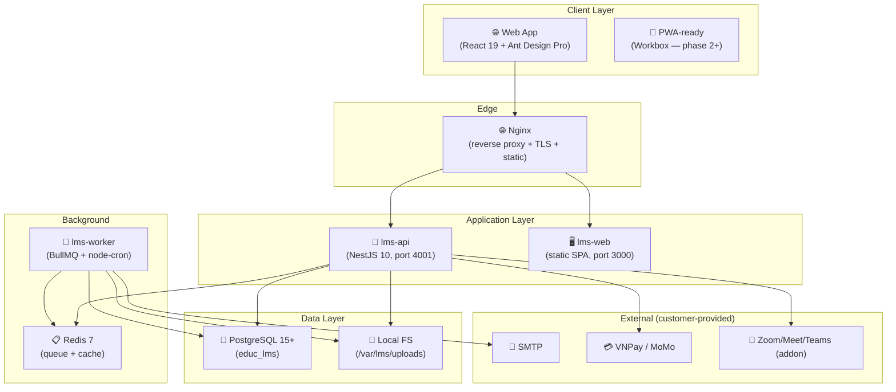

# 01. Architecture — EduCenter LMS (Unified)

**Version**: 4.1 (Consolidated)
**Date**: 2026-08-26
**Status**: ✅ Nguồn chuẩn — thay thế `architecture-proposal.md` cũ (đã ghi nhầm "SaaS Multi-tenant")

> ⚠️ **Quyết định hiện hành (D1)**: kiến trúc là **On-Premise Self-Hosted**, một installation = một khách hàng. Không có multi-tenant SaaS, không có control plane super-admin. **D9 (2026-08-26)**: hệ thống quản lý license chưa triển khai ở giai đoạn này — LMS chạy license mặc định (stub); giữ tables + contract API + LicenseService interface làm điểm kết nối chờ. Tài liệu cũ `archive/specs-001-lms-multi-branch/architecture-proposal.md` chỉ để tham khảo lịch sử.

---

## 1. Tổng quan kiến trúc

**Monolithic-first, module-ready** — một ứng dụng NestJS duy nhất tổ chức theo module nghiệp vụ, sẵn sàng tách service khi cần (không bắt buộc).



**Luồng dữ liệu cốt lõi**:
1. Browser → Nginx (TLS) → `lms-api` (REST JSON, JWT bearer) → PostgreSQL/Redis/Filesystem.
2. Tác vụ nặng (email, hóa đơn PDF, reconcile, backup) đẩy qua BullMQ → `lms-worker`.
3. Webhook thanh toán → API xác thực chữ ký → inbox event → xử lý bất đồng bộ, idempotent.

---

## 2. Tech Stack (chốt — D4)

```yaml
Frontend:
  Framework: React 19
  UI Library: Ant Design 5.x + Ant Design Pro / ProComponents
  Build Tool: Vite 5.x
  State: TanStack Query (server) + Zustand (client)
  Forms: React Hook Form + Zod
  Routing: React Router 6.x
  i18n: react-i18next (vi-VN, en-US)
  Charts: Recharts / @ant-design/charts

Backend:
  Runtime: Node.js 20 LTS
  Framework: NestJS 10.x
  ORM: TypeORM (migrations + query builder)
  Validation: class-validator + class-transformer
  Auth: JWT (access 15m / refresh 7d HTTP-only cookie) + bcrypt
  Docs: @nestjs/swagger (OpenAPI 3.0)

Database:
  Primary: PostgreSQL 15+
  Cache/Queue: Redis 7+ (BullMQ)
  Search: PostgreSQL full-text (MVP) → pgvector (phase AI)

Storage:
  Files: Local filesystem (/var/lms/uploads) — S3-compatible tùy chọn sau
  Backups: /var/lms/backups

Worker:
  Queue: BullMQ
  Scheduler: node-cron
  Jobs: email/SMS, payment reconcile, report generation, backup, license-state check

Deployment:
  OS: Debian 12 / Ubuntu 22.04 LTS
  Web Server: Nginx (reverse proxy + static + TLS/certbot)
  Process Manager: systemd (lms-web, lms-api, lms-worker)
  Package: .deb (dpkg/apt)
  Không dùng: Docker, Kubernetes

Testing:
  Unit: Vitest · Integration: Vitest + testcontainers · E2E: Playwright · API: Supertest
```

---

## 3. Cấu trúc Monorepo

```
educenter-lms/
├── apps/
│   ├── web/                    # React SPA (Ant Design Pro)
│   │   ├── src/
│   │   │   ├── layouts/        # PublicLayout, AdminLayout, BlankLayout
│   │   │   ├── pages/          # auth/, admin/, academic/, learning/, finance/, reports/, settings/
│   │   │   ├── components/     # business/ + common/ (ProTable wrappers, FormBuilder)
│   │   │   ├── services/       # api.ts (axios), từng domain service
│   │   │   ├── hooks/          # useAuth, usePermission, useBranchScope, useDataTable
│   │   │   ├── stores/         # auth.store, ui.store, branch.store (Zustand)
│   │   │   ├── config/         # routes.config, menu.config, theme.config
│   │   │   └── locales/        # vi-VN.json, en-US.json
│   │   ├── vite.config.ts
│   │   └── package.json
│   │
│   └── api/                    # NestJS
│       └── src/
│           ├── modules/
│           │   ├── auth/           # login, refresh, logout, password
│           │   ├── users/          # users, roles, permissions, scope_grants
│           │   ├── organization/   # org settings, branches, theme, modules
│           │   ├── license/        # STUB (D9) — trả license mặc định; điểm chờ kết nối hệ thống quản lý license
│           │   ├── academic/       # departments, programs, courses, classes, schedules
│           │   ├── enrollment/     # students, enrollments, progress
│           │   ├── learning/       # content library, access scopes, progress
│           │   ├── finance/        # invoices, payments, receipts, reports
│           │   ├── reports/        # async report jobs
│           │   ├── integrations/   # payment gateway plugins (vnpay, momo), webhooks
│           │   ├── audit/          # audit log, retention
│           │   ├── notifications/  # in-app + email
│           │   └── addons/         # registry, feature flags, module state (CRM, HRM...)
│           ├── common/             # guards, interceptors, filters, decorators
│           ├── config/             # env, database, redis, license public key (trống ở giai đoạn này, D9)
│           └── main.ts
│
├── worker/                    # BullMQ worker process (đọc queue từ apps/api)
├── packages/
│   ├── shared/                # DTO/type dùng chung, enums, permission constants
│   ├── license-core/          # STUB (D9) — license mặc định; sẽ thay bằng hệ thống quản lý license
│   └── payment-plugin-api/    # interface PaymentGatewayAdapter
├── infra/
│   ├── debian/                # DEBIAN/control, postinst, prerm, conffiles
│   ├── systemd/               # lms-web.service, lms-api.service, lms-worker.service
│   ├── nginx/                 # sites-available/lms
│   └── scripts/               # lms-setup wizard, lms-backup, lms-addon
└── database/
    ├── migrations/            # TypeORM migrations (versioned)
    └── seeds/                 # roles, permissions, modules, demo data
```

---

## 4. Kiến trúc Frontend

### 4.1 Nguyên tắc

- **Một app duy nhất**, role-based routing (không tách 3 shell như đề xuất cũ).
- Menu được sinh từ `menu.config.ts` + lọc theo role/branch scope/module effective state.
- **Không tin client**: UI ẩn menu không thay thế guard backend (FR-004).
- i18n vi-VN mặc định, en-US song song.

### 4.2 Điều hướng theo vai trò (mẫu)

| Nhóm | Route | Roles |
|---|---|---|
| Dashboard | `/dashboard` | tất cả |
| Tuyển sinh | `/admission/*` | admin, consultant (addon CRM) |
| Đào tạo | `/academic/*` | admin, academic_manager, teacher |
| Học tập | `/learning/*` | student, parent, teacher |
| Nhân sự | `/hrm/*` | admin, hr_manager (addon HRM) |
| Tài chính | `/finance/*` | admin, finance_officer, accountant |
| Báo cáo | `/reports/*` | admin, branch_manager, finance |
| Cài đặt | `/settings/*` | admin, system_admin |

### 4.3 Chủ đề (Theme)

- Ant Design theming + CSS variables; không custom design system.
- Brand tokens (logo, màu) đặt trong `organization.brand_settings`.

---

## 5. Kiến trúc Backend

### 5.1 Module & phân lớp

```
Route → Controller (validation) → Service (business logic) → Repository/TypeORM → PostgreSQL
                                        │
                                        ├─ Guard: JWT auth → Permission → Scope(branch/class/student) → License/module state
                                        └─ Interceptor: audit log, correlation_id, idempotency
```

- **Guards (thứ tự bắt buộc)**: ① JWT → ② Role/Permission → ③ Branch/Scope → ④ Module effective state. Module disabled → chặn mọi business endpoint. (Giai đoạn này license mặc định → module luôn enabled, D9.)
- **Idempotency**: command tài chính/ghi danh/webhook hỗ trợ `Idempotency-Key`; unique business key ở DB.
- **Audit**: append-only `audit_events` cho dữ liệu nhạy cảm (điểm, lương, tài chính, phân quyền, license); giữ 7 năm (NFR-011).
- **Lỗi**: response chuẩn `{ code, message, correlation_id, details }`, không lộ secret (SEC).

### 5.2 License & Module (STUB — D9)

- Giai đoạn này **không triển khai hệ thống quản lý license**: `packages/license-core` là **stub** trả license mặc định (dev/evaluation) → mọi module `effective_enabled = true`, không enforce constraint.
- Giữ sẵn **điểm kết nối chờ (integration seam)**: bảng `licenses`/`addon_licenses`/`module_states`/`feature_flags` (RESERVED), contract API `/license/*` (FUTURE), interface `LicenseService`.
- Khi triển khai hệ thống quản lý license (giai đoạn sau): thay stub bằng verify RSA-2048/SHA-256 chữ ký license file (JSON), tính constraint (max_students, max_branches, max_storage_gb, addons, expiry), kích hoạt bằng file/key từ hệ thống license. Không phone-home từng request.
- `EffectiveModuleState`: `installed && configured_enabled && licensed_enabled && dependency_satisfied` (áp dụng khi có hệ thống license).
- Addon: `.deb` cài code + migration; kích hoạt bằng serial key / feature flag (hiện tại: feature flag, vì chưa có license server).

### 5.3 Bảo mật (tóm tắt — chi tiết `07-operations/security-checklist.md`)

- bcrypt cost ≥ 10 · JWT access 15m / refresh 7d (HTTP-only, SameSite) · session 8h inactivity
- Login rate-limit 5 lần/15 phút · API rate-limit 100 req/15 phút/IP (NFR-015)
- RSA-2048 cho license (FUTURE — D9, khi có hệ thống quản lý license) · webhook verify chữ ký + replay window
- File upload: virus scan, giới hạn 500MB, URL cấp sau authorization
- Branch scope enforced ở service layer (không chỉ UI)
- Encryption at rest (disk-level + column-level cho secret), HTTPS bắt buộc

---

## 6. Kiến trúc dữ liệu (tóm tắt — chi tiết `03-data-model.md`, `04-database-schema.md`)

- **Một database duy nhất** mỗi installation (`educ_lms`), organization thường 1 record.
- Tất cả entity gắn `organization_id`; entity phạm vi chi nhánh gắn `branch_id`.
- Không xóa vật lý: tài chính, payroll, điểm, bài làm, audit — soft delete/append-only.
- File lớn để ngoài DB (`/var/lms/uploads`), DB lưu metadata + access scope.
- Bảng addon được tạo sẵn (nullable) hoặc qua migration khi cài addon — chọn: **migration theo addon** để giữ DB gọn ở MVP, bảng lõi của base luôn đầy đủ.

---

## 7. Deployment (tóm tắt — chi tiết `06-deployment/*`)

```
Browser ──TLS──▶ Nginx (443) ──▶ /api/* → lms-api (4001)
                        └──────▶ /*     → lms-web  (3000, static SPA)

systemd: lms-web.service · lms-api.service · lms-worker.service
PostgreSQL 15 (localhost:5432) · Redis 7 (localhost:6379)
Data: /var/lms/uploads · /var/lms/backups · Config: /opt/lms/config
```

- Cài đặt: `dpkg -i lms-base-v*.deb` → `lms-setup wizard` → hệ thống tự tạo DB, chạy migration, sinh systemd units, cấu hình Nginx + SSL (certbot).
- Cập nhật: minor = `dpkg -i` bản mới + restart; major = theo upgrade guide (migration script).
- **Không Docker** (theo yêu cầu khách hàng).

---

## 8. Khả năng mở rộng (Scalability)

| Quy mô | Cấu hình | Ghi chú |
|---|---|---|
| ≤ 500 học viên | 2 vCPU / 4GB / 50GB SSD | Minimum |
| 500–1.500 học viên | 4 vCPU / 8GB / 100GB SSD | Recommended (NFR-001: tối đa 2.000) |
| 1.500–5.000+ | Tách lms-worker riêng, PG tune, cache nâng cao | Tùy biến; monolith tách service khi cần |

- NFR-002: list page < 2s với 1.000 records · NFR-003: detail < 500ms · NFR-005: 50 concurrent users.
- Điểm nghẽn tiềm năng: báo cáo lớn → chạy async qua worker (NFR: report async + notification).

---

## 9. Kiến trúc phase sau (Roadmap — không thuộc MVP)

| Phase | Bổ sung kiến trúc |
|---|---|
| **Phase 2 — Enhanced** | Socket.IO (real-time notification/messaging), adapter meeting provider (Zoom/Meet/Teams), landing CMS |
| **Phase 3 — AI** | AI gateway module (provider adapter: OpenAI/Claude/local), pgvector, `ai_tasks` + policy check + review workflow, AI governance (log, confidence, appeal) |
| **Phase 4 — Advanced** | Mobile native (React Native), advanced analytics, marketplace addon |

Thiết kế MVP đã chừa chỗ: `integrations/` module (plugin pattern), bảng `ai_tasks` (nullable, phase 3), `conversations` (phase 2).

---

## 10. Các quyết định kiến trúc đã loại bỏ (so với tài liệu cũ)

- ❌ SaaS multi-tenant, database-per-tenant, tenant migration/cutover → **một DB mỗi installation**
- ❌ Control plane super-admin (product plans, tenant billing) → hệ thống quản lý license chưa triển khai (D9); license phát hành sẽ qua hệ thống này ở giai đoạn sau
- ❌ 3 application shells (public/platform/admin) → **một app, role-based routing**
- ❌ shadcn/ui + Tailwind + custom design system → **Ant Design Pro theming**
- ❌ Module manifest + dependency graph phức tạp → **feature flags + serial key**
- ❌ Next.js SSR → **Vite SPA + Nginx static**

---

**Xem tiếp**: [`02-spec.md`](./02-spec.md) · [`03-data-model.md`](./03-data-model.md) · [`04-database-schema.md`](./04-database-schema.md)
