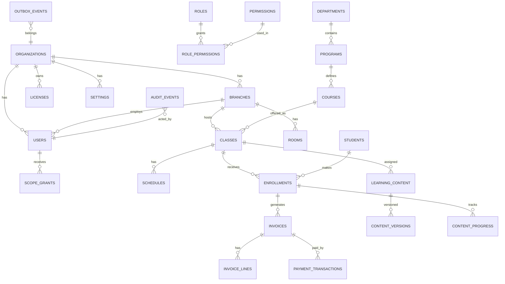

# 04. Database Schema — EduCenter LMS (PostgreSQL 15+)

**Version**: 1.1 (MỚI — tạo trong đợt hợp nhất)
**Date**: 2026-08-26
**Status**: ✅ Nguồn chuẩn

> Tài liệu này thay thế `database/lms-schema.sql` cũ ở root (schema EduCenter legacy: users/courses/assignments đơn giản, không có branch/license) và cập nhật `12-diagrams/Database-Schema-ERD.md` (v3). DDL dưới đây là chuẩn cho implementation.

---

## 1. Tổng quan & quy ước

**Một database duy nhất mỗi installation** (`lms_database`), organization thường 1 record (D6).

| Quy ước | Giá trị |
|---|---|
| Primary key | `UUID` (`uuid_generate_v4()`) |
| Timestamp | `TIMESTAMPTZ`, `created_at` default `NOW()` |
| Tiền tệ | `NUMERIC(14,2)` — không dùng float |
| Percent | `NUMERIC(5,2)` |
| Soft delete | `deleted_at TIMESTAMPTZ` cho dữ liệu không tài chính |
| Bất biến | tài chính, payroll, điểm, bài làm, audit → **append-only, không soft delete** |
| Status | `VARCHAR(20..50)` + `CHECK` constraint |
| JSON | `JSONB` cho metadata linh hoạt |
| Audit | `audit_events` append-only, giữ 7 năm (NFR-011), partition theo tháng |
| Idempotency | unique constraint trên business key / `idempotency_key` |
| Full-text | GIN index `to_tsvector('simple', ...)` cho search (VN) |

**Phân vùng bảng**:

| Ký hiệu | Ý nghĩa |
|---|---|
| `[MVP]` | Tạo trong migration base — bắt buộc |
| `[P2]` / `[P3]` | Tạo qua migration khi cài addon / phase — bảng nullable, không triển khai ở MVP |

---

## 2. ERD (Mermaid)



---

## 3. Table Catalog

| # | Bảng | Mô tả | Phân vùng |
|---|---|---|---|
| 1 | organizations | Tổ chức (thường 1 record) | MVP |
| 2 | branches | Chi nhánh | MVP |
| 3 | users | Người dùng (đăng nhập + profile) | MVP |
| 4 | roles | Vai trò | MVP |
| 5 | permissions | Quyền (resource:action) | MVP |
| 6 | role_permissions | Gán quyền cho role | MVP |
| 7 | scope_grants | Phạm vi truy cập (branch/class/student) + hiệu lực | MVP |
| 8 | settings | Org settings key-value | MVP |
| 9 | audit_events | Audit append-only (partition theo tháng) | MVP |
| 10 | outbox_events | Outbox cho tích hợp | MVP |
| 11 | inbox_events | Webhook inbox (idempotent) | MVP |
| 12 | licenses | License base | MVP-RESERVED (D9) |
| 13 | addon_licenses | Serial key addon | MVP-RESERVED (D9) |
| 14 | module_states | Effective module state (cache + nguồn) | MVP-RESERVED (D9) |
| 15 | feature_flags | Feature flags | MVP |
| 16 | departments | Ngành đào tạo | MVP |
| 17 | programs | Chương trình | MVP |
| 18 | courses | Khóa học/học phần | MVP |
| 19 | classes | Lớp học | MVP |
| 20 | class_teachers | Giáo viên dạy lớp | MVP |
| 21 | rooms | Phòng học | MVP |
| 22 | schedules | Lịch học (chống trùng) | MVP |
| 23 | students | Hồ sơ học viên | MVP |
| 24 | enrollments | Ghi danh | MVP |
| 25 | enrollment_progress | Tiến độ theo enrollment | MVP |
| 26 | learning_content | Học liệu | MVP |
| 27 | content_versions | Version học liệu | MVP |
| 28 | content_progress | Tiến độ xem học liệu | MVP |
| 29 | library_categories | Danh mục thư viện | MVP |
| 30 | library_resources | Tài nguyên thư viện | MVP |
| 31 | invoices | Hóa đơn | MVP |
| 32 | invoice_lines | Dòng hóa đơn | MVP |
| 33 | payments | Thanh toán (ghi nhận) | MVP |
| 34 | payment_transactions | Giao dịch gateway (idempotent) | MVP |
| 35 | refunds | Hoàn tiền (append-only) | MVP |
| 36 | receipts | Phiếu thu PDF metadata | MVP |
| 37 | notifications | Thông báo trong ứng dụng | MVP |
| 38 | password_reset_tokens | Token đặt lại mật khẩu | MVP |
| 39 | landing_content | Landing CMS | P2 CRM |
| 40 | leads | Khách hàng tiềm năng | P2 CRM |
| 41 | consultations | Buổi tư vấn | P2 CRM |
| 42 | lead_assignments | Phân công lead | P2 CRM |
| 43 | parent_links | Liên kết phụ huynh | P2 Parent |
| 44 | delegations | Ủy quyền phụ huynh | P2 Parent |
| 45 | assessment_bank_items | Ngân hàng câu hỏi | P2 Assessment |
| 46 | assessments | Bài đánh giá | P2 Assessment |
| 47 | assessment_attempts | Lần làm bài | P2 Assessment |
| 48 | assessment_results | Kết quả | P2 Assessment |
| 49 | english_pathways | Lộ trình tiếng Anh | P2 Assessment |
| 50 | english_skill_records | Điểm 4 kỹ năng | P2 Assessment |
| 51 | online_sessions | Buổi học online | P2 Online |
| 52 | meeting_events | Event từ provider họp | P2 Online |
| 53 | conversations | Hội thoại | P2 Communication |
| 54 | conversation_members | Thành viên hội thoại | P2 Communication |
| 55 | messages | Tin nhắn (immutable) | P2 Communication |
| 56 | budgets | Ngân sách chi nhánh | P2 Finance |
| 57 | finance_categories | Danh mục thu chi | P2 Finance |
| 58 | cash_accounts | Tài khoản quỹ | P2 Finance |
| 59 | finance_entries | Chứng từ thu chi | P2 Finance |
| 60 | expense_requests | Đề nghị chi | P2 Finance |
| 61 | receipt_documents | Chứng từ file | P2 Finance |
| 62 | employees | Hồ sơ nhân sự | P3 HRM |
| 63 | employment_contracts | Hợp đồng lao động | P3 HRM |
| 64 | teacher_assignments | Phân công giáo viên | P3 HRM |
| 65 | work_schedules | Lịch làm việc | P3 HRM |
| 66 | attendance | Chấm công | P3 HRM |
| 67 | leave_requests | Nghỉ phép | P3 HRM |
| 68 | performance_reviews | Đánh giá hiệu suất | P3 HRM |
| 69 | payroll_periods | Kỳ lương | P3 HRM |
| 70 | payroll_lines | Dòng lương | P3 HRM |
| 71 | payslips | Phiếu lương | P3 HRM |
| 72 | accounting_sync_events | Đồng bộ kế toán/ERP | P3 ERP |
| 73 | ai_tasks | Tác vụ AI | P3 AI |
| 74 | ai_policy_decisions | Quyết định chính sách AI | P3 AI |
| 75 | ai_reviews | Review AI output | P3 AI |

---

## 4. DDL — Core (MVP)

```sql
-- ============================================================
-- EduCenter LMS — Unified Schema (PostgreSQL 15+)
-- Phân vùng: [MVP] bắt buộc · [P2]/[P3] tạo qua migration addon
-- ============================================================
CREATE EXTENSION IF NOT EXISTS "uuid-ossp";

-- ------------------------------------------------------------
-- 1. ORGANIZATIONS & BRANCHES [MVP]
-- ------------------------------------------------------------
CREATE TABLE organizations (
    id              UUID PRIMARY KEY DEFAULT uuid_generate_v4(),
    name            VARCHAR(255) NOT NULL,
    slug            VARCHAR(100) UNIQUE NOT NULL,
    timezone        VARCHAR(64) NOT NULL DEFAULT 'Asia/Ho_Chi_Minh',
    academic_period VARCHAR(50),                 -- e.g. '2026-2027'
    currency        VARCHAR(3)  NOT NULL DEFAULT 'VND',
    brand_settings  JSONB       NOT NULL DEFAULT '{}',
    contact_settings JSONB      NOT NULL DEFAULT '{}',
    status          VARCHAR(20) NOT NULL DEFAULT 'active'
                    CHECK (status IN ('active','inactive','suspended')),
    created_at      TIMESTAMPTZ NOT NULL DEFAULT NOW(),
    updated_at      TIMESTAMPTZ NOT NULL DEFAULT NOW(),
    deleted_at      TIMESTAMPTZ
);

CREATE TABLE branches (
    id              UUID PRIMARY KEY DEFAULT uuid_generate_v4(),
    organization_id UUID NOT NULL REFERENCES organizations(id),
    code            VARCHAR(50)  NOT NULL,       -- unique trong org
    name            VARCHAR(255) NOT NULL,
    address         TEXT,
    manager_user_id UUID,                        -- FK users (add sau khi tạo users)
    status          VARCHAR(20) NOT NULL DEFAULT 'active'
                    CHECK (status IN ('active','inactive')),
    opened_at       DATE,
    closed_at       DATE,
    created_at      TIMESTAMPTZ NOT NULL DEFAULT NOW(),
    updated_at      TIMESTAMPTZ NOT NULL DEFAULT NOW(),
    deleted_at      TIMESTAMPTZ,
    UNIQUE (organization_id, code)
);

-- ------------------------------------------------------------
-- 2. USERS, ROLES, PERMISSIONS, SCOPE [MVP]
-- ------------------------------------------------------------
CREATE TABLE users (
    id               UUID PRIMARY KEY DEFAULT uuid_generate_v4(),
    organization_id  UUID NOT NULL REFERENCES organizations(id),
    email            VARCHAR(255) NOT NULL,
    password_hash    VARCHAR(255) NOT NULL,      -- bcrypt cost >= 10
    full_name        VARCHAR(255) NOT NULL,
    avatar_url       VARCHAR(500),
    phone            VARCHAR(30),
    date_of_birth    DATE,
    gender           VARCHAR(20),
    status           VARCHAR(20) NOT NULL DEFAULT 'active'
                     CHECK (status IN ('active','inactive','suspended','deleted')),
    email_verified_at TIMESTAMPTZ,
    two_fa_enabled   BOOLEAN NOT NULL DEFAULT FALSE,
    two_fa_secret    VARCHAR(255),
    last_login_at    TIMESTAMPTZ,
    last_login_ip    INET,
    created_at       TIMESTAMPTZ NOT NULL DEFAULT NOW(),
    updated_at       TIMESTAMPTZ NOT NULL DEFAULT NOW(),
    deleted_at       TIMESTAMPTZ,
    UNIQUE (organization_id, email)
);
CREATE INDEX idx_users_email ON users (LOWER(email)) WHERE deleted_at IS NULL;
CREATE INDEX idx_users_org_status ON users (organization_id, status);

CREATE TABLE roles (
    id              UUID PRIMARY KEY DEFAULT uuid_generate_v4(),
    organization_id UUID NOT NULL REFERENCES organizations(id),
    code            VARCHAR(50) NOT NULL,        -- org_admin, branch_manager, teacher, student...
    name            VARCHAR(100) NOT NULL,
    description     TEXT,
    is_system       BOOLEAN NOT NULL DEFAULT FALSE,  -- role hệ thống không xóa
    created_at      TIMESTAMPTZ NOT NULL DEFAULT NOW(),
    UNIQUE (organization_id, code)
);

CREATE TABLE permissions (
    id          UUID PRIMARY KEY DEFAULT uuid_generate_v4(),
    resource    VARCHAR(100) NOT NULL,           -- invoice, class, user...
    action      VARCHAR(50)  NOT NULL,           -- create, read, update, delete, export...
    description TEXT,
    UNIQUE (resource, action)
);

CREATE TABLE role_permissions (
    role_id       UUID NOT NULL REFERENCES roles(id) ON DELETE CASCADE,
    permission_id UUID NOT NULL REFERENCES permissions(id) ON DELETE CASCADE,
    PRIMARY KEY (role_id, permission_id)
);

CREATE TABLE user_roles (
    user_id       UUID NOT NULL REFERENCES users(id) ON DELETE CASCADE,
    role_id       UUID NOT NULL REFERENCES roles(id) ON DELETE CASCADE,
    granted_by    UUID REFERENCES users(id),
    granted_at    TIMESTAMPTZ NOT NULL DEFAULT NOW(),
    PRIMARY KEY (user_id, role_id)
);

CREATE TABLE scope_grants (
    id              UUID PRIMARY KEY DEFAULT uuid_generate_v4(),
    user_id         UUID NOT NULL REFERENCES users(id) ON DELETE CASCADE,
    organization_id UUID NOT NULL REFERENCES organizations(id),
    branch_id       UUID REFERENCES branches(id),
    class_id        UUID,                        -- FK classes (add sau)
    student_id      UUID,                        -- FK students (add sau)
    effective_from  TIMESTAMPTZ NOT NULL DEFAULT NOW(),
    effective_to    TIMESTAMPTZ,                 -- NULL = vô hạn
    created_by      UUID REFERENCES users(id),
    created_at      TIMESTAMPTZ NOT NULL DEFAULT NOW(),
    CHECK (branch_id IS NOT NULL OR class_id IS NOT NULL OR student_id IS NOT NULL)
);
CREATE INDEX idx_scope_grants_user ON scope_grants (user_id);
CREATE INDEX idx_scope_grants_active ON scope_grants (user_id) WHERE effective_to IS NULL OR effective_to > NOW();

CREATE TABLE settings (
    id              UUID PRIMARY KEY DEFAULT uuid_generate_v4(),
    organization_id UUID NOT NULL REFERENCES organizations(id),
    key             VARCHAR(100) NOT NULL,
    value           JSONB,
    description     TEXT,
    updated_at      TIMESTAMPTZ NOT NULL DEFAULT NOW(),
    UNIQUE (organization_id, key)
);

-- ------------------------------------------------------------
-- 3. AUDIT & INTEGRATION [MVP]
-- ------------------------------------------------------------
CREATE TABLE audit_events (
    id              UUID PRIMARY KEY DEFAULT uuid_generate_v4(),
    organization_id UUID,
    branch_id       UUID,
    actor_user_id   UUID,
    action          VARCHAR(100) NOT NULL,       -- user.create, enrollment.create, payment.settled...
    entity_type     VARCHAR(50)  NOT NULL,
    entity_id       UUID,
    before_snapshot JSONB,
    after_snapshot  JSONB,
    result          VARCHAR(20)  NOT NULL DEFAULT 'success'
                    CHECK (result IN ('success','denied','error')),
    correlation_id  UUID,
    occurred_at     TIMESTAMPTZ NOT NULL DEFAULT NOW(),
    ip_address      INET,
    user_agent      TEXT
) PARTITION BY RANGE (occurred_at);
-- Partition theo tháng (tạo động trong migration):
-- CREATE TABLE audit_events_2026_09 PARTITION OF audit_events
--   FOR VALUES FROM ('2026-09-01') TO ('2026-10-01');
CREATE INDEX idx_audit_org_time ON audit_events (organization_id, occurred_at DESC);
CREATE INDEX idx_audit_entity ON audit_events (entity_type, entity_id);
CREATE INDEX idx_audit_correlation ON audit_events (correlation_id);

CREATE TABLE outbox_events (
    id               UUID PRIMARY KEY DEFAULT uuid_generate_v4(),
    event_id         UUID NOT NULL,
    organization_id  UUID NOT NULL REFERENCES organizations(id),
    branch_id        UUID,
    entity_type      VARCHAR(50) NOT NULL,
    entity_id        UUID NOT NULL,
    event_type       VARCHAR(50) NOT NULL,
    payload_version  INTEGER NOT NULL DEFAULT 1,
    payload          JSONB NOT NULL,
    idempotency_key  VARCHAR(255) NOT NULL,
    state            VARCHAR(20) NOT NULL DEFAULT 'pending'
                     CHECK (state IN ('pending','published','failed','dead_letter')),
    attempts         INTEGER NOT NULL DEFAULT 0,
    next_attempt_at  TIMESTAMPTZ,
    last_error       TEXT,
    created_at       TIMESTAMPTZ NOT NULL DEFAULT NOW(),
    UNIQUE (event_id)
);
CREATE INDEX idx_outbox_state ON outbox_events (state, next_attempt_at);

CREATE TABLE inbox_events (
    id                UUID PRIMARY KEY DEFAULT uuid_generate_v4(),
    provider          VARCHAR(50) NOT NULL,      -- vnpay, momo, zoom...
    external_event_id VARCHAR(255) NOT NULL,
    signature_state   VARCHAR(20) NOT NULL DEFAULT 'valid'
                      CHECK (signature_state IN ('valid','invalid','missing')),
    received_at       TIMESTAMPTZ NOT NULL DEFAULT NOW(),
    processed_at      TIMESTAMPTZ,
    state             VARCHAR(20) NOT NULL DEFAULT 'received'
                      CHECK (state IN ('received','processing','processed','failed','dead_letter')),
    raw_reference     TEXT,
    UNIQUE (provider, external_event_id)
);
```

---

## 5. DDL — License & Modules (MVP — RESERVED, D9)

> ⚠️ **(D9)** Bảng dưới đây vẫn **được tạo** trong migration base để giữ schema cho **điểm kết nối chờ** (integration seam) — nhưng giai đoạn này **không seed dữ liệu license thật** và LicenseService là **stub** trả license mặc định (mọi module enabled, không enforce constraint). Chúng sẽ được kích hoạt khi triển khai hệ thống quản lý license ở giai đoạn sau.

```sql
-- ------------------------------------------------------------
-- 4. LICENSE & MODULE STATE [MVP-RESERVED / D9]
-- ------------------------------------------------------------
CREATE TABLE licenses (
    id              UUID PRIMARY KEY DEFAULT uuid_generate_v4(),
    organization_id UUID NOT NULL REFERENCES organizations(id),
    license_key_id  VARCHAR(100) NOT NULL,       -- LIC-2026-001-...
    term_type       VARCHAR(20) NOT NULL
                    CHECK (term_type IN ('perpetual','subscription')),
    starts_at       TIMESTAMPTZ NOT NULL,
    expires_at      TIMESTAMPTZ,                 -- NULL = perpetual
    grace_until     TIMESTAMPTZ,
    status          VARCHAR(20) NOT NULL DEFAULT 'active'
                    CHECK (status IN ('active','grace','expired','revoked')),
    constraints     JSONB NOT NULL,              -- {max_students, max_branches, max_storage_gb}
    base_modules    JSONB NOT NULL DEFAULT '[]', -- ["organization","academic","learning","finance"]
    support_until   TIMESTAMPTZ,
    updates_until   TIMESTAMPTZ,
    signature       TEXT NOT NULL,               -- RSA-2048/SHA-256 base64
    issued_at       TIMESTAMPTZ NOT NULL,
    revoked_at      TIMESTAMPTZ,
    created_at      TIMESTAMPTZ NOT NULL DEFAULT NOW(),
    UNIQUE (organization_id, license_key_id)
);

CREATE TABLE addon_licenses (
    id              UUID PRIMARY KEY DEFAULT uuid_generate_v4(),
    license_id      UUID NOT NULL REFERENCES licenses(id) ON DELETE CASCADE,
    addon_id        VARCHAR(50) NOT NULL,        -- crm, assessment, online, hrm...
    addon_name      VARCHAR(100) NOT NULL,
    serial_key      VARCHAR(100) NOT NULL,
    activated_at    TIMESTAMPTZ,
    expires_at      TIMESTAMPTZ,
    status          VARCHAR(20) NOT NULL DEFAULT 'pending'
                    CHECK (status IN ('pending','active','grace','expired','revoked')),
    UNIQUE (license_id, addon_id),
    UNIQUE (serial_key)
);

CREATE TABLE module_states (
    organization_id     UUID NOT NULL REFERENCES organizations(id),
    module_key          VARCHAR(50) NOT NULL,    -- organization, crm, hrm...
    installed           BOOLEAN NOT NULL DEFAULT FALSE,
    configured_enabled  BOOLEAN NOT NULL DEFAULT FALSE,
    licensed_enabled    BOOLEAN NOT NULL DEFAULT FALSE,
    dependency_satisfied BOOLEAN NOT NULL DEFAULT TRUE,
    effective_enabled   BOOLEAN NOT NULL DEFAULT FALSE,
    reason              VARCHAR(255),
    evaluated_at        TIMESTAMPTZ NOT NULL DEFAULT NOW(),
    PRIMARY KEY (organization_id, module_key)
);

CREATE TABLE feature_flags (
    id              UUID PRIMARY KEY DEFAULT uuid_generate_v4(),
    organization_id UUID NOT NULL REFERENCES organizations(id),
    module_key      VARCHAR(50) NOT NULL,
    flag_key        VARCHAR(100) NOT NULL,
    value           JSONB NOT NULL DEFAULT 'true',
    description     TEXT,
    UNIQUE (organization_id, module_key, flag_key)
);
```

---

## 6. DDL — Academic Core (MVP)

```sql
-- ------------------------------------------------------------
-- 5. ACADEMIC [MVP]
-- ------------------------------------------------------------
CREATE TABLE departments (
    id              UUID PRIMARY KEY DEFAULT uuid_generate_v4(),
    organization_id UUID NOT NULL REFERENCES organizations(id),
    code            VARCHAR(50) NOT NULL,
    name            VARCHAR(255) NOT NULL,
    status          VARCHAR(20) NOT NULL DEFAULT 'active'
                    CHECK (status IN ('active','inactive')),
    created_at      TIMESTAMPTZ NOT NULL DEFAULT NOW(),
    UNIQUE (organization_id, code)
);

CREATE TABLE programs (
    id               UUID PRIMARY KEY DEFAULT uuid_generate_v4(),
    organization_id  UUID NOT NULL REFERENCES organizations(id),
    department_id    UUID NOT NULL REFERENCES departments(id),
    code             VARCHAR(50) NOT NULL,
    name             VARCHAR(255) NOT NULL,
    description      TEXT,
    objectives       JSONB,
    duration_months  INTEGER,
    completion_rules JSONB,                      -- {min_attendance, min_score, required_modules}
    status           VARCHAR(20) NOT NULL DEFAULT 'draft'
                     CHECK (status IN ('draft','active','archived')),
    created_at       TIMESTAMPTZ NOT NULL DEFAULT NOW(),
    updated_at       TIMESTAMPTZ NOT NULL DEFAULT NOW(),
    UNIQUE (organization_id, code)
);

CREATE TABLE courses (
    id               UUID PRIMARY KEY DEFAULT uuid_generate_v4(),
    organization_id  UUID NOT NULL REFERENCES organizations(id),
    program_id       UUID NOT NULL REFERENCES programs(id),
    code             VARCHAR(50) NOT NULL,
    name             VARCHAR(255) NOT NULL,
    description      TEXT,
    order_index      INTEGER NOT NULL DEFAULT 0,
    prerequisites    UUID[],                     -- course ids
    learning_outcomes JSONB,
    status           VARCHAR(20) NOT NULL DEFAULT 'draft'
                     CHECK (status IN ('draft','active','archived')),
    created_at       TIMESTAMPTZ NOT NULL DEFAULT NOW(),
    updated_at       TIMESTAMPTZ NOT NULL DEFAULT NOW(),
    UNIQUE (program_id, code)
);

CREATE TABLE rooms (
    id              UUID PRIMARY KEY DEFAULT uuid_generate_v4(),
    organization_id UUID NOT NULL REFERENCES organizations(id),
    branch_id       UUID NOT NULL REFERENCES branches(id),
    code            VARCHAR(50) NOT NULL,
    name            VARCHAR(100),
    capacity        INTEGER,
    status          VARCHAR(20) NOT NULL DEFAULT 'active'
                    CHECK (status IN ('active','inactive')),
    UNIQUE (branch_id, code)
);

CREATE TABLE classes (
    id               UUID PRIMARY KEY DEFAULT uuid_generate_v4(),
    organization_id  UUID NOT NULL REFERENCES organizations(id),
    branch_id        UUID NOT NULL REFERENCES branches(id),
    program_id       UUID NOT NULL REFERENCES programs(id),
    course_id        UUID NOT NULL REFERENCES courses(id),
    code             VARCHAR(50) NOT NULL,
    name             VARCHAR(255) NOT NULL,
    modality         VARCHAR(20) NOT NULL DEFAULT 'offline'
                     CHECK (modality IN ('offline','online','hybrid','flexible')),
    capacity         INTEGER NOT NULL DEFAULT 20,
    enrolled_count   INTEGER NOT NULL DEFAULT 0,
    enrollment_status VARCHAR(20) NOT NULL DEFAULT 'draft'
                     CHECK (enrollment_status IN ('draft','open','closed','full','archived')),
    start_date       DATE,
    end_date         DATE,
    status           VARCHAR(20) NOT NULL DEFAULT 'draft'
                     CHECK (status IN ('draft','active','archived')),
    created_at       TIMESTAMPTZ NOT NULL DEFAULT NOW(),
    updated_at       TIMESTAMPTZ NOT NULL DEFAULT NOW(),
    UNIQUE (branch_id, code),
    CHECK (enrolled_count <= capacity)
);

CREATE TABLE class_teachers (
    class_id    UUID NOT NULL REFERENCES classes(id) ON DELETE CASCADE,
    teacher_id  UUID NOT NULL REFERENCES users(id) ON DELETE CASCADE,
    role        VARCHAR(50) NOT NULL DEFAULT 'primary'
                CHECK (role IN ('primary','assistant','substitute')),
    PRIMARY KEY (class_id, teacher_id)
);

CREATE TABLE schedules (
    id              UUID PRIMARY KEY DEFAULT uuid_generate_v4(),
    organization_id UUID NOT NULL REFERENCES organizations(id),
    class_id        UUID NOT NULL REFERENCES classes(id) ON DELETE CASCADE,
    branch_id       UUID NOT NULL REFERENCES branches(id),
    room_id         UUID REFERENCES rooms(id),
    teacher_id      UUID NOT NULL REFERENCES users(id),
    day_of_week     SMALLINT NOT NULL CHECK (day_of_week BETWEEN 1 AND 7),
    start_time      TIME NOT NULL,
    end_time        TIME NOT NULL,
    recurrence      VARCHAR(20) NOT NULL DEFAULT 'weekly'
                    CHECK (recurrence IN ('weekly','biweekly','once')),
    valid_from      DATE NOT NULL,
    valid_to        DATE,
    created_at      TIMESTAMPTZ NOT NULL DEFAULT NOW(),
    CHECK (end_time > start_time)
);
-- Chống trùng lịch: teacher/room/time (dùng exclusion constraint)
CREATE EXTENSION IF NOT EXISTS btree_gist;
ALTER TABLE schedules ADD CONSTRAINT no_teacher_overlap
    EXCLUDE USING gist (teacher_id WITH =,
                        tstzrange(valid_from::timestamptz,
                                  COALESCE(valid_to, DATE '9999-12-31')::timestamptz,
                                  '[)') WITH &&,
                        (make_time(day_of_week, 0, 0)) WITH =);
-- (Implementation chính xác dùng cột time range; chi tiết trong migration)
CREATE INDEX idx_schedules_class ON schedules (class_id);
CREATE INDEX idx_schedules_teacher ON schedules (teacher_id, valid_from);

CREATE TABLE students (
    id              UUID PRIMARY KEY DEFAULT uuid_generate_v4(),
    organization_id UUID NOT NULL REFERENCES organizations(id),
    user_id         UUID REFERENCES users(id),   -- NULL nếu chưa có account
    student_code    VARCHAR(50) NOT NULL,
    full_name       VARCHAR(255) NOT NULL,
    date_of_birth   DATE,
    gender          VARCHAR(20),
    phone           VARCHAR(30),
    guardian_phone  VARCHAR(30),
    identity_ref    VARCHAR(100),
    status          VARCHAR(20) NOT NULL DEFAULT 'active'
                    CHECK (status IN ('active','inactive','graduated','dropped')),
    notes           TEXT,
    created_at      TIMESTAMPTZ NOT NULL DEFAULT NOW(),
    updated_at      TIMESTAMPTZ NOT NULL DEFAULT NOW(),
    deleted_at      TIMESTAMPTZ,
    UNIQUE (organization_id, student_code)
);
CREATE INDEX idx_students_user ON students (user_id);
CREATE INDEX idx_students_search ON students
    USING gin (to_tsvector('simple', full_name || ' ' || COALESCE(student_code,'')));

CREATE TABLE enrollments (
    id                UUID PRIMARY KEY DEFAULT uuid_generate_v4(),
    organization_id   UUID NOT NULL REFERENCES organizations(id),
    branch_id         UUID NOT NULL REFERENCES branches(id),
    student_id        UUID NOT NULL REFERENCES students(id),
    class_id          UUID NOT NULL REFERENCES classes(id),
    status            VARCHAR(30) NOT NULL DEFAULT 'pending_payment'
                      CHECK (status IN ('pending_payment','active','completed','dropped','suspended','waitlist')),
    enrolled_at       TIMESTAMPTZ NOT NULL DEFAULT NOW(),
    completion_state  VARCHAR(30),                -- not_started, in_progress, completed, failed
    financial_account_ref UUID,                   -- FK invoices.id
    created_by        UUID REFERENCES users(id),
    created_at        TIMESTAMPTZ NOT NULL DEFAULT NOW(),
    updated_at        TIMESTAMPTZ NOT NULL DEFAULT NOW(),
    UNIQUE (student_id, class_id)                 -- chống ghi danh trùng
);
CREATE INDEX idx_enrollments_class ON enrollments (class_id, status);
CREATE INDEX idx_enrollments_student ON enrollments (student_id);

-- Trigger: cập nhật enrolled_count + check capacity
CREATE OR REPLACE FUNCTION sync_class_enrolled_count() RETURNS TRIGGER AS $$
BEGIN
    IF TG_OP = 'INSERT' AND NEW.status IN ('pending_payment','active') THEN
        UPDATE classes SET enrolled_count = enrolled_count + 1 WHERE id = NEW.class_id;
    ELSIF TG_OP = 'UPDATE' AND OLD.status IN ('pending_payment','active')
          AND NEW.status NOT IN ('pending_payment','active') THEN
        UPDATE classes SET enrolled_count = enrolled_count - 1 WHERE id = NEW.class_id;
    END IF;
    RETURN NEW;
END; $$ LANGUAGE plpgsql;
CREATE TRIGGER trg_enrollment_count AFTER INSERT OR UPDATE OF status ON enrollments
    FOR EACH ROW EXECUTE FUNCTION sync_class_enrolled_count();

CREATE TABLE enrollment_progress (
    id               UUID PRIMARY KEY DEFAULT uuid_generate_v4(),
    enrollment_id    UUID NOT NULL REFERENCES enrollments(id) ON DELETE CASCADE,
    progress_percent NUMERIC(5,2) NOT NULL DEFAULT 0 CHECK (progress_percent BETWEEN 0 AND 100),
    completed_sessions INTEGER NOT NULL DEFAULT 0,
    total_sessions   INTEGER NOT NULL DEFAULT 0,
    last_activity_at TIMESTAMPTZ,
    updated_at       TIMESTAMPTZ NOT NULL DEFAULT NOW(),
    UNIQUE (enrollment_id)
);
```

---

## 7. DDL — Learning & Content (MVP)

```sql
-- ------------------------------------------------------------
-- 6. LEARNING CONTENT [MVP]
-- ------------------------------------------------------------
CREATE TABLE learning_content (
    id               UUID PRIMARY KEY DEFAULT uuid_generate_v4(),
    organization_id  UUID NOT NULL REFERENCES organizations(id),
    branch_id        UUID REFERENCES branches(id),  -- NULL = toàn org
    owner_id         UUID NOT NULL REFERENCES users(id),
    title            VARCHAR(255) NOT NULL,
    content_type     VARCHAR(30) NOT NULL
                     CHECK (content_type IN ('document','video','audio','presentation','interactive','ebook')),
    access_scope     VARCHAR(20) NOT NULL DEFAULT 'class'
                     CHECK (access_scope IN ('public','class','private')),
    category         VARCHAR(100),
    subject          VARCHAR(100),
    file_ref         VARCHAR(500),
    file_size_bytes  BIGINT,
    file_hash        VARCHAR(64),
    mime_type        VARCHAR(100),
    current_version  INTEGER NOT NULL DEFAULT 1,
    approval_status  VARCHAR(20) NOT NULL DEFAULT 'pending'
                     CHECK (approval_status IN ('draft','pending','approved','rejected')),
    status           VARCHAR(20) NOT NULL DEFAULT 'draft'
                     CHECK (status IN ('draft','published','archived')),
    usage_policy     JSONB,                       -- {download_allowed, preview, watermark}
    created_at       TIMESTAMPTZ NOT NULL DEFAULT NOW(),
    updated_at       TIMESTAMPTZ NOT NULL DEFAULT NOW(),
    deleted_at       TIMESTAMPTZ
);
CREATE INDEX idx_content_scope ON learning_content (access_scope, status);
CREATE INDEX idx_content_owner ON learning_content (owner_id);

CREATE TABLE content_versions (
    id          UUID PRIMARY KEY DEFAULT uuid_generate_v4(),
    content_id  UUID NOT NULL REFERENCES learning_content(id) ON DELETE CASCADE,
    version     INTEGER NOT NULL,
    file_ref    VARCHAR(500),
    file_hash   VARCHAR(64),
    change_note TEXT,
    created_by  UUID NOT NULL REFERENCES users(id),
    created_at  TIMESTAMPTZ NOT NULL DEFAULT NOW(),
    UNIQUE (content_id, version)
);

CREATE TABLE content_class_links (
    content_id UUID NOT NULL REFERENCES learning_content(id) ON DELETE CASCADE,
    class_id   UUID NOT NULL REFERENCES classes(id) ON DELETE CASCADE,
    PRIMARY KEY (content_id, class_id)
);

CREATE TABLE content_progress (
    id              UUID PRIMARY KEY DEFAULT uuid_generate_v4(),
    content_id      UUID NOT NULL REFERENCES learning_content(id) ON DELETE CASCADE,
    student_id      UUID NOT NULL REFERENCES students(id) ON DELETE CASCADE,
    progress_percent NUMERIC(5,2) NOT NULL DEFAULT 0 CHECK (progress_percent BETWEEN 0 AND 100),
    watch_seconds   INTEGER NOT NULL DEFAULT 0,
    is_completed    BOOLEAN NOT NULL DEFAULT FALSE,
    first_viewed_at TIMESTAMPTZ,
    last_viewed_at  TIMESTAMPTZ,
    UNIQUE (content_id, student_id)
);

-- Thư viện số (cơ bản MVP)
CREATE TABLE library_categories (
    id              UUID PRIMARY KEY DEFAULT uuid_generate_v4(),
    organization_id UUID NOT NULL REFERENCES organizations(id),
    code            VARCHAR(50) NOT NULL,
    name            VARCHAR(255) NOT NULL,
    UNIQUE (organization_id, code)
);

CREATE TABLE library_resources (
    id               UUID PRIMARY KEY DEFAULT uuid_generate_v4(),
    organization_id  UUID NOT NULL REFERENCES organizations(id),
    category_id      UUID REFERENCES library_categories(id),
    subject          VARCHAR(100),
    title            VARCHAR(255) NOT NULL,
    content_type     VARCHAR(30),
    access_scope     VARCHAR(20) NOT NULL DEFAULT 'public'
                     CHECK (access_scope IN ('public','class','private')),
    file_ref         VARCHAR(500),
    version          INTEGER NOT NULL DEFAULT 1,
    status           VARCHAR(20) NOT NULL DEFAULT 'published'
                     CHECK (status IN ('draft','published','archived')),
    created_by       UUID NOT NULL REFERENCES users(id),
    created_at       TIMESTAMPTZ NOT NULL DEFAULT NOW(),
    updated_at       TIMESTAMPTZ NOT NULL DEFAULT NOW(),
    deleted_at       TIMESTAMPTZ
);
CREATE INDEX idx_library_search ON library_resources
    USING gin (to_tsvector('simple', title || ' ' || COALESCE(subject,'')));
```

---

## 8. DDL — Finance & Billing (MVP)

```sql
-- ------------------------------------------------------------
-- 7. FINANCE & BILLING [MVP]
-- ------------------------------------------------------------
CREATE TABLE invoices (
    id                UUID PRIMARY KEY DEFAULT uuid_generate_v4(),
    organization_id   UUID NOT NULL REFERENCES organizations(id),
    branch_id         UUID NOT NULL REFERENCES branches(id),
    invoice_number    VARCHAR(50) NOT NULL,       -- INV-YYYYMM-XXXX
    student_id        UUID NOT NULL REFERENCES students(id),
    enrollment_id     UUID REFERENCES enrollments(id),
    amount            NUMERIC(14,2) NOT NULL CHECK (amount >= 0),
    discount          NUMERIC(14,2) NOT NULL DEFAULT 0,
    tax_amount        NUMERIC(14,2) NOT NULL DEFAULT 0,
    total_amount      NUMERIC(14,2) NOT NULL,
    paid_amount       NUMERIC(14,2) NOT NULL DEFAULT 0,
    balance_state     VARCHAR(20) NOT NULL DEFAULT 'pending'
                      CHECK (balance_state IN ('pending','partially_paid','paid','overdue','void')),
    due_at            TIMESTAMPTZ NOT NULL,
    issued_at         TIMESTAMPTZ NOT NULL DEFAULT NOW(),
    voided_at         TIMESTAMPTZ,
    void_reason       TEXT,
    created_by        UUID NOT NULL REFERENCES users(id),
    created_at        TIMESTAMPTZ NOT NULL DEFAULT NOW(),
    updated_at        TIMESTAMPTZ NOT NULL DEFAULT NOW(),
    UNIQUE (organization_id, invoice_number),
    CHECK (paid_amount >= 0 AND paid_amount <= total_amount)
);
CREATE INDEX idx_invoices_student ON invoices (student_id);
CREATE INDEX idx_invoices_branch_state ON invoices (branch_id, balance_state, due_at);
CREATE INDEX idx_invoices_due ON invoices (due_at) WHERE balance_state IN ('pending','partially_paid');

CREATE TABLE invoice_lines (
    id           UUID PRIMARY KEY DEFAULT uuid_generate_v4(),
    invoice_id   UUID NOT NULL REFERENCES invoices(id) ON DELETE CASCADE,
    description  VARCHAR(255) NOT NULL,
    quantity     NUMERIC(10,2) NOT NULL DEFAULT 1,
    unit_price   NUMERIC(14,2) NOT NULL,
    line_total   NUMERIC(14,2) NOT NULL,
    sort_order   INTEGER NOT NULL DEFAULT 0
);

CREATE TABLE payments (
    id              UUID PRIMARY KEY DEFAULT uuid_generate_v4(),
    organization_id UUID NOT NULL REFERENCES organizations(id),
    branch_id       UUID NOT NULL REFERENCES branches(id),
    invoice_id      UUID NOT NULL REFERENCES invoices(id),
    student_id      UUID NOT NULL REFERENCES students(id),
    amount          NUMERIC(14,2) NOT NULL CHECK (amount > 0),
    payment_method  VARCHAR(30) NOT NULL
                    CHECK (payment_method IN ('cash','bank_transfer','vnpay','momo','other')),
    received_at     TIMESTAMPTZ NOT NULL DEFAULT NOW(),
    recorded_by     UUID NOT NULL REFERENCES users(id),
    status          VARCHAR(20) NOT NULL DEFAULT 'confirmed'
                    CHECK (status IN ('pending','confirmed','failed','reversed')),
    created_at      TIMESTAMPTZ NOT NULL DEFAULT NOW(),
    updated_at      TIMESTAMPTZ NOT NULL DEFAULT NOW()
);

CREATE TABLE payment_transactions (
    id                UUID PRIMARY KEY DEFAULT uuid_generate_v4(),
    payment_id        UUID REFERENCES payments(id),
    invoice_id        UUID NOT NULL REFERENCES invoices(id),
    provider          VARCHAR(50) NOT NULL,      -- vnpay, momo
    provider_reference VARCHAR(255),
    attempt_id        VARCHAR(255),
    idempotency_key   VARCHAR(255) NOT NULL,
    amount            NUMERIC(14,2) NOT NULL,
    state             VARCHAR(20) NOT NULL DEFAULT 'initiated'
                      CHECK (state IN ('initiated','pending','confirmed','failed','cancelled')),
    redirect_url      VARCHAR(500),
    created_at        TIMESTAMPTZ NOT NULL DEFAULT NOW(),
    updated_at        TIMESTAMPTZ NOT NULL DEFAULT NOW(),
    UNIQUE (provider, idempotency_key)
);
CREATE INDEX idx_payment_tx_invoice ON payment_transactions (invoice_id, state);

CREATE TABLE refunds (
    id              UUID PRIMARY KEY DEFAULT uuid_generate_v4(),
    organization_id UUID NOT NULL REFERENCES organizations(id),
    payment_id      UUID NOT NULL REFERENCES payments(id),
    amount          NUMERIC(14,2) NOT NULL CHECK (amount > 0),
    reason          TEXT NOT NULL,
    state           VARCHAR(20) NOT NULL DEFAULT 'pending'
                    CHECK (state IN ('pending','confirmed','failed','rejected')),
    processed_by    UUID REFERENCES users(id),
    created_at      TIMESTAMPTZ NOT NULL DEFAULT NOW(),
    updated_at      TIMESTAMPTZ NOT NULL DEFAULT NOW()
);

CREATE TABLE receipts (
    id              UUID PRIMARY KEY DEFAULT uuid_generate_v4(),
    organization_id UUID NOT NULL REFERENCES organizations(id),
    payment_id      UUID NOT NULL REFERENCES payments(id),
    receipt_number  VARCHAR(50) NOT NULL,
    file_ref        VARCHAR(500) NOT NULL,
    file_hash       VARCHAR(64),
    generated_at    TIMESTAMPTZ NOT NULL DEFAULT NOW(),
    UNIQUE (organization_id, receipt_number)
);

-- Trigger: cập nhật paid_amount + balance_state trên invoice
CREATE OR REPLACE FUNCTION sync_invoice_balance() RETURNS TRIGGER AS $$
DECLARE
    paid NUMERIC(14,2);
    total NUMERIC(14,2);
BEGIN
    SELECT COALESCE(SUM(amount),0) INTO paid FROM payments
      WHERE invoice_id = NEW.invoice_id AND status = 'confirmed';
    SELECT total_amount INTO total FROM invoices WHERE id = NEW.invoice_id;
    UPDATE invoices
       SET paid_amount = paid,
           balance_state = CASE WHEN paid <= 0 THEN 'pending'
                                WHEN paid < total THEN 'partially_paid'
                                ELSE 'paid' END,
           updated_at = NOW()
     WHERE id = NEW.invoice_id;
    RETURN NEW;
END; $$ LANGUAGE plpgsql;
CREATE TRIGGER trg_invoice_balance AFTER INSERT OR UPDATE OF status ON payments
    FOR EACH ROW EXECUTE FUNCTION sync_invoice_balance();
```

---

## 9. DDL — Bảng Addon / Phase (P2, P3)

> Các bảng dưới đây được tạo qua migration khi cài addon (P2) hoặc khi triển khai phase (P3). DDL chuẩn hóa để tham chiếu trong `08-addons/addon-development-guide.md`.

### 9.1 CRM & Admission (P2)

```sql
CREATE TABLE landing_content (
    id              UUID PRIMARY KEY DEFAULT uuid_generate_v4(),
    organization_id UUID NOT NULL REFERENCES organizations(id),
    branch_id       UUID REFERENCES branches(id),
    content_type    VARCHAR(30) NOT NULL CHECK (content_type IN ('page','program','news','banner','form')),
    slug            VARCHAR(150) NOT NULL,
    title           VARCHAR(255) NOT NULL,
    summary         TEXT,
    body            TEXT,
    media_refs      JSONB,
    status          VARCHAR(20) NOT NULL DEFAULT 'draft'
                    CHECK (status IN ('draft','review','published','revoked','archived')),
    version         INTEGER NOT NULL DEFAULT 1,
    published_at    TIMESTAMPTZ,
    published_by    UUID REFERENCES users(id),
    created_at      TIMESTAMPTZ NOT NULL DEFAULT NOW(),
    UNIQUE (organization_id, slug)
);

CREATE TABLE leads (
    id                UUID PRIMARY KEY DEFAULT uuid_generate_v4(),
    organization_id   UUID NOT NULL REFERENCES organizations(id),
    full_name         VARCHAR(255) NOT NULL,
    phone             VARCHAR(30) NOT NULL,
    email             VARCHAR(255),
    source            VARCHAR(50),
    interested_branch UUID REFERENCES branches(id),
    interested_program UUID REFERENCES programs(id),
    consent_status    VARCHAR(20) NOT NULL DEFAULT 'not_collected'
                      CHECK (consent_status IN ('not_collected','granted','denied')),
    status            VARCHAR(30) NOT NULL DEFAULT 'new'
                      CHECK (status IN ('new','assigned','contacted','consulting','converted','lost','duplicate')),
    created_at        TIMESTAMPTZ NOT NULL DEFAULT NOW(),
    updated_at        TIMESTAMPTZ NOT NULL DEFAULT NOW()
);

CREATE TABLE consultations (
    id           UUID PRIMARY KEY DEFAULT uuid_generate_v4(),
    lead_id      UUID NOT NULL REFERENCES leads(id) ON DELETE CASCADE,
    consultant_id UUID NOT NULL REFERENCES users(id),
    notes        TEXT,
    next_action  VARCHAR(255),
    occurred_at  TIMESTAMPTZ NOT NULL DEFAULT NOW()
);

CREATE TABLE lead_assignments (
    id           UUID PRIMARY KEY DEFAULT uuid_generate_v4(),
    lead_id      UUID NOT NULL REFERENCES leads(id),
    branch_id    UUID NOT NULL REFERENCES branches(id),
    consultant_id UUID NOT NULL REFERENCES users(id),
    assigned_at  TIMESTAMPTZ NOT NULL DEFAULT NOW(),
    released_at  TIMESTAMPTZ,
    reason       VARCHAR(255)
);
```

### 9.2 Assessment & English Pathway (P2)

```sql
CREATE TABLE assessment_bank_items (
    id             UUID PRIMARY KEY DEFAULT uuid_generate_v4(),
    organization_id UUID NOT NULL REFERENCES organizations(id),
    prompt         TEXT NOT NULL,
    skill          VARCHAR(30) NOT NULL CHECK (skill IN ('listening','speaking','reading','writing','grammar','code')),
    topic          VARCHAR(100),
    difficulty     SMALLINT NOT NULL DEFAULT 3 CHECK (difficulty BETWEEN 1 AND 5),
    answer_schema  JSONB,
    approval_state VARCHAR(20) NOT NULL DEFAULT 'pending'
                   CHECK (approval_state IN ('draft','pending','approved','rejected')),
    created_by     UUID NOT NULL REFERENCES users(id),
    created_at     TIMESTAMPTZ NOT NULL DEFAULT NOW()
);

CREATE TABLE assessments (
    id                UUID PRIMARY KEY DEFAULT uuid_generate_v4(),
    organization_id   UUID NOT NULL REFERENCES organizations(id),
    assessment_type   VARCHAR(20) NOT NULL CHECK (assessment_type IN ('entrance','mock','practice')),
    title             VARCHAR(255) NOT NULL,
    blueprint         JSONB,                     -- cấu trúc đề (số câu/skill/khó)
    window_start      TIMESTAMPTZ,
    window_end        TIMESTAMPTZ,
    attempts_allowed  INTEGER NOT NULL DEFAULT 1,
    scoring_policy    JSONB,
    result_visibility VARCHAR(20) NOT NULL DEFAULT 'after_review'
                      CHECK (result_visibility IN ('immediate','after_review','manual_only')),
    status            VARCHAR(20) NOT NULL DEFAULT 'draft'
                      CHECK (status IN ('draft','published','closed')),
    created_at        TIMESTAMPTZ NOT NULL DEFAULT NOW()
);

CREATE TABLE assessment_attempts (
    id           UUID PRIMARY KEY DEFAULT uuid_generate_v4(),
    assessment_id UUID NOT NULL REFERENCES assessments(id),
    candidate_id UUID NOT NULL REFERENCES students(id),
    business_key VARCHAR(100) NOT NULL,          -- chống duplicate attempt
    state        VARCHAR(20) NOT NULL DEFAULT 'started'
                 CHECK (state IN ('started','submitted','grading','graded','expired','void')),
    started_at   TIMESTAMPTZ NOT NULL DEFAULT NOW(),
    submitted_at TIMESTAMPTZ,
    expires_at   TIMESTAMPTZ,
    answers      JSONB,
    UNIQUE (assessment_id, business_key)
);

CREATE TABLE assessment_results (
    id            UUID PRIMARY KEY DEFAULT uuid_generate_v4(),
    attempt_id    UUID NOT NULL REFERENCES assessment_attempts(id) ON DELETE CASCADE,
    total_score   NUMERIC(5,2),
    skill_scores  JSONB,
    topic_scores  JSONB,
    recommendations JSONB,
    published_at  TIMESTAMPTZ,
    UNIQUE (attempt_id)
);

CREATE TABLE english_pathways (
    id              UUID PRIMARY KEY DEFAULT uuid_generate_v4(),
    organization_id UUID NOT NULL REFERENCES organizations(id),
    level           VARCHAR(10) NOT NULL,        -- A1..C2
    name            VARCHAR(100) NOT NULL,
    modules         JSONB,
    placement_rules JSONB,
    UNIQUE (organization_id, level)
);

CREATE TABLE english_skill_records (
    id          UUID PRIMARY KEY DEFAULT uuid_generate_v4(),
    student_id  UUID NOT NULL REFERENCES students(id),
    skill       VARCHAR(20) NOT NULL CHECK (skill IN ('listening','speaking','reading','writing')),
    level       VARCHAR(10),
    score       NUMERIC(5,2),
    evidence    JSONB,
    assessed_at TIMESTAMPTZ NOT NULL DEFAULT NOW(),
    assessed_by UUID REFERENCES users(id),
    state       VARCHAR(20) NOT NULL DEFAULT 'auto'
                CHECK (state IN ('auto','pending_review','reviewed'))
);
```

### 9.3 Online Classes & Communication (P2)

```sql
CREATE TABLE online_sessions (
    id                   UUID PRIMARY KEY DEFAULT uuid_generate_v4(),
    class_id             UUID NOT NULL REFERENCES classes(id),
    provider             VARCHAR(30) NOT NULL CHECK (provider IN ('zoom','meet','teams')),
    external_meeting_id  VARCHAR(255),
    join_reference       TEXT,
    host_reference       TEXT,
    scheduled_at         TIMESTAMPTZ NOT NULL,
    duration_minutes     INTEGER NOT NULL,
    attendance_sync_state VARCHAR(20) NOT NULL DEFAULT 'pending'
                          CHECK (attendance_sync_state IN ('pending','synced','failed')),
    recording_ref        VARCHAR(500),
    status               VARCHAR(20) NOT NULL DEFAULT 'scheduled'
                         CHECK (status IN ('scheduled','live','ended','cancelled')),
    created_at           TIMESTAMPTZ NOT NULL DEFAULT NOW()
);

CREATE TABLE meeting_events (
    id                UUID PRIMARY KEY DEFAULT uuid_generate_v4(),
    provider          VARCHAR(30) NOT NULL,
    external_event_id VARCHAR(255) NOT NULL,
    event_type        VARCHAR(50) NOT NULL,      -- participant_joined, recording_ready...
    session_id        UUID REFERENCES online_sessions(id),
    payload           JSONB,
    state             VARCHAR(20) NOT NULL DEFAULT 'received'
                      CHECK (state IN ('received','mapped','failed')),
    received_at       TIMESTAMPTZ NOT NULL DEFAULT NOW(),
    UNIQUE (provider, external_event_id)
);

CREATE TABLE conversations (
    id              UUID PRIMARY KEY DEFAULT uuid_generate_v4(),
    organization_id UUID NOT NULL REFERENCES organizations(id),
    context_type    VARCHAR(30),                  -- class, student, lead, business
    context_id      UUID,
    subject         VARCHAR(255),
    status          VARCHAR(20) NOT NULL DEFAULT 'open'
                    CHECK (status IN ('open','archived','closed')),
    created_at      TIMESTAMPTZ NOT NULL DEFAULT NOW()
);

CREATE TABLE conversation_members (
    conversation_id UUID NOT NULL REFERENCES conversations(id) ON DELETE CASCADE,
    user_id         UUID NOT NULL REFERENCES users(id),
    role            VARCHAR(30) NOT NULL DEFAULT 'member',
    access_until    TIMESTAMPTZ,
    PRIMARY KEY (conversation_id, user_id)
);

CREATE TABLE messages (
    id              UUID PRIMARY KEY DEFAULT uuid_generate_v4(),
    conversation_id UUID NOT NULL REFERENCES conversations(id) ON DELETE CASCADE,
    sender_id       UUID NOT NULL REFERENCES users(id),
    body            TEXT NOT NULL,
    attachment_refs JSONB,
    moderation_state VARCHAR(20) NOT NULL DEFAULT 'ok'
                     CHECK (moderation_state IN ('ok','flagged','blocked','reported')),
    created_at      TIMESTAMPTZ NOT NULL DEFAULT NOW()
);
```

### 9.4 HRM & Payroll (P3)

```sql
CREATE TABLE employees (
    id              UUID PRIMARY KEY DEFAULT uuid_generate_v4(),
    organization_id UUID NOT NULL REFERENCES organizations(id),
    user_id         UUID REFERENCES users(id),
    employee_code   VARCHAR(50) NOT NULL,
    full_name       VARCHAR(255) NOT NULL,
    position        VARCHAR(100),
    branch_assignments UUID[],                   -- nhiều chi nhánh
    skills          JSONB,
    certifications  JSONB,
    status          VARCHAR(20) NOT NULL DEFAULT 'active'
                    CHECK (status IN ('active','on_leave','terminated')),
    UNIQUE (organization_id, employee_code)
);

CREATE TABLE employment_contracts (
    id              UUID PRIMARY KEY DEFAULT uuid_generate_v4(),
    employee_id     UUID NOT NULL REFERENCES employees(id),
    contract_type   VARCHAR(30) NOT NULL,
    start_date      DATE NOT NULL,
    end_date        DATE,
    salary_basis    NUMERIC(14,2),
    attachments     JSONB,
    approval_state  VARCHAR(20) NOT NULL DEFAULT 'draft'
                    CHECK (approval_state IN ('draft','pending','approved','rejected','terminated'))
);

CREATE TABLE teacher_assignments (
    id           UUID PRIMARY KEY DEFAULT uuid_generate_v4(),
    teacher_id   UUID NOT NULL REFERENCES users(id),
    class_id     UUID NOT NULL REFERENCES classes(id),
    subject_skill VARCHAR(100),
    workload_hours NUMERIC(6,2),
    effective_from DATE NOT NULL,
    effective_to   DATE
);

CREATE TABLE attendance (
    id              UUID PRIMARY KEY DEFAULT uuid_generate_v4(),
    employee_id     UUID NOT NULL REFERENCES employees(id),
    work_date       DATE NOT NULL,
    check_in        TIMESTAMPTZ,
    check_out       TIMESTAMPTZ,
    source          VARCHAR(20) NOT NULL DEFAULT 'manual'
                    CHECK (source IN ('manual','biometric','meeting_sync')),
    approval_state  VARCHAR(20) NOT NULL DEFAULT 'pending'
                    CHECK (approval_state IN ('pending','approved','rejected','adjusted')),
    UNIQUE (employee_id, work_date)
);

CREATE TABLE leave_requests (
    id              UUID PRIMARY KEY DEFAULT uuid_generate_v4(),
    employee_id     UUID NOT NULL REFERENCES employees(id),
    leave_type      VARCHAR(30) NOT NULL,
    start_date      DATE NOT NULL,
    end_date        DATE NOT NULL,
    balance_delta   NUMERIC(6,2),
    approval_state  VARCHAR(20) NOT NULL DEFAULT 'pending'
                    CHECK (approval_state IN ('pending','approved','rejected','cancelled')),
    approved_by     UUID REFERENCES users(id)
);

CREATE TABLE payroll_periods (
    id              UUID PRIMARY KEY DEFAULT uuid_generate_v4(),
    organization_id UUID NOT NULL REFERENCES organizations(id),
    branch_id       UUID REFERENCES branches(id),
    period_code     VARCHAR(20) NOT NULL,        -- 2026-09
    status          VARCHAR(20) NOT NULL DEFAULT 'open'
                    CHECK (status IN ('open','calculating','approved','locked','adjusting')),
    UNIQUE (branch_id, period_code)
);

CREATE TABLE payroll_lines (
    id                  UUID PRIMARY KEY DEFAULT uuid_generate_v4(),
    period_id           UUID NOT NULL REFERENCES payroll_periods(id),
    employee_id         UUID NOT NULL REFERENCES employees(id),
    base_pay            NUMERIC(14,2) NOT NULL DEFAULT 0,
    teaching_pay        NUMERIC(14,2) NOT NULL DEFAULT 0,
    allowance           NUMERIC(14,2) NOT NULL DEFAULT 0,
    deduction           NUMERIC(14,2) NOT NULL DEFAULT 0,
    tax                 NUMERIC(14,2) NOT NULL DEFAULT 0,
    insurance           NUMERIC(14,2) NOT NULL DEFAULT 0,
    net_pay             NUMERIC(14,2) NOT NULL DEFAULT 0,
    calculation_version INTEGER NOT NULL DEFAULT 1,
    UNIQUE (period_id, employee_id)
);

CREATE TABLE payslips (
    id           UUID PRIMARY KEY DEFAULT uuid_generate_v4(),
    payroll_line_id UUID NOT NULL REFERENCES payroll_lines(id),
    publish_state VARCHAR(20) NOT NULL DEFAULT 'draft'
                  CHECK (publish_state IN ('draft','published','revoked')),
    file_ref     VARCHAR(500)
);
```

### 9.5 ERP Sync & AI (P3)

```sql
CREATE TABLE accounting_sync_events (
    id                UUID PRIMARY KEY DEFAULT uuid_generate_v4(),
    source_event_id   UUID NOT NULL,
    organization_id   UUID NOT NULL,
    branch_id         UUID,
    entity_type       VARCHAR(50) NOT NULL,
    entity_id         UUID NOT NULL,
    event_type        VARCHAR(50) NOT NULL,
    payload_version   INTEGER NOT NULL DEFAULT 1,
    idempotency_key   VARCHAR(255) NOT NULL,
    external_reference VARCHAR(255),
    state             VARCHAR(30) NOT NULL DEFAULT 'pending'
                      CHECK (state IN ('pending','accepted','duplicate','retryable_error','business_error','unavailable','reconciled')),
    attempts          INTEGER NOT NULL DEFAULT 0,
    last_error        TEXT,
    created_at        TIMESTAMPTZ NOT NULL DEFAULT NOW(),
    UNIQUE (idempotency_key)
);

CREATE TABLE ai_tasks (
    id               UUID PRIMARY KEY DEFAULT uuid_generate_v4(),
    organization_id  UUID NOT NULL,
    purpose          VARCHAR(50) NOT NULL,       -- grading, content_gen, recommendation...
    requester_id     UUID NOT NULL,
    context_type     VARCHAR(30),
    context_id       UUID,
    requested_action VARCHAR(100),
    input_ref        JSONB,
    output_ref       JSONB,
    model_version    VARCHAR(100),
    prompt_version   VARCHAR(100),
    status           VARCHAR(20) NOT NULL DEFAULT 'pending'
                     CHECK (status IN ('pending','running','needs_review','approved','rejected','failed')),
    confidence       NUMERIC(5,2),
    cost_usd         NUMERIC(10,6),
    created_at       TIMESTAMPTZ NOT NULL DEFAULT NOW(),
    completed_at     TIMESTAMPTZ
);

CREATE TABLE ai_policy_decisions (
    id            UUID PRIMARY KEY DEFAULT uuid_generate_v4(),
    task_id       UUID NOT NULL REFERENCES ai_tasks(id),
    allowed_data  JSONB,
    redactions    JSONB,
    policy_result VARCHAR(20) NOT NULL,
    reason        TEXT
);

CREATE TABLE ai_reviews (
    id            UUID PRIMARY KEY DEFAULT uuid_generate_v4(),
    task_id       UUID NOT NULL REFERENCES ai_tasks(id),
    reviewer_id   UUID NOT NULL,
    decision      VARCHAR(20) NOT NULL CHECK (decision IN ('approved','rejected','needs_revision')),
    feedback      TEXT,
    appeal_state  VARCHAR(20) NOT NULL DEFAULT 'none'
                  CHECK (appeal_state IN ('none','appealed','resolved')),
    reviewed_at   TIMESTAMPTZ NOT NULL DEFAULT NOW()
);
```

---

## 10. Indexes, Constraints & Notes

### 10.1 Index chiến lược (ngoài index trong DDL)

- `enrollments (class_id, status)` — đếm class utilization (US8).
- `invoices (branch_id, issued_at)` — báo cáo doanh thu theo branch/tháng.
- `audit_events (organization_id, occurred_at DESC)` — tra cứu audit.
- `payment_transactions (provider, state)` — reconcile job.
- Full-text GIN (tiếng Việt dùng `simple` config) cho students, library_resources, landing_content.

### 10.2 Constraint & trigger tóm tắt

| Bảng | Ràng buộc |
|---|---|
| enrollments | UNIQUE(student_id, class_id) — chống ghi danh trùng |
| schedules | exclusion constraint — chống trùng teacher/room/time |
| payment_transactions | UNIQUE(provider, idempotency_key) — webhook idempotent |
| inbox_events | UNIQUE(provider, external_event_id) — không xử lý webhook 2 lần |
| invoices | CHECK(paid_amount ≤ total_amount), trigger sync balance |
| classes | CHECK(enrolled_count ≤ capacity) + trigger count |
| scope_grants | CHECK có ít nhất một scope (branch/class/student) |

### 10.3 Retention & Partition

| Bảng | Policy |
|---|---|
| audit_events | Partition theo tháng; giữ 7 năm (NFR-011) |
| inbox_events | Xóa record đã xử lý > 90 ngày (cron) |
| outbox_events | Dead-letter giữ 30 ngày |
| password_reset_tokens | Xóa hết hạn (cron hàng giờ) |
| notifications | Giữ 1 năm |
| messages | Theo retention policy org (mặc định 2 năm) |

### 10.4 Migration strategy

- Base MVP: migration `001..0xx` — core + academic + learning + finance + license (bảng license tạo nhưng **không seed** — RESERVED, D9).
- Addon: migration có prefix theo addon (`crm_001...`, `assessment_001...`) — tạo bảng P2/P3 khi cài.
- Nguyên tắc: migration chỉ tiến về trước; bảng addon không xóa khi addon hết hạn (chỉ vô hiệu hóa qua module_states).

---

**Xem tiếp**: [`05-api/api-spec.yaml`](./05-api/api-spec.yaml) · [`03-data-model.md`](./03-data-model.md)
