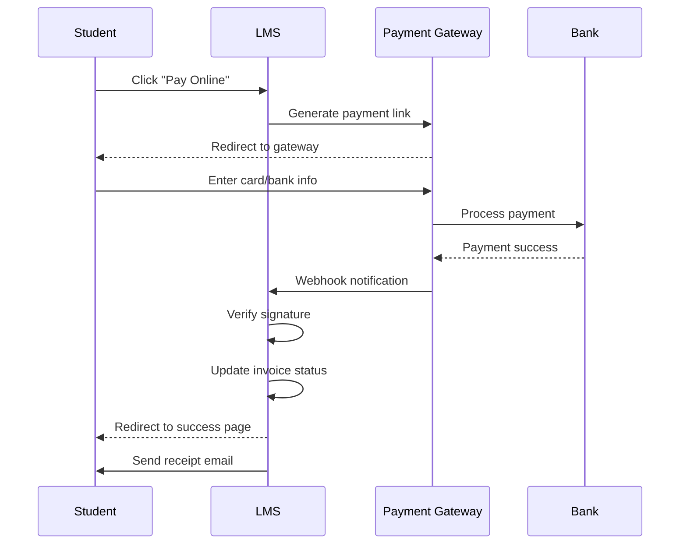

# 🎯 WF-01: Enrollment Journey (Lead to Student)

> 🧭 **Triển khai**: xem [`IMPLEMENTATION-MAP.md`](./IMPLEMENTATION-MAP.md) §1 (entity/API/task/quy tắc) + `09-planning/task-prompts.md` · **Scope**: ✅ MVP

## Overview

**Workflow ID**: `wf_01`  
**Category**: Critical Path  
**Phases**: 5 stages  
**Estimated Duration**: 3-7 days (normal), 1 day (express)  
**Frequency**: Daily  
**MVP Scope**: ✅ Included

---

## Description

Enrollment Journey là quy trình chuyển đổi từ **potential lead** (người quan tâm) thành **active student** (học viên đang học). Quy trình này trải qua nhiều touchpoints và vai trò khác nhau, từ marketing → tư vấn → test đầu vào → ghi danh → thanh toán → bắt đầu học.

**Business Impact**: 
- Primary revenue driver
- Customer acquisition funnel
- Student lifecycle starting point

---

## Workflow Diagram (Mermaid)

```mermaid
graph TB
    Start([🚀 Lead Capture]) --> Contact{Contact Method?}
    
    Contact -->|Landing Page Form| LP[📝 Form Submission]
    Contact -->|Phone Call| PC[📞 Call Reception]
    Contact -->|Walk-in| WI[🚶 In-person Visit]
    Contact -->|Referral| RF[👥 Referral]
    
    LP --> LeadCreate[Create Lead Record]
    PC --> LeadCreate
    WI --> LeadCreate
    RF --> LeadCreate
    
    LeadCreate --> Assign[👔 Assign to Consultant]
    
    Assign --> Consult[💬 Consultation]
    Consult --> ConsultOutcome{Outcome?}
    
    ConsultOutcome -->|Not Interested| Lost[❌ Mark as Lost]
    ConsultOutcome -->|Needs Follow-up| FollowUp[📅 Schedule Follow-up]
    ConsultOutcome -->|Ready to Enroll| Assessment{Assessment Required?}
    
    FollowUp -.->|Later| Consult
    
    Assessment -->|No| SelectClass[📚 Select Class]
    Assessment -->|Yes| TakeTest[📝 Entrance Test]
    
    TakeTest --> GradeTest[🎓 Grade Test]
    GradeTest --> TestResult{Pass?}
    
    TestResult -->|Fail| Remedial[📖 Recommend Remedial]
    TestResult -->|Pass| LevelPlace[🎯 Place in Level]
    
    Remedial -.->|Later| TakeTest
    LevelPlace --> SelectClass
    
    SelectClass --> CheckCapacity{Class Full?}
    CheckCapacity -->|Yes| Waitlist[⏳ Add to Waitlist]
    CheckCapacity -->|No| CreateEnroll[✅ Create Enrollment]
    
    Waitlist -.->|Seat Available| CreateEnroll
    
    CreateEnroll --> GenInvoice[💰 Generate Invoice]
    GenInvoice --> NotifyPayment[📧 Notify Payment Required]
    
    NotifyPayment --> PaymentMethod{Payment Method?}
    
    PaymentMethod -->|Online| OnlinePay[💳 Online Payment Gateway]
    PaymentMethod -->|Cash| CashPay[💵 Cash at Counter]
    PaymentMethod -->|Bank Transfer| BankPay[🏦 Bank Transfer]
    
    OnlinePay --> VerifyPayment[✓ Verify Payment]
    CashPay --> RecordPayment[✓ Record Payment]
    BankPay --> RecordPayment
    
    VerifyPayment --> RecordPayment
    RecordPayment --> IssueReceipt[🧾 Issue Receipt]
    
    IssueReceipt --> ActivateEnroll[🎉 Activate Enrollment]
    ActivateEnroll --> SendWelcome[📨 Send Welcome Email]
    
    SendWelcome --> NotifyTeacher[👨‍🏫 Notify Teacher]
    NotifyTeacher --> AddToClass[➕ Add to Class List]
    
    AddToClass --> GrantAccess[🔑 Grant LMS Access]
    GrantAccess --> End([✅ Student Active])
    
    Lost --> End
    
    style Start fill:#e1f5e1
    style End fill:#e1f5e1
    style Lost fill:#ffe1e1
    style CreateEnroll fill:#fff4e1
    style RecordPayment fill:#fff4e1
    style ActivateEnroll fill:#e1f0ff
    
    classDef consultant fill:#ffd4e5,stroke:#ff69b4
    classDef finance fill:#d4f5d4,stroke:#4caf50
    classDef admin fill:#d4e5ff,stroke:#2196f3
    classDef system fill:#f0f0f0,stroke:#9e9e9e
    
    class Consult,ConsultOutcome,FollowUp consultant
    class GenInvoice,NotifyPayment,RecordPayment,IssueReceipt finance
    class CreateEnroll,ActivateEnroll,AddToClass admin
    class GrantAccess,SendWelcome,NotifyTeacher system
```



---

## Phase Breakdown

### Phase 1: Lead Capture (Day 0)

**Objective**: Capture potential customer information

**Trigger**: 
- Form submission on landing page
- Phone call to hotline
- Walk-in to branch
- Referral from existing student

**Actors**: 
- Lead (potential customer)
- [[Receptionist]] / [[Admission Consultant]]
- System (auto-capture from web form)

**Actions**:
1. Capture contact information:
   - Full name
   - Phone number
   - Email (optional)
   - Interested program
   - Preferred contact time
2. Create lead record in system
3. Source tracking (how did they find us?)

**Data Captured**:
```typescript
interface Lead {
  id: string;
  full_name: string;
  phone: string;
  email?: string;
  source: 'website' | 'phone' | 'walk-in' | 'referral' | 'social-media';
  interested_program: string;
  preferred_contact_time?: string;
  notes?: string;
  status: 'new' | 'contacted' | 'qualified' | 'lost';
  assigned_consultant?: string;
  created_at: Date;
}
```

**Success Criteria**:
- Lead record created within 5 minutes of contact
- All required fields populated
- Auto-assigned to consultant based on rules

---

### Phase 2: Consultation (Day 0-2)

**Objective**: Understand needs, explain programs, qualify lead

**Trigger**: New lead assigned to consultant

**Actors**: 
- [[Admission Consultant]] (primary)
- Lead
- [[Academic Manager]] (for program details)

**Actions**:
1. Consultant contacts lead (phone/email)
2. Schedule consultation meeting (in-person or video)
3. During consultation:
   - Understand student background and goals
   - Explain program options
   - Discuss schedule and pricing
   - Address questions and concerns
4. Determine fit and interest level
5. Update lead status and notes

**Consultation Checklist**:
- [ ] Student background assessed
- [ ] Learning goals identified
- [ ] Program recommendation made
- [ ] Schedule compatibility confirmed
- [ ] Pricing discussed
- [ ] Questions answered
- [ ] Next steps explained

**Outcomes**:
- ✅ **Qualified**: Ready to proceed → Phase 3
- 📅 **Follow-up**: Needs time to decide → Schedule callback
- ❌ **Unqualified**: Not interested / not fit → Mark as lost

**Success Criteria**:
- First contact within 24 hours of lead creation
- Consultation completed within 48 hours
- Clear outcome documented

---

### Phase 3: Assessment (Day 2-3) - Optional

**Objective**: Evaluate student level for appropriate class placement

**Trigger**: Lead qualified and assessment required

**Actors**: 
- [[Teacher]] or [[Academic Manager]]
- Lead (test taker)
- [[Admission Consultant]] (coordination)

**Actions**:
1. Schedule assessment test
2. Lead takes entrance test:
   - Written test (grammar, vocabulary)
   - Listening test
   - Speaking test (interview)
3. Teacher grades test
4. Determine proficiency level
5. Recommend appropriate class level

**Assessment Data**:
```typescript
interface Assessment {
  id: string;
  lead_id: string;
  assessment_type: 'entrance' | 'placement';
  scheduled_at: Date;
  completed_at?: Date;
  scores: {
    listening?: number;
    reading?: number;
    writing?: number;
    speaking?: number;
    total: number;
  };
  level_placement: 'beginner' | 'elementary' | 'intermediate' | 'advanced';
  recommendations: string;
  assessed_by: string;
}
```

**Placement Rules**:
- Total score 0-30%: Beginner
- Total score 31-50%: Elementary  
- Total score 51-75%: Intermediate
- Total score 76-100%: Advanced

**Outcomes**:
- ✅ **Passed**: Placed in appropriate level → Phase 4
- ❌ **Below threshold**: Recommend preparatory course → Consultation
- ⏸️ **Incomplete**: Reschedule test

**Success Criteria**:
- Test scheduled within 2 days of qualification
- Results available within 24 hours of test completion
- Clear level recommendation provided

---

### Phase 4: Enrollment & Payment (Day 3-5)

**Objective**: Complete enrollment and secure payment

**Trigger**: Class level determined and class selected

**Actors**: 
- [[Admission Consultant]] or [[Receptionist]]
- [[Finance Officer]]
- Lead (becoming student)
- [[Branch Manager]] (approval if special case)

**Actions**:

**4.1 Select Class**
1. Consultant shows available classes for appropriate level
2. Lead selects preferred:
   - Schedule (day/time)
   - Teacher preference (if available)
   - Branch location
3. Check class capacity
4. If full, offer waitlist or alternative class

**4.2 Create Enrollment**
1. Consultant creates enrollment record
2. System generates invoice automatically:
   - Program fee
   - Registration fee
   - Material fee
   - Discount (if applicable)
3. Enrollment status: `Pending Payment`

**4.3 Payment Collection**
1. Present invoice to lead
2. Explain payment options:
   - **Online**: VNPay / Momo
   - **Cash**: At counter
   - **Bank Transfer**: Provide account details
3. Lead chooses payment method

**4.4 Payment Processing**

**Option A: Online Payment**


**Option B: Cash Payment**
- Finance Officer receives cash
- Issues physical receipt
- Records payment in system
- Updates invoice status to `Paid`

**Option C: Bank Transfer**
- Provide bank account details
- Lead transfers money
- Finance Officer checks bank statement
- Matches transaction to invoice
- Records payment
- Updates invoice status

**4.5 Payment Verification**
- Verify payment received and amount correct
- Generate official receipt
- Send receipt via email
- Update enrollment status to `Active`

**Enrollment Data**:
```typescript
interface Enrollment {
  id: string;
  student_id: string;
  class_id: string;
  enrolled_at: Date;
  status: 'pending_payment' | 'active' | 'completed' | 'cancelled';
  invoice_id: string;
  payment_status: 'pending' | 'partial' | 'paid';
  start_date: Date;
  expected_end_date: Date;
}

interface Invoice {
  id: string;
  invoice_number: string;
  enrollment_id: string;
  amount_total: number;
  amount_paid: number;
  amount_due: number;
  due_date: Date;
  status: 'pending' | 'paid' | 'overdue' | 'cancelled';
  line_items: {
    description: string;
    amount: number;
  }[];
}
```

**Success Criteria**:
- Enrollment created within same day as class selection
- Invoice generated automatically
- Payment processed successfully
- Receipt issued within 1 hour of payment

---

### Phase 5: Activation & Onboarding (Day 5-7)

**Objective**: Complete student setup and ensure ready to start learning

**Trigger**: Payment confirmed and enrollment activated

**Actors**: 
- System (automated)
- [[Branch Manager]] or [[Academic Manager]]
- [[Teacher]]
- New [[Student]]

**Actions**:

**5.1 System Activation** (Automated)
1. Enrollment status: `Active`
2. Generate student login credentials
3. Send welcome email with:
   - Login instructions
   - Class details (schedule, location, teacher)
   - First day information
   - System quick start guide
4. Add student to class roster
5. Notify teacher of new student

**5.2 Teacher Notification**
- Teacher receives email/notification
- New student appears in class list
- Teacher can view student profile
- Teacher prepares for new student arrival

**5.3 Student LMS Access**
- Student receives login credentials
- Student logs in to portal
- Student can view:
  - Class schedule
  - Learning materials (if uploaded)
  - Course syllabus
  - Teacher information
- Student sets up profile (photo, preferences)

**5.4 First Day Preparation**
- Send reminder 1 day before first class
- Include:
  - Exact location (room number)
  - What to bring (notebook, pen)
  - Contact person if lost
  - Parking/transportation info

**Welcome Email Template**:
```
Subject: Welcome to [School Name] - Your Class Starts Soon! 🎉

Dear [Student Name],

Congratulations! You are now enrolled in [Class Name].

📅 Class Schedule:
- Start Date: [Date]
- Days: [Monday, Wednesday]
- Time: [18:00 - 19:30]
- Location: [Branch Name - Room 201]

👨‍🏫 Your Teacher: [Teacher Name]

🔑 Login to Student Portal:
- URL: https://lms.school.edu.vn
- Username: [email]
- Temporary Password: [password]
(Please change password on first login)

📚 Before Your First Class:
1. Login to portal and complete your profile
2. Review the course syllabus
3. Check your class schedule
4. Download any pre-class materials

📞 Need Help?
Contact us at [phone] or reply to this email.

See you in class!

[School Name] Team
```

**Success Criteria**:
- Welcome email sent within 1 hour of payment
- Student credentials working
- Student can access portal
- Teacher notified
- Student attended first class

---

## Role Participation Matrix

| Phase | Primary Role | Supporting Roles | Approval Required |
|-------|--------------|------------------|-------------------|
| Lead Capture | [[Receptionist]] | [[Admission Consultant]] | No |
| Consultation | [[Admission Consultant]] | [[Academic Manager]] | No |
| Assessment | [[Teacher]] | [[Admission Consultant]] | No |
| Enrollment | [[Admission Consultant]] | [[Finance Officer]], [[Branch Manager]] | Special cases only |
| Payment | [[Finance Officer]] | [[Receptionist]] | No (auto) |
| Activation | System (auto) | [[Branch Manager]], [[Teacher]] | No |

---

## Decision Points

### Decision 1: Assessment Required?
**Context**: Some programs require placement test, others don't

**Criteria**:
- Language programs (English, etc.): **Yes**
- Skill-based programs (IT, Design): **Optional**
- Beginner-level courses: **No** (assume zero knowledge)
- Advanced courses: **Yes** (verify qualification)

**Decision made by**: [[Admission Consultant]] based on program rules

---

### Decision 2: Class Selection
**Context**: Multiple classes available at different times

**Factors**:
- Student schedule preference
- Class capacity
- Teacher availability
- Branch location
- Price tier (if different)

**Decision made by**: Lead, advised by [[Admission Consultant]]

---

### Decision 3: Payment Method
**Context**: How will student pay?

**Options**:
- **Online**: Instant, convenient, but requires bank account/card
- **Cash**: Immediate, no fees, requires in-person visit
- **Bank Transfer**: Good for large amounts, 1-2 days delay

**Decision made by**: Lead (student preference)

---

## Integration Points

### 1. Payment Gateway (VNPay / Momo)

**Flow**:
```
LMS → Generate payment link → Gateway → Student pays → Webhook → LMS updates status
```

**Key Requirements**:
- Idempotent webhook processing
- Signature validation
- Timeout handling (15 minutes)
- Reconciliation for failed notifications

---

### 2. Email/SMS Notifications

**Trigger Events**:
- Lead captured → Consultant notification
- Consultation scheduled → Lead reminder
- Invoice created → Payment link sent
- Payment received → Receipt sent
- Enrollment activated → Welcome email
- First class reminder → 1 day before

---

### 3. Accounting System (If addon)

**Data Sync**:
- Invoice created → Export to accounting
- Payment recorded → Sync transaction
- Reconciliation daily → Match records

---

## Exception Handling

### Exception 1: Class Full
**Scenario**: Student wants to enroll but class is at capacity

**Options**:
1. **Waitlist**: Add to waitlist, notify when space available
2. **Alternative Class**: Offer different time/day at same level
3. **New Class**: If enough waitlist, open new class
4. **Defer**: Enroll for next term

**Handled by**: [[Admission Consultant]]

---

### Exception 2: Payment Failed
**Scenario**: Online payment attempted but failed

**Actions**:
1. Show error message to student
2. Log failure reason
3. Offer alternative payment method
4. Hold enrollment for 24 hours
5. If unpaid, release class seat and notify student

**Handled by**: System (auto) + [[Finance Officer]] (manual follow-up)

---

### Exception 3: Test Score Below Minimum
**Scenario**: Student wants advanced class but test score too low

**Actions**:
1. Explain results and gap
2. Recommend appropriate level class
3. Offer preparatory/remedial course
4. Set expectations for progression timeline
5. Option to retake test after study (min 1 month gap)

**Handled by**: [[Academic Manager]]

---

### Exception 4: Enrollment After Class Started
**Scenario**: Student wants to join class that already began

**Rules**:
- **Week 1-2**: Allowed with [[Branch Manager]] approval
- **Week 3+**: Not allowed, must wait for next term
- Prorated fees if joining late
- Student responsible for catching up on missed content

**Handled by**: [[Branch Manager]]

---

## Success Metrics

### Conversion Metrics
- **Lead to Consultation**: Target 80% within 48 hours
- **Consultation to Assessment**: Target 60%
- **Assessment to Enrollment**: Target 70%
- **Enrollment to Payment**: Target 95%
- **Overall Lead to Student**: Target 40%

### Time Metrics
- **Lead Response Time**: < 24 hours
- **Consultation to Enrollment**: < 5 days
- **Payment to Activation**: < 1 hour (online), < 4 hours (offline)
- **Total Cycle Time**: < 7 days (target), 3 days (express)

### Quality Metrics
- **Show-up Rate**: % of enrolled students attending first class (target 95%)
- **Payment Success Rate**: % of online payments succeeding (target 98%)
- **Data Accuracy**: % of enrollments with complete information (target 100%)

---

## Process Improvements

### Quick Wins
1. **Auto-assign consultant** based on availability and workload
2. **Template messages** for common consultation scenarios
3. **Online scheduling** for assessments
4. **Payment reminders** (24h, 48h, 72h)
5. **First class reminder** (SMS + Email)

### Future Enhancements (Post-MVP)
1. **Lead scoring** - Prioritize high-intent leads
2. **Automated follow-up** - Drip campaign for "Follow-up" leads
3. **Virtual tours** - Video preview of facilities
4. **Trial class** - Free trial before commitment
5. **Installment payments** - Pay in 2-3 installments

---

## Related Workflows

- [[WF-02 Teaching & Learning Cycle]] - What happens after enrollment
- [[WF-03 Financial Operations]] - Detailed payment processing
- [[WF-10 Student Self-Service]] - Student portal usage

---

## Related Roles

- [[Admission Consultant]] - Primary driver
- [[Receptionist]] - First contact
- [[Teacher]] - Assessment
- [[Finance Officer]] - Payment handling
- [[Academic Manager]] - Program recommendations
- [[Branch Manager]] - Approvals
- [[Student]] - End beneficiary

---

## Appendices

### Appendix A: Sample Timeline (Typical Case)

```
Day 0: Lead submits form on website at 10:00 AM
       → Auto-assigned to Consultant A at 10:01 AM
       → Consultant calls at 11:30 AM
       → Consultation scheduled for Day 1 at 6:00 PM

Day 1: Consultation conducted (in-person, 45 minutes)
       → Lead interested in English Intermediate program
       → Assessment required
       → Test scheduled for Day 2 at 10:00 AM

Day 2: Lead takes placement test (1 hour)
       → Teacher grades test (30 minutes)
       → Result: Intermediate level confirmed
       → Consultant presents class options
       → Lead selects Class B (Mon/Wed 6-7:30 PM)

Day 3: Enrollment created
       → Invoice generated (5,000,000 VND)
       → Lead chooses online payment
       → Pays via VNPay at 2:00 PM
       → Payment confirmed at 2:02 PM
       → Welcome email sent at 2:05 PM
       → Teacher notified at 2:10 PM

Day 4-6: Lead logs into student portal
         → Reviews class materials
         → Prepares for first class

Day 7: First class attended
       → Enrollment journey complete ✅
```

### Appendix B: Lead Sources & Conversion Rates

| Source | % of Leads | Conversion Rate | Avg Time to Close |
|--------|------------|-----------------|-------------------|
| Website Form | 40% | 35% | 5 days |
| Facebook Ads | 25% | 28% | 7 days |
| Referral | 20% | 55% | 3 days |
| Walk-in | 10% | 65% | 2 days |
| Phone Call | 5% | 40% | 4 days |

**Insight**: Referrals have highest conversion and fastest close. Invest in referral program.

---

**Last Updated**: 2026-08-25  
**Reviewed By**: Academic Manager, Finance Officer  
**Next Review**: 2026-09-25
