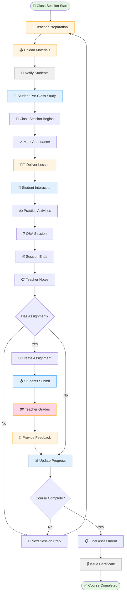

# 📚 WF-02: Teaching & Learning Cycle

> 🧭 **Triển khai**: xem [`IMPLEMENTATION-MAP.md`](./IMPLEMENTATION-MAP.md) §2 · **Scope**: ✅ MVP

## Overview

**Workflow ID**: `wf_02`  
**Category**: Critical - Core Operations  
**Phases**: 6 recurring stages  
**Duration**: Ongoing throughout course  
**Frequency**: Daily/Weekly  
**MVP Scope**: ✅ Included

---

## Description

Teaching & Learning Cycle là quy trình core của LMS, diễn ra liên tục trong suốt khóa học. Workflow này bao gồm teacher preparation, content delivery, student engagement, assessment, feedback, và progress tracking.

**Business Impact**: 
- Core value delivery to students
- Determines learning outcomes
- Drives student satisfaction và retention
- Foundation for academic reputation

---

## Workflow Diagram (Mermaid)



---

## Phase Breakdown

### Phase 1: Pre-Class Preparation (Before Session)

**Objective**: Teacher prepares materials and students preview content

**Actors**: [[Teacher]], [[Student]], System

**Teacher Actions**:
1. Review lesson plan for upcoming session
2. Prepare teaching materials:
   - Presentation slides
   - Handouts/worksheets
   - Videos or audio files
   - Practice exercises
3. Upload materials to LMS:
   - Navigate to **My Classes → [Class Name] → Content**
   - Click **Upload Material**
   - Select files (max 500MB per file)
   - Set metadata:
     - Lesson number: Lesson 5
     - Topic: "Past Tense"
     - Visible to students: Yes
     - Available from: 2 days before class
   - Click **Upload**
4. System notifies students: "New materials available"
5. Create homework/assignment if applicable
6. Review previous session notes and student questions

**Student Actions**:
1. Receive notification: "New materials for Lesson 5"
2. Login to student portal
3. Navigate to **My Classes → English Intermediate B → Content**
4. Download materials:
   - `Lesson-05-Past-Tense.pdf`
   - `Practice-Exercises.pdf`
5. Preview materials before class
6. Note questions to ask in class

**Success Criteria**:
- Materials uploaded at least 24 hours before class
- All students notified
- At least 70% of students preview materials

---

### Phase 2: Class Session Delivery (During Session)

**Objective**: Deliver effective instruction and facilitate learning

**Actors**: [[Teacher]], [[Student]]

**Timeline**: 90-minute session example

**Minutes 0-10: Opening**
- Teacher arrives 10 minutes early
- Setup classroom/online meeting
- Students arrive
- Mark attendance:
  - Navigate to **My Classes → Attendance**
  - Select today's date
  - Mark present/absent/late for each student
  - Add notes if needed
- Warm-up activity or review

**Minutes 10-30: Content Delivery**
- Present new concept (Past Tense)
- Use slides and examples
- Check understanding with questions
- Engage students with real-life contexts

**Minutes 30-60: Practice & Activities**
- Guided practice (teacher-led)
- Pair/group work
- Interactive exercises
- Error correction and feedback

**Minutes 60-80: Application**
- Students apply learned concepts
- Speaking activities
- Writing practice
- Problem-solving tasks

**Minutes 80-90: Wrap-up**
- Recap key points
- Answer questions
- Preview next lesson
- Assign homework
- Dismissal

**Student Engagement**:
- Active participation in activities
- Ask questions when unclear
- Complete in-class exercises
- Peer collaboration

**Post-Session**:
- Teacher adds session notes:
  - Navigate to **My Classes → Sessions**
  - Select today's session
  - Add notes: "Covered past tense, students struggled with irregular verbs"
  - Mark completion status
  - Set follow-up reminders

**Success Criteria**:
- 95%+ attendance rate
- All students participated
- Learning objectives achieved
- Session notes documented

---

### Phase 3: Assignment & Homework (After Session)

**Objective**: Reinforce learning through practice

**Actors**: [[Teacher]], [[Student]]

**Teacher Creates Assignment**:
1. Navigate to **My Classes → Assignments → Create**
2. Assignment details:
   - Title: "Past Tense Practice - Lesson 5"
   - Description: "Complete exercises 1-5 on page 23"
   - Instructions: Clear and specific
   - Due date: 3 days from now
   - Points: 10
   - Submission type: File upload (PDF/Word)
3. Attach reference materials if needed
4. Click **Publish Assignment**
5. System notifies all students

**Student Completes Assignment**:
1. Receive notification: "New assignment due in 3 days"
2. Navigate to **My Classes → Assignments**
3. See assignment: **Past Tense Practice**
4. Click **View Details**
5. Read instructions
6. Download worksheet if provided
7. Complete homework (offline)
8. Prepare submission file
9. Navigate back to assignment
10. Click **Submit Assignment**
11. Upload file: `Homework-Lesson5-NguyenVanA.pdf`
12. Add optional comment
13. Click **Submit**
14. See confirmation: "Submitted successfully"
15. Deadline tracker updates

**Assignment Data**:
```typescript
interface Assignment {
  id: string;
  class_id: string;
  title: string;
  description: string;
  instructions: string;
  due_date: Date;
  points: number;
  attachment_url?: string;
  created_by: string; // teacher_id
  created_at: Date;
}

interface Submission {
  id: string;
  assignment_id: string;
  student_id: string;
  file_url: string;
  submitted_at: Date;
  status: 'submitted' | 'graded' | 'late';
  grade?: number;
  feedback?: string;
  graded_by?: string;
  graded_at?: Date;
}
```

**Success Criteria**:
- Assignment created same day as class
- Clear instructions provided
- 90%+ submission rate
- Submissions on time

---

### Phase 4: Grading & Feedback (Teacher Review)

**Objective**: Assess student work and provide constructive feedback

**Actors**: [[Teacher]]

**Grading Process**:

**Step 1: Review Submissions**
1. Navigate to **My Classes → Assignments → Past Tense Practice**
2. See submission list:
   - 15 students enrolled
   - 14 submitted (93%)
   - 1 pending
3. Sort by submission date

**Step 2: Grade Each Submission**
1. Click on student: **Nguyen Van A**
2. View submitted file (opens in browser)
3. Review work:
   - Exercise 1: Correct ✓
   - Exercise 2: 2 mistakes
   - Exercise 3: Good effort
   - Exercise 4: Excellent
   - Exercise 5: Minor errors
4. Calculate score: 8.5/10
5. Write feedback:
   ```
   Good work, Van! You understand the concept well.
   
   Strengths:
   - Exercises 1 & 4: Perfect!
   - Good sentence structure
   
   Areas to improve:
   - Exercise 2: Remember irregular verbs (went, not goed)
   - Exercise 5: Watch subject-verb agreement
   
   Keep practicing irregular verbs list on page 45.
   See me if you need clarification.
   
   Grade: 8.5/10
   ```
6. Click **Save Grade**
7. Repeat for all students

**Step 3: Publish Grades**
1. After grading all submissions
2. Review grade distribution:
   - A (9-10): 4 students
   - B (7-8.9): 7 students
   - C (5-6.9): 3 students
   - Below 5: 0 students
   - Average: 8.1/10
3. Click **Publish Grades**
4. System sends notifications to students
5. Students can view grades and feedback

**Grading Rubric Example**:
```yaml
Criteria:
  Accuracy: 40%
    - Correct answers
    - Proper grammar
  
  Completeness: 30%
    - All exercises attempted
    - Followed instructions
  
  Effort: 20%
    - Neat presentation
    - Thoughtful responses
  
  Timeliness: 10%
    - Submitted on time
    - Late: -10% per day
```

**Success Criteria**:
- All submissions graded within 7 days
- Constructive feedback provided
- Grade distribution reasonable
- Students receive detailed comments

---

### Phase 5: Progress Tracking (Continuous)

**Objective**: Monitor student learning progress and identify needs

**Actors**: [[Teacher]], [[Academic Manager]], [[Student]]

**Teacher Monitors Progress**:
1. Navigate to **My Classes → Progress**
2. View class dashboard:
   - Overall class average: 8.2/10
   - Attendance rate: 94%
   - Assignment completion: 91%
   - At-risk students: 2
3. Individual student view:
   - **Nguyen Van A**:
     - Attendance: 19/20 (95%)
     - Avg grade: 8.5/10
     - Trend: Improving ↗
     - Status: On track ✓
   
   - **Tran Thi B**:
     - Attendance: 15/20 (75%)
     - Avg grade: 6.2/10
     - Trend: Declining ↘
     - Status: At risk ⚠️

**Intervention for At-Risk Students**:
1. Identify struggling student: Tran Thi B
2. Review details:
   - Low attendance (missing classes)
   - Grades declining
   - Last 3 assignments: 6.0, 5.5, 6.0
3. Take action:
   - Send message to student:
     ```
     Hi Thi,
     
     I noticed you've missed some classes recently
     and your grades have dropped a bit. Is everything
     okay? I'd like to help you get back on track.
     
     Can we schedule a 15-minute chat after class?
     
     Ms. Nguyen
     ```
   - If no response, contact [[Parent (Addon)]] if enabled
   - Offer extra support:
     - Extra practice materials
     - 1-on-1 tutoring
     - Study group recommendations
4. Document intervention in system
5. Follow up in 2 weeks

**Student Views Own Progress**:
1. Login to student portal
2. Navigate to **My Learning → Progress**
3. See dashboard:
   - Current grade: 8.5/10 (B+)
   - Attendance: 95%
   - Assignments: 9/10 completed
   - Next milestone: Final exam in 2 weeks
4. Progress bar: 75% complete
5. Strengths: Speaking, Listening
6. Areas to improve: Grammar

**Success Criteria**:
- Progress tracked after each session
- At-risk students identified early
- Interventions documented
- 85%+ students on track

---

### Phase 6: Course Completion (End of Term)

**Objective**: Assess overall learning and issue completion certificates

**Actors**: [[Teacher]], [[Academic Manager]], [[Student]]

**Final Assessment**:
1. Teacher creates final exam:
   - Navigate to **Assessments → Create Exam**
   - Include all topics covered
   - Multiple formats: Written, listening, speaking
   - Total: 100 points
2. Schedule exam date
3. Students take exam
4. Teacher grades within 1 week
5. Calculate final course grade:
   ```
   Formula:
   - Homework: 30%
   - Quizzes: 20%
   - Midterm: 20%
   - Final exam: 30%
   
   Example (Nguyen Van A):
   - Homework avg: 8.5 × 0.3 = 2.55
   - Quizzes avg: 8.0 × 0.2 = 1.60
   - Midterm: 8.0 × 0.2 = 1.60
   - Final: 9.0 × 0.3 = 2.70
   Final Grade: 8.45/10 (B+)
   ```

**Course Completion**:
1. Teacher marks course as complete
2. System generates completion statistics:
   - Started: 15 students
   - Completed: 14 students (93%)
   - Dropped: 1 student
   - Average grade: 8.2/10
   - Pass rate: 100% (of completers)
3. Issue certificates:
   - For students with passing grade
   - Certificate template populated:
     - Student name
     - Course name
     - Grade achieved
     - Date completed
     - Teacher signature
4. Send certificates via email
5. Archive course materials

**Post-Course Actions**:
1. Gather student feedback:
   - Send course evaluation survey
   - Questions about:
     - Teaching quality
     - Content relevance
     - Difficulty level
     - Facilities/platform
     - Would recommend?
2. Teacher reflection:
   - What worked well?
   - What to improve?
   - Materials to update?
   - Pacing adjustments?
3. Share insights with [[Academic Manager]]
4. Prepare for next term

**Success Criteria**:
- 80%+ completion rate
- 90%+ passing rate (of completers)
- 4.0/5+ average student satisfaction
- Certificates issued within 1 week
- Lessons learned documented

---

## Role Participation Matrix

| Phase | Primary | Supporting | Approval |
|-------|---------|------------|----------|
| Preparation | [[Teacher]] | [[Librarian]] | - |
| Delivery | [[Teacher]] | [[Student]] | - |
| Assignment | [[Teacher]], [[Student]] | - | - |
| Grading | [[Teacher]] | - | [[Academic Manager]] (disputes) |
| Progress | [[Teacher]] | [[Academic Manager]] | - |
| Completion | [[Teacher]] | [[Academic Manager]] | [[Branch Manager]] |

---

## Success Metrics

### Teaching Quality
- **Student Satisfaction**: Average 4.2/5 (Target: 4.0+)
- **Completion Rate**: 85% (Target: 80%+)
- **Pass Rate**: 92% (Target: 90%+)
- **Attendance**: 94% (Target: 90%+)

### Engagement
- **Assignment Submission**: 91% on-time (Target: 85%+)
- **Material Access**: 78% preview materials (Target: 70%+)
- **Class Participation**: Measured via teacher observation

### Outcomes
- **Learning Objectives Met**: 88% (Target: 85%+)
- **Progress vs Baseline**: Average 2-level improvement in 6 months
- **Student Retention**: 85% continue to next level (Target: 80%+)

---

## Integration Points

### 1. Content Library
- Teachers access shared content
- Upload and organize materials
- Version control for updates

### 2. Communication System
- Announcements to class
- Direct messages to students
- Parent notifications (if addon)

### 3. Gradebook
- Automatic grade calculations
- Progress tracking
- Transcript generation

### 4. Analytics
- Class performance dashboards
- Teacher effectiveness metrics
- Student engagement indicators

---

## Common Issues & Solutions

### Issue 1: Low Attendance
**Symptoms**: < 80% attendance rate

**Root Causes**:
- Schedule conflicts
- Lack of engagement
- External factors (work, family)

**Solutions**:
1. Contact students to understand reasons
2. Offer makeup sessions
3. Provide recorded sessions (if online)
4. Adjust schedule if pattern emerges
5. Engage parents for minors

---

### Issue 2: Low Assignment Completion
**Symptoms**: < 70% submission rate

**Root Causes**:
- Unclear instructions
- Too difficult
- Not enough time

**Solutions**:
1. Clarify assignment requirements
2. Provide examples
3. Extend deadline if reasonable
4. Offer office hours for help
5. Break large assignments into smaller tasks

---

### Issue 3: Poor Grades
**Symptoms**: Class average < 6.0/10

**Root Causes**:
- Material too advanced
- Teaching pace too fast
- Students unprepared

**Solutions**:
1. Review and simplify content
2. Slow down pace
3. Add more practice
4. Extra support sessions
5. Adjust assessment difficulty

---

## Best Practices

### For Teachers

**Preparation**:
- Upload materials 48 hours in advance
- Test all links and files before sharing
- Prepare backup activities
- Review previous session notes

**Delivery**:
- Start and end on time
- Use varied teaching methods
- Check understanding frequently
- Encourage questions
- Make learning fun and relevant

**Assessment**:
- Grade promptly (within 1 week)
- Provide specific feedback
- Highlight strengths and areas to improve
- Be consistent and fair

**Communication**:
- Respond to student questions within 24 hours
- Proactive outreach to struggling students
- Clear and friendly tone
- Document important conversations

---

### For Students

**Before Class**:
- Preview materials
- Note questions
- Complete pre-class readings
- Arrive on time

**During Class**:
- Active participation
- Take notes
- Ask questions when unclear
- Respect classmates and teacher

**After Class**:
- Review notes same day
- Start homework early
- Seek help if stuck
- Submit on time

---

## Related Workflows

- [[WF-01 Enrollment Journey]] - How students join class
- [[WF-07 Content Management]] - Managing learning materials
- [[WF-08 Assessment & Grading]] - Detailed grading process
- [[WF-09 Student Progress Tracking]] - Progress monitoring

---

## Related Roles

- [[Teacher]] - Primary driver
- [[Student]] - Active participant
- [[Academic Manager]] - Quality oversight
- [[Librarian]] - Content support
- [[Parent (Addon)]] - Progress monitoring

---

**Last Updated**: 2026-08-25  
**Reviewed By**: Academic Manager, Teacher  
**Next Review**: 2026-09-25
