# 💰 WF-03: Financial Operations

> 🧭 **Triển khai**: xem [`IMPLEMENTATION-MAP.md`](./IMPLEMENTATION-MAP.md) §3 · **Scope**: ✅ MVP

## Overview

**Workflow ID**: `wf_03`  
**Category**: Critical - Revenue Operations  
**Phases**: 5 stages  
**Duration**: Varies (1 hour - 5 days)  
**Frequency**: Daily  
**MVP Scope**: ✅ Included

---

## Description

Financial Operations workflow covers complete revenue cycle từ invoice generation đến payment collection, reconciliation, và reporting. Ensures accurate financial records và timely collections.

**Business Impact**: 
- Direct revenue impact
- Cash flow management
- Financial compliance
- Audit trail maintenance

---

## Workflow Diagram (Mermaid)

```mermaid
graph TB
    Start([💼 Enrollment Confirmed]) --> GenInvoice[📋 Generate Invoice]
    
    GenInvoice --> InvoiceDetails[💰 Invoice Details]
    InvoiceDetails --> SendInvoice[📧 Send to Student]
    
    SendInvoice --> PaymentWait{Awaiting Payment}
    
    PaymentWait -->|Online| OnlineFlow[💳 Online Payment Flow]
    PaymentWait -->|Cash| CashFlow[💵 Cash Payment Flow]
    PaymentWait -->|Transfer| BankFlow[🏦 Bank Transfer Flow]
    
    OnlineFlow --> PayGateway[🌐 Payment Gateway]
    PayGateway --> GatewayProcess[⚙️ Process Payment]
    GatewayProcess --> Webhook[📨 Webhook Notification]
    Webhook --> VerifyWebhook[✓ Verify Signature]
    VerifyWebhook --> RecordPayment[💾 Record Payment]
    
    CashFlow --> ReceiveCash[💵 Receive at Counter]
    ReceiveCash --> CountCash[🔢 Count & Verify]
    CountCash --> RecordPayment
    
    BankFlow --> StudentTransfer[🏦 Student Transfers]
    StudentTransfer --> CheckStatement[📄 Check Bank Statement]
    CheckStatement --> MatchTransaction[🔍 Match to Invoice]
    MatchTransaction --> RecordPayment
    
    RecordPayment --> UpdateInvoice[📝 Update Invoice Status]
    UpdateInvoice --> GenReceipt[🧾 Generate Receipt]
    GenReceipt --> SendReceipt[📧 Send Receipt]
    
    SendReceipt --> DailyRecon{End of Day?}
    
    DailyRecon -->|Yes| Reconcile[⚖️ Daily Reconciliation]
    DailyRecon -->|No| Continue[➡️ Continue Operations]
    
    Reconcile --> CashCount[💵 Count Cash Drawer]
    CashCount --> CompareRecords[📊 Compare with Records]
    CompareRecords --> DiscrepCheck{Discrepancies?}
    
    DiscrepCheck -->|Yes| Investigate[🔍 Investigate & Adjust]
    DiscrepCheck -->|No| BankDeposit[🏦 Prepare Bank Deposit]
    
    Investigate --> Resolve[✓ Resolve Discrepancy]
    Resolve --> BankDeposit
    
    BankDeposit --> CloseDay[🔒 Close Day]
    CloseDay --> DailyReport[📊 Generate Daily Report]
    
    DailyReport --> MonthCheck{Month End?}
    
    MonthCheck -->|Yes| MonthClose[📅 Monthly Close]
    MonthCheck -->|No| End
    
    MonthClose --> MonthRecon[⚖️ Full Reconciliation]
    MonthRecon --> FinReports[📈 Financial Reports]
    FinReports --> End([✅ Complete])
    
    Continue --> End
    
    style Start fill:#e1f5e1
    style End fill:#e1f5e1
    style GenInvoice fill:#fff4e1
    style RecordPayment fill:#d4f5d4
    style GenReceipt fill:#ffd4e5
    style Reconcile fill:#e1f0ff
    
    classDef finance fill:#d4f5d4,stroke:#4caf50
    classDef system fill:#f0f0f0,stroke:#9e9e9e
    classDef payment fill:#fff4e1,stroke:#ffa500
    
    class GenInvoice,RecordPayment,Reconcile,MonthClose finance
    class Webhook,VerifyWebhook,GenReceipt,DailyReport system
    class OnlineFlow,CashFlow,BankFlow payment
```



---

## Phase 1: Invoice Generation (Automated)

**Objective**: Create accurate invoice immediately after enrollment

**Trigger**: Enrollment record created and confirmed

**Actors**: System (automated), [[Finance Officer]] (verification)

**Process**:

1. **Trigger Event**:
   - Student enrolled in class by [[Admission Consultant]]
   - Enrollment status: `Pending Payment`
   
2. **Auto-Generate Invoice**:
   ```typescript
   async function generateInvoice(enrollmentId: string) {
     const enrollment = await Enrollment.findOne(enrollmentId);
     const class = await Class.findOne(enrollment.class_id);
     const program = await Program.findOne(class.program_id);
     
     const invoice = {
       invoice_number: generateInvoiceNumber(), // INV-2024-XXXX
       enrollment_id: enrollmentId,
       student_id: enrollment.student_id,
       branch_id: class.branch_id,
       issue_date: new Date(),
       due_date: addDays(new Date(), 7), // 7 days to pay
       
       line_items: [
         {
           description: `Tuition - ${program.name}`,
           quantity: 1,
           unit_price: program.tuition_fee,
           amount: program.tuition_fee
         },
         {
           description: 'Registration Fee',
           quantity: 1,
           unit_price: 500000,
           amount: 500000
         },
         {
           description: 'Learning Materials',
           quantity: 1,
           unit_price: 300000,
           amount: 300000
         }
       ],
       
       subtotal: calculateSubtotal(),
       discount: applyDiscount(enrollment.promotion_code),
       tax: 0, // Educational services VAT-exempt in Vietnam
       total: calculateTotal(),
       
       status: 'pending',
       payment_method: null,
       paid_amount: 0
     };
     
     await Invoice.create(invoice);
     await sendInvoiceEmail(invoice);
     
     return invoice;
   }
   ```

3. **Invoice Details**:
   ```
   INVOICE #INV-2024-0234
   Date: 2024-08-25
   Due: 2024-09-01
   
   Bill To:
   Nguyen Van A
   Email: nguyenvana@email.com
   Phone: 0912-345-678
   
   Description                    Amount
   ─────────────────────────────────────
   English Intermediate Program  5,000,000 VND
   Registration Fee                500,000 VND
   Learning Materials              300,000 VND
   ─────────────────────────────────────
   Subtotal                      5,800,000 VND
   Discount (Early Bird -10%)     -580,000 VND
   ─────────────────────────────────────
   TOTAL DUE                     5,220,000 VND
   
   Payment due by: September 1, 2024
   ```

4. **Send to Student**:
   - Email with PDF attachment
   - SMS with payment link (if configured)
   - Available in student portal

**Success Criteria**:
- Invoice generated within 1 minute of enrollment
- All line items accurate
- Discounts applied correctly
- Student receives invoice immediately

---

## Phase 2: Payment Collection (Multiple Methods)

**Objective**: Collect payment through convenient channels

**Actors**: [[Finance Officer]], [[Student]], Payment Gateway

### Method A: Online Payment (60% of payments)

**Flow**:
1. Student clicks "Pay Online" in email or portal
2. System generates payment URL:
   ```typescript
   const paymentLink = await generateVNPayLink({
     invoice_id: 'INV-2024-0234',
     amount: 5220000,
     description: 'Học phí English Intermediate',
     return_url: 'https://lms.school.vn/payment/return',
     notify_url: 'https://lms.school.vn/api/webhooks/vnpay'
   });
   ```
3. Redirect to VNPay/Momo gateway
4. Student enters payment details:
   - Bank account / Card
   - OTP verification
5. Gateway processes payment
6. Gateway sends webhook to LMS
7. LMS validates webhook signature:
   ```typescript
   function validateWebhook(data: any, signature: string) {
     const secretKey = process.env.VNPAY_SECRET_KEY;
     const computedSignature = crypto
       .createHmac('sha256', secretKey)
       .update(JSON.stringify(data))
       .digest('hex');
     
     return computedSignature === signature;
   }
   ```
8. If valid, record payment
9. Redirect student to success page

**Webhook Handling** (Idempotent):
```typescript
async function handlePaymentWebhook(payload: WebhookPayload) {
  // Check if already processed
  const existing = await PaymentTransaction.findOne({
    gateway_transaction_id: payload.transaction_id
  });
  
  if (existing) {
    return { status: 'already_processed' }; // Idempotent
  }
  
  // Validate signature
  if (!validateWebhook(payload.data, payload.signature)) {
    throw new Error('Invalid signature');
  }
  
  // Record payment
  const payment = await PaymentTransaction.create({
    invoice_id: payload.invoice_id,
    amount: payload.amount,
    payment_method: 'online_vnpay',
    gateway_transaction_id: payload.transaction_id,
    status: 'completed',
    paid_at: new Date()
  });
  
  // Update invoice
  await updateInvoiceStatus(payload.invoice_id, payment.amount);
  
  // Generate receipt
  await generateReceipt(payment.id);
  
  return { status: 'success' };
}
```

---

### Method B: Cash Payment (25% of payments)

**Flow**:
1. Student comes to branch with cash
2. [[Finance Officer]] or [[Receptionist]] receives payment:
   - Navigate to **Finance → Record Payment**
   - Search invoice: `INV-2024-0234`
   - Verify student identity
   - Count cash carefully
3. Enter payment details:
   - Amount received: 5,220,000 VND
   - Payment method: Cash
   - Note: "Paid at HN Central counter"
4. Click **Record Payment**
5. System generates receipt number
6. Print receipt (2 copies):
   - Give original to student
   - Keep copy for records
7. Place cash in drawer
8. Log in cash log book

**Cash Handling**:
```typescript
interface CashTransaction {
  date: Date;
  receipt_number: string;
  student_name: string;
  amount: number;
  received_by: string;
  notes: string;
}

// Cash log example
{
  date: '2024-08-25',
  receipt_number: 'RCP-2024-0156',
  student_name: 'Nguyen Van A',
  amount: 5220000,
  received_by: 'Ms. Lan (Finance)',
  notes: 'English Intermediate tuition'
}
```

---

### Method C: Bank Transfer (15% of payments)

**Flow**:
1. Student transfers money to school bank account
2. Include invoice number in transfer description
3. [[Finance Officer]] checks bank statement daily:
   - Download bank statement CSV
   - Navigate to **Finance → Reconciliation → Bank Transfer**
   - Upload statement
4. System auto-matches transactions:
   ```typescript
   function matchBankTransfer(transaction: BankTransaction) {
     // Try to find invoice number in description
     const invoiceMatch = transaction.description.match(/INV-\d{4}-\d{4}/);
     
     if (invoiceMatch) {
       return Invoice.findOne({ invoice_number: invoiceMatch[0] });
     }
     
     // Try to match by amount and date range
     return Invoice.findOne({
       total: transaction.amount,
       issue_date: Between(
         subtractDays(transaction.date, 7),
         transaction.date
       ),
       status: 'pending'
     });
   }
   ```
5. Review matched và unmatched transactions
6. For unmatched:
   - Manually search by student name
   - Call student to confirm
   - Match manually
7. Record payment for matched transactions
8. Generate receipts

---

## Phase 3: Payment Recording & Receipt Generation

**Objective**: Accurately record payment and provide proof

**Actors**: System, [[Finance Officer]]

**Recording Payment**:
```typescript
async function recordPayment(data: PaymentData) {
  // Start transaction
  await db.transaction(async (trx) => {
    // 1. Create payment record
    const payment = await PaymentTransaction.create({
      invoice_id: data.invoice_id,
      amount: data.amount,
      payment_method: data.method,
      reference_number: data.reference,
      paid_at: new Date(),
      recorded_by: data.user_id
    }, { transaction: trx });
    
    // 2. Update invoice
    const invoice = await Invoice.findOne(data.invoice_id);
    invoice.paid_amount += data.amount;
    
    if (invoice.paid_amount >= invoice.total) {
      invoice.status = 'paid';
      invoice.paid_at = new Date();
    } else if (invoice.paid_amount > 0) {
      invoice.status = 'partially_paid';
    }
    
    await invoice.save({ transaction: trx });
    
    // 3. Update enrollment status
    if (invoice.status === 'paid') {
      const enrollment = await Enrollment.findOne({
        id: invoice.enrollment_id
      });
      enrollment.status = 'active';
      await enrollment.save({ transaction: trx });
      
      // Activate student access
      await activateStudentAccess(enrollment.student_id);
    }
    
    // 4. Generate receipt
    const receipt = await generateReceipt({
      payment_id: payment.id,
      invoice_id: invoice.id
    }, { transaction: trx });
    
    // 5. Send receipt
    await sendReceiptEmail(receipt);
    
    // 6. Log audit trail
    await AuditLog.create({
      action: 'payment_recorded',
      entity: 'payment',
      entity_id: payment.id,
      user_id: data.user_id,
      details: {
        amount: data.amount,
        method: data.method,
        invoice: invoice.invoice_number
      }
    }, { transaction: trx });
    
    return { payment, receipt };
  });
}
```

**Receipt Generation** (PDF):
```
╔═══════════════════════════════════════════════╗
║           OFFICIAL RECEIPT                    ║
║       [School Name & Logo]                    ║
╠═══════════════════════════════════════════════╣
║                                               ║
║  Receipt No: RCP-2024-0156                    ║
║  Date: August 25, 2024                        ║
║  Payment Method: Cash                         ║
║                                               ║
║  Received From:                               ║
║  Nguyen Van A                                 ║
║  Email: nguyenvana@email.com                  ║
║                                               ║
║  For:                                         ║
║  Invoice #INV-2024-0234                       ║
║  English Intermediate Program                 ║
║                                               ║
║  Amount: 5,220,000 VND                        ║
║  (Five million two hundred twenty thousand    ║
║   Vietnamese Dong)                            ║
║                                               ║
║  ─────────────────────────────────────────   ║
║  Received by: ____________                    ║
║  Finance Officer                              ║
║                                               ║
║  [School Stamp]                               ║
║                                               ║
║  Thank you for your payment!                  ║
╚═══════════════════════════════════════════════╝
```

---

## Phase 4: Daily Reconciliation

**Objective**: Ensure all transactions recorded accurately

**Actors**: [[Finance Officer]]

**Daily Reconciliation Process**:

**Step 1: Cash Reconciliation**
1. Navigate to **Finance → Daily Close**
2. Count physical cash in drawer
3. Compare with system records:
   ```
   Opening Balance:     500,000 VND
   
   Today's Collections:
   RCP-001: 5,220,000 VND
   RCP-002: 3,000,000 VND
   RCP-003: 4,500,000 VND
   Total Collected:    12,720,000 VND
   
   Expected Balance:   13,220,000 VND
   Actual Count:       13,220,000 VND
   Variance:                0 VND ✓
   ```
4. If variance exists:
   - Recount carefully
   - Check receipts for errors
   - Review cash log
   - Document discrepancy
   - Report to [[Branch Manager]]

**Step 2: Online Payment Reconciliation**
1. Export online payments from system
2. Compare with gateway dashboard
3. Match transactions:
   ```
   System Record          Gateway Record      Status
   ───────────────────────────────────────────────────
   5,220,000 VND         5,220,000 VND       ✓ Matched
   3,000,000 VND         3,000,000 VND       ✓ Matched
   4,500,000 VND         [Missing]           ⚠️ Investigate
   [None]                2,000,000 VND       ⚠️ Not recorded
   ```
4. For mismatches:
   - Check webhook logs
   - Query gateway API for status
   - Manual reconciliation if needed

**Step 3: Bank Deposit**
1. Prepare cash for deposit:
   - Total cash: 13,220,000 VND
   - Keep petty cash: 500,000 VND
   - Deposit amount: 12,720,000 VND
2. Fill deposit slip
3. Deposit at bank
4. Record deposit in system:
   - Date: Today
   - Amount: 12,720,000 VND
   - Bank: VCB Account XXX
   - Deposit slip: Photo/scan
5. File deposit receipt

**Step 4: Generate Daily Report**
```
DAILY FINANCIAL REPORT
Date: August 25, 2024
Branch: HN Central

REVENUE BREAKDOWN:
Cash Payments:          12,720,000 VND (3 transactions)
Online Payments:         8,220,000 VND (2 transactions)
Bank Transfers:          5,000,000 VND (1 transaction)
──────────────────────────────────────────────
Total Revenue:          25,940,000 VND

OUTSTANDING INVOICES:
Pending Payment:        18 invoices, 89,500,000 VND
Overdue (1-7 days):      5 invoices, 23,000,000 VND
Overdue (>7 days):       2 invoices,  9,500,000 VND

RECONCILIATION STATUS:
Cash: ✓ Balanced
Online: ✓ Balanced
Bank: ⏳ Pending confirmation

Prepared by: Ms. Lan (Finance Officer)
Reviewed by: _______________ (Branch Manager)
```

---

## Phase 5: Monthly Close & Reporting

**Objective**: Consolidated financial reporting and analysis

**Actors**: [[Accountant]], [[Finance Officer]], [[Branch Manager]]

**Monthly Close Process**:

**Week 1 of New Month**:

**Day 1-2: Collection & Verification**
1. [[Accountant]] requests data from [[Finance Officer]]s:
   - All invoices issued
   - All payments received
   - Bank statements
   - Reconciliation reports
2. Verify data completeness
3. Request corrections for discrepancies

**Day 3-4: Reconciliation**
1. Full month reconciliation:
   ```typescript
   async function monthlyReconciliation(month: string) {
     const invoices = await Invoice.find({
       issue_date: Between(startOfMonth, endOfMonth)
     });
     
     const payments = await PaymentTransaction.find({
       paid_at: Between(startOfMonth, endOfMonth)
     });
     
     const report = {
       total_invoiced: sum(invoices.map(i => i.total)),
       total_collected: sum(payments.map(p => p.amount)),
       outstanding: calculateOutstanding(invoices, payments),
       
       by_branch: groupBy(invoices, 'branch_id'),
       by_program: groupBy(invoices, 'program_id'),
       by_payment_method: groupBy(payments, 'payment_method'),
       
       collection_rate: (total_collected / total_invoiced) * 100
     };
     
     return report;
   }
   ```

2. Identify variances:
   - Uncollected receivables
   - Unreconciled transactions
   - Refunds processed

**Day 5: Financial Statements**
1. Generate P&L (Profit & Loss):
   ```
   PROFIT & LOSS STATEMENT
   Month: August 2024
   
   REVENUE:
   Tuition Revenue              285,000,000 VND
   Registration Fees             12,500,000 VND
   Materials Sales                8,200,000 VND
   ───────────────────────────────────────────
   Total Revenue               305,700,000 VND
   
   COST OF REVENUE:
   Teacher Salaries             120,000,000 VND
   Teaching Materials             5,200,000 VND
   ───────────────────────────────────────────
   Gross Profit                180,500,000 VND
   
   OPERATING EXPENSES:
   Staff Salaries                45,000,000 VND
   Rent & Utilities              25,000,000 VND
   Marketing                     12,000,000 VND
   Administrative                 8,000,000 VND
   ───────────────────────────────────────────
   Total Operating Exp          90,000,000 VND
   
   NET PROFIT                   90,500,000 VND
   Net Margin                        29.6%
   ```

2. Generate Balance Sheet
3. Generate Cash Flow Statement

**Day 6-7: Analysis & Reporting**
1. Financial analysis:
   - Revenue trends
   - Collection efficiency
   - Cost analysis
   - Profitability by branch/program
2. Prepare management report
3. Present to [[Organization Admin]] and [[Branch Manager]]s
4. Discuss action items:
   - Collection improvements
   - Cost optimizations
   - Growth opportunities

---

## Success Metrics

### Payment Collection
- **Collection Rate**: 92% (Target: 90%+)
- **Payment Success Rate**: 98% (Target: 95%+)
- **Average Days to Collect**: 4 days (Target: <7 days)

### Accuracy
- **Reconciliation Accuracy**: 99.8% (Target: 99%+)
- **Invoice Error Rate**: 0.2% (Target: <1%)
- **Payment Recording Errors**: <0.1% (Target: <0.5%)

### Efficiency
- **Time to Issue Invoice**: <1 min (Target: <5 min)
- **Time to Record Payment**: 3 min (Target: <5 min)
- **Time to Issue Receipt**: <1 min (Target: <2 min)

---

## Related Workflows

- [[WF-01 Enrollment Journey]] - Invoice generation trigger
- [[WF-11 Monthly Financial Close]] - Detailed month-end process
- [[WF-12 Refund Processing]] - Handling refunds

---

## Related Roles

- [[Finance Officer]] - Primary processor
- [[Accountant]] - Reporting and analysis
- [[Branch Manager]] - Oversight and approvals
- [[Student]] - Payment source

---

**Last Updated**: 2026-08-25  
**Reviewed By**: Finance Officer, Accountant  
**Next Review**: 2026-09-25
