# 💼 WF-04: HR & Payroll

> 🧭 **Triển khai**: xem [`IMPLEMENTATION-MAP.md`](./IMPLEMENTATION-MAP.md) §4 · **Scope**: 🚧 Roadmap P3 (Addon HRM)

## Overview

**Workflow ID**: `wf_04`  
**Category**: HR Operations (Addon)  
**Phases**: 4 recurring stages  
**Duration**: Monthly cycle  
**Frequency**: Monthly (payroll), Daily (attendance)  
**License Requirement**: HRM & Payroll Addon

---

## Description

HR & Payroll workflow quản lý employee lifecycle, attendance tracking, leave management, và monthly payroll processing. Đảm bảo accurate và timely compensation cho staff.

**Business Impact**: 
- Employee satisfaction
- Labor law compliance
- Accurate cost tracking
- Staff retention

---

## Workflow Diagram (Mermaid)

```mermaid
graph TB
    Start([📅 Month Begins]) --> DailyAtt[📍 Daily Attendance]
    
    DailyAtt --> CheckIn[✓ Check In/Out]
    CheckIn --> TeachHours[⏱️ Log Teaching Hours]
    TeachHours --> LeaveReq{Leave Request?}
    
    LeaveReq -->|Yes| ReviewLeave[👔 Manager Review]
    LeaveReq -->|No| Continue[➡️ Continue Work]
    
    ReviewLeave --> LeaveApprove{Approved?}
    LeaveApprove -->|Yes| DeductLeave[📉 Deduct Leave Balance]
    LeaveApprove -->|No| Notify[📧 Notify Employee]
    
    DeductLeave --> Continue
    Notify --> Continue
    Continue --> NextDay{Next Day?}
    
    NextDay -->|Yes| DailyAtt
    NextDay -->|Month End| MonthEnd[📊 Month-End Processing]
    
    MonthEnd --> CollectData[📋 Collect Attendance Data]
    CollectData --> CalcHours[⏱️ Calculate Total Hours]
    
    CalcHours --> CalcSalary[💰 Calculate Salaries]
    CalcSalary --> BaseCalc[💵 Base Salary]
    BaseCalc --> HourlyCalc[⏰ Teaching Hours × Rate]
    HourlyCalc --> BonusCalc[🎁 Bonuses & Allowances]
    BonusCalc --> DeductCalc[📉 Deductions]
    
    DeductCalc --> Insurance[🏥 Insurance]
    Insurance --> Tax[💼 Tax]
    Tax --> Other[📝 Other Deductions]
    
    Other --> NetCalc[💵 Calculate Net Pay]
    NetCalc --> GenPayslip[📄 Generate Payslips]
    
    GenPayslip --> HRReview[👔 HR Manager Review]
    HRReview --> ReviewOK{Approved?}
    
    ReviewOK -->|Changes Needed| CalcSalary
    ReviewOK -->|Approved| SendPayslips[📧 Send Payslips]
    
    SendPayslips --> PrepPayment[💰 Prepare Payment]
    PrepPayment --> BankTransfer[🏦 Bank Transfer]
    BankTransfer --> ConfirmPaid[✓ Confirm Payment]
    
    ConfirmPaid --> ClosePayroll[🔒 Close Payroll]
    ClosePayroll --> Archive[📦 Archive Records]
    Archive --> End([✅ Complete])
    
    style Start fill:#e1f5e1
    style End fill:#e1f5e1
    style CalcSalary fill:#fff4e1
    style GenPayslip fill:#ffd4e5
    style BankTransfer fill:#d4f5d4
    
    classDef hr fill:#ffd4e5,stroke:#ff69b4
    classDef finance fill:#d4f5d4,stroke:#4caf50
    classDef system fill:#f0f0f0,stroke:#9e9e9e
    
    class ReviewLeave,HRReview hr
    class CalcSalary,BankTransfer finance
    class GenPayslip,SendPayslips,Archive system
```



---

## Phase 1: Daily Attendance & Time Tracking

**Objective**: Record employee work hours accurately

**Actors**: Employees, [[HR Manager]], System

**Daily Attendance Process**:

**For Office Staff**:
```typescript
// Check-in flow
async function checkIn(employeeId: string) {
  const now = new Date();
  const today = startOfDay(now);
  
  // Check if already checked in
  const existing = await Attendance.findOne({
    employee_id: employeeId,
    date: today,
    check_out: null
  });
  
  if (existing) {
    throw new Error('Already checked in');
  }
  
  // Create attendance record
  const attendance = await Attendance.create({
    employee_id: employeeId,
    date: today,
    check_in: now,
    status: 'present',
    work_type: 'office'
  });
  
  return attendance;
}

// Check-out flow
async function checkOut(employeeId: string) {
  const now = new Date();
  const today = startOfDay(now);
  
  const attendance = await Attendance.findOne({
    employee_id: employeeId,
    date: today,
    check_out: null
  });
  
  if (!attendance) {
    throw new Error('No check-in found');
  }
  
  // Calculate hours worked
  const hoursWorked = differenceInHours(now, attendance.check_in);
  
  attendance.check_out = now;
  attendance.hours_worked = hoursWorked;
  await attendance.save();
  
  return attendance;
}
```

**For Teachers** (Teaching Hours):
```typescript
// Log teaching hours after class
async function logTeachingHours(data: TeachingHoursData) {
  const session = await ClassSession.findOne(data.session_id);
  const teacher = await Employee.findOne(data.teacher_id);
  
  // Calculate hours (session duration)
  const duration = differenceInHours(
    session.end_time,
    session.start_time
  );
  
  const teachingHours = await TeachingHours.create({
    employee_id: data.teacher_id,
    class_id: session.class_id,
    session_id: session.id,
    date: session.date,
    hours: duration,
    hourly_rate: teacher.hourly_rate,
    status: 'confirmed'
  });
  
  return teachingHours;
}
```

**Attendance Status**:
- ✅ **Present**: Checked in on time
- ⏰ **Late**: Checked in >15 min after start time
- ❌ **Absent**: No check-in
- 🏥 **Sick Leave**: Approved sick leave
- 🏖️ **Annual Leave**: Approved vacation
- 📅 **Unpaid Leave**: Approved unpaid leave

---

## Phase 2: Leave Management

**Objective**: Handle leave requests efficiently

**Actors**: Employee, [[HR Manager]], [[Branch Manager]]

**Leave Request Process**:

**Step 1: Employee Submits Request**
```typescript
interface LeaveRequest {
  employee_id: string;
  leave_type: 'annual' | 'sick' | 'unpaid' | 'maternity' | 'emergency';
  start_date: Date;
  end_date: Date;
  days_count: number;
  reason: string;
  status: 'pending' | 'approved' | 'rejected';
  requested_at: Date;
}

// Submit leave request
async function submitLeaveRequest(data: LeaveRequestInput) {
  const employee = await Employee.findOne(data.employee_id);
  
  // Check leave balance
  if (data.leave_type === 'annual') {
    const balance = await getLeaveBalance(employee.id);
    if (balance < data.days_count) {
      throw new Error('Insufficient leave balance');
    }
  }
  
  // Check for conflicts
  const conflicts = await Attendance.find({
    employee_id: employee.id,
    date: Between(data.start_date, data.end_date),
    status: Not('absent')
  });
  
  if (conflicts.length > 0) {
    throw new Error('Leave dates conflict with existing records');
  }
  
  const request = await LeaveRequest.create({
    ...data,
    status: 'pending'
  });
  
  // Notify manager
  await notifyManager(employee.manager_id, request);
  
  return request;
}
```

**Step 2: Manager Reviews**
1. [[HR Manager]] or [[Branch Manager]] receives notification
2. Review request details:
   - Employee: Nguyen Van B
   - Type: Annual Leave
   - Dates: Sep 15-20 (5 days)
   - Reason: Family vacation
   - Balance: 8 days remaining
3. Check impact:
   - Classes scheduled (for teachers)
   - Coverage availability
   - Team workload
4. Decision:
   - Approve: Deduct from balance, mark dates as leave
   - Reject: Provide reason, suggest alternatives
   - Request changes: Ask for different dates

**Step 3: Apply Leave**
```typescript
async function approveLeave(requestId: string, approverId: string) {
  const request = await LeaveRequest.findOne(requestId);
  const employee = await Employee.findOne(request.employee_id);
  
  // Update request status
  request.status = 'approved';
  request.approved_by = approverId;
  request.approved_at = new Date();
  await request.save();
  
  // Create attendance records for leave days
  const dates = getDatesInRange(request.start_date, request.end_date);
  
  for (const date of dates) {
    await Attendance.create({
      employee_id: employee.id,
      date: date,
      status: request.leave_type,
      hours_worked: 0,
      note: `Leave: ${request.reason}`
    });
  }
  
  // Deduct from leave balance
  if (request.leave_type === 'annual') {
    employee.leave_balance -= request.days_count;
    await employee.save();
  }
  
  // Notify employee
  await notifyEmployee(employee.id, 'Leave request approved');
  
  return request;
}
```

---

## Phase 3: Monthly Payroll Calculation

**Objective**: Calculate accurate salaries for all employees

**Actors**: [[Payroll Officer]], [[HR Manager]], [[Accountant]]

**Payroll Calculation Process**:

**Step 1: Collect Attendance Data** (Day 1-2 of new month)
```typescript
async function collectMonthlyAttendance(month: string, year: number) {
  const startDate = new Date(year, month - 1, 1);
  const endDate = endOfMonth(startDate);
  
  const attendance = await Attendance.find({
    date: Between(startDate, endDate)
  });
  
  // Group by employee
  const byEmployee = groupBy(attendance, 'employee_id');
  
  const summary = {};
  for (const [employeeId, records] of Object.entries(byEmployee)) {
    summary[employeeId] = {
      total_days: records.length,
      present: records.filter(r => r.status === 'present').length,
      late: records.filter(r => r.status === 'late').length,
      absent: records.filter(r => r.status === 'absent').length,
      leave: records.filter(r => r.status.includes('leave')).length,
      hours_worked: sum(records.map(r => r.hours_worked))
    };
  }
  
  return summary;
}
```

**Step 2: Calculate Salaries** (Day 3-5)

**For Full-time Staff**:
```typescript
async function calculateFullTimeSalary(employee: Employee, month: string) {
  const attendance = await getMonthlyAttendance(employee.id, month);
  const workingDays = 22; // Standard working days per month
  
  // Base salary (fixed)
  let grossSalary = employee.base_salary;
  
  // Attendance deductions
  const absentDays = attendance.absent + attendance.unpaid_leave;
  const dailyRate = employee.base_salary / workingDays;
  const absentDeduction = absentDays * dailyRate;
  
  grossSalary -= absentDeduction;
  
  // Allowances
  const transportAllowance = 500000; // 500K VND/month
  const mealAllowance = 750000; // 750K VND/month
  grossSalary += transportAllowance + mealAllowance;
  
  // Bonuses
  if (employee.performance_rating === 'excellent') {
    grossSalary += employee.base_salary * 0.1; // 10% bonus
  }
  
  // Calculate deductions
  const socialInsurance = grossSalary * 0.08; // 8%
  const healthInsurance = grossSalary * 0.015; // 1.5%
  const unemploymentInsurance = grossSalary * 0.01; // 1%
  
  const totalInsurance = socialInsurance + healthInsurance + unemploymentInsurance;
  
  // Tax calculation (progressive)
  const taxableIncome = grossSalary - totalInsurance - 11000000; // 11M personal deduction
  const tax = calculateTax(taxableIncome);
  
  const netSalary = grossSalary - totalInsurance - tax;
  
  return {
    employee_id: employee.id,
    month: month,
    base_salary: employee.base_salary,
    allowances: transportAllowance + mealAllowance,
    bonuses: 0,
    gross_salary: grossSalary,
    insurance_deductions: totalInsurance,
    tax_deductions: tax,
    other_deductions: 0,
    net_salary: netSalary,
    attendance_summary: attendance
  };
}
```

**For Teachers** (Base + Hourly):
```typescript
async function calculateTeacherSalary(teacher: Employee, month: string) {
  const attendance = await getMonthlyAttendance(teacher.id, month);
  const teachingHours = await getTeachingHours(teacher.id, month);
  
  // Base salary
  let grossSalary = teacher.base_salary;
  
  // Teaching hours compensation
  const totalTeachingHours = sum(teachingHours.map(h => h.hours));
  const hourlyEarnings = totalTeachingHours * teacher.hourly_rate;
  
  grossSalary += hourlyEarnings;
  
  // Performance bonus
  const avgStudentRating = await getAvgStudentRating(teacher.id, month);
  if (avgStudentRating >= 4.5) {
    grossSalary += 2000000; // 2M VND excellence bonus
  }
  
  // Calculate deductions (same as full-time)
  const { insurance, tax } = calculateDeductions(grossSalary);
  
  const netSalary = grossSalary - insurance - tax;
  
  return {
    employee_id: teacher.id,
    month: month,
    base_salary: teacher.base_salary,
    teaching_hours: totalTeachingHours,
    hourly_rate: teacher.hourly_rate,
    teaching_earnings: hourlyEarnings,
    bonuses: avgStudentRating >= 4.5 ? 2000000 : 0,
    gross_salary: grossSalary,
    insurance_deductions: insurance,
    tax_deductions: tax,
    net_salary: netSalary,
    attendance_summary: attendance,
    teaching_summary: {
      total_hours: totalTeachingHours,
      classes_taught: teachingHours.length,
      avg_rating: avgStudentRating
    }
  };
}
```

**Vietnam Tax Brackets** (2024):
```typescript
function calculateTax(taxableIncome: number): number {
  if (taxableIncome <= 0) return 0;
  
  const brackets = [
    { limit: 5000000, rate: 0.05 },    // Up to 5M: 5%
    { limit: 10000000, rate: 0.10 },   // 5M-10M: 10%
    { limit: 18000000, rate: 0.15 },   // 10M-18M: 15%
    { limit: 32000000, rate: 0.20 },   // 18M-32M: 20%
    { limit: 52000000, rate: 0.25 },   // 32M-52M: 25%
    { limit: 80000000, rate: 0.30 },   // 52M-80M: 30%
    { limit: Infinity, rate: 0.35 }    // >80M: 35%
  ];
  
  let tax = 0;
  let remaining = taxableIncome;
  let previousLimit = 0;
  
  for (const bracket of brackets) {
    const bracketAmount = Math.min(remaining, bracket.limit - previousLimit);
    if (bracketAmount <= 0) break;
    
    tax += bracketAmount * bracket.rate;
    remaining -= bracketAmount;
    previousLimit = bracket.limit;
  }
  
  return Math.round(tax);
}
```

**Step 3: Generate Payslips** (Day 6)
```typescript
async function generatePayslip(payrollData: PayrollData) {
  const employee = await Employee.findOne(payrollData.employee_id);
  
  const payslip = await Payslip.create({
    employee_id: employee.id,
    month: payrollData.month,
    year: payrollData.year,
    
    // Earnings
    base_salary: payrollData.base_salary,
    allowances: payrollData.allowances,
    bonuses: payrollData.bonuses,
    overtime: payrollData.overtime || 0,
    teaching_earnings: payrollData.teaching_earnings || 0,
    gross_salary: payrollData.gross_salary,
    
    // Deductions
    social_insurance: payrollData.social_insurance,
    health_insurance: payrollData.health_insurance,
    unemployment_insurance: payrollData.unemployment_insurance,
    tax: payrollData.tax,
    other_deductions: payrollData.other_deductions || 0,
    total_deductions: payrollData.total_deductions,
    
    // Net
    net_salary: payrollData.net_salary,
    
    // Status
    status: 'pending_approval',
    generated_at: new Date()
  });
  
  return payslip;
}
```

**Payslip Template**:
```
╔════════════════════════════════════════════════╗
║             PAYSLIP - September 2024           ║
║          [School Name]                         ║
╠════════════════════════════════════════════════╣
║                                                ║
║  Employee: Nguyen Van B                        ║
║  ID: EMP-001                                   ║
║  Position: English Teacher                     ║
║  Department: Academic                          ║
║  Bank Account: VCB 1234567890                  ║
║                                                ║
║  ──────────────────────────────────────────   ║
║  EARNINGS                                      ║
║  ──────────────────────────────────────────   ║
║  Base Salary               8,000,000 VND       ║
║  Teaching Hours (80h)     12,000,000 VND       ║
║  Performance Bonus         2,000,000 VND       ║
║  ──────────────────────────────────────────   ║
║  Gross Salary             22,000,000 VND       ║
║                                                ║
║  ──────────────────────────────────────────   ║
║  DEDUCTIONS                                    ║
║  ──────────────────────────────────────────   ║
║  Social Insurance (8%)     1,760,000 VND       ║
║  Health Insurance (1.5%)     330,000 VND       ║
║  Unemployment (1%)           220,000 VND       ║
║  Personal Income Tax       1,850,000 VND       ║
║  ──────────────────────────────────────────   ║
║  Total Deductions          4,160,000 VND       ║
║                                                ║
║  ════════════════════════════════════════════ ║
║  NET SALARY               17,840,000 VND       ║
║  ════════════════════════════════════════════ ║
║                                                ║
║  Attendance: 22/22 days                        ║
║  Teaching Hours: 80 hours                      ║
║                                                ║
║  Generated: September 30, 2024                 ║
║  Payment Date: October 5, 2024                 ║
║                                                ║
╚════════════════════════════════════════════════╝
```

---

## Phase 4: Payment & Closing

**Objective**: Execute payment and close payroll cycle

**Actors**: [[Payroll Officer]], [[HR Manager]], [[Finance Officer]]

**Step 1: Review & Approve** (Day 7)
1. [[HR Manager]] reviews all payslips
2. Check for:
   - Calculation accuracy
   - Policy compliance
   - Unusual amounts
3. Request corrections if needed
4. Approve payroll run

**Step 2: Prepare Payment File** (Day 8)
```typescript
async function generatePaymentFile(payrollRunId: string) {
  const payslips = await Payslip.find({
    payroll_run_id: payrollRunId,
    status: 'approved'
  });
  
  // Bank transfer format (CSV)
  const paymentRecords = payslips.map(slip => ({
    account_number: slip.employee.bank_account,
    account_name: slip.employee.full_name,
    amount: slip.net_salary,
    reference: `Salary-${slip.month}-${slip.employee.employee_code}`,
    bank_code: slip.employee.bank_code
  }));
  
  const csv = generateCSV(paymentRecords);
  
  return {
    file: csv,
    total_amount: sum(paymentRecords.map(r => r.amount)),
    employee_count: paymentRecords.length
  };
}
```

**Step 3: Execute Payment** (Day 9-10)
1. [[Finance Officer]] downloads payment file
2. Login to corporate banking
3. Upload payment file
4. Review summary:
   ```
   Payment Summary:
   Number of transactions: 25
   Total amount: 243,000,000 VND
   Payment date: October 5, 2024
   ```
5. Authorize payment
6. Bank processes (may take 1-2 days)
7. Confirm all payments successful
8. Update system:
   ```typescript
   async function markPayrollPaid(payrollRunId: string) {
     await Payslip.update(
       { payroll_run_id: payrollRunId },
       { 
         status: 'paid',
         paid_at: new Date(),
         payment_method: 'bank_transfer'
       }
     );
   }
   ```

**Step 4: Send Payslips** (Day 10)
1. System sends email to all employees:
   ```
   Subject: Your Payslip for September 2024
   
   Dear [Name],
   
   Your salary for September 2024 has been processed
   and transferred to your bank account.
   
   Please find attached your payslip.
   
   Net Amount: 17,840,000 VND
   Payment Date: October 5, 2024
   
   If you have any questions, please contact HR.
   
   Best regards,
   HR Department
   ```
2. Payslip PDF attached
3. Record delivery status

**Step 5: Close Payroll** (Day 11)
```typescript
async function closePayrollRun(payrollRunId: string) {
  const run = await PayrollRun.findOne(payrollRunId);
  
  // Verify all paid
  const unpaid = await Payslip.count({
    payroll_run_id: payrollRunId,
    status: Not('paid')
  });
  
  if (unpaid > 0) {
    throw new Error('Cannot close: unpaid payslips exist');
  }
  
  // Mark as closed
  run.status = 'closed';
  run.closed_at = new Date();
  run.closed_by = getCurrentUserId();
  await run.save();
  
  // Archive records
  await archivePayrollData(payrollRunId);
  
  // Generate final report
  await generatePayrollReport(payrollRunId);
  
  return run;
}
```

---

## Success Metrics

### Accuracy
- **Payroll Accuracy**: 99.9% (Target: 99%+)
- **Attendance Accuracy**: 99.5% (Target: 99%+)
- **Leave Balance Accuracy**: 100% (Target: 100%)

### Timeliness
- **Payroll Processing Time**: 8 days (Target: <10 days)
- **Payment Date Consistency**: 95% on-time (Target: 90%+)
- **Leave Request Response**: <24 hours (Target: <48 hours)

### Compliance
- **Tax Calculation Accuracy**: 100% (Target: 100%)
- **Insurance Compliance**: 100% (Target: 100%)
- **Labor Law Compliance**: 100% (Target: 100%)

---

## Related Workflows

- [[WF-29 Recruitment Process]]
- [[WF-30 Performance Review Cycle]]
- [[WF-31 Leave Management]]
- [[WF-32 Monthly Payroll Run]]

---

## Related Roles

- [[HR Manager]] - Oversight and approval
- [[Payroll Officer]] - Processing
- [[Finance Officer]] - Payment execution
- [[Branch Manager]] - Leave approvals

---

**Last Updated**: 2026-08-25  
**Reviewed By**: HR Manager, Payroll Officer  
**Next Review**: 2026-09-25
