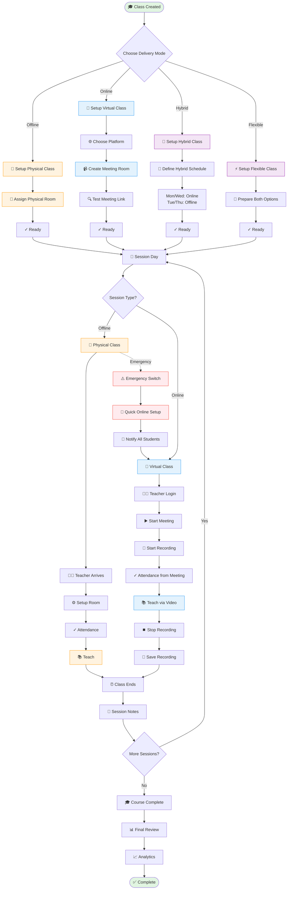

# 🎥 WF-05: Online & Hybrid Learning Management

> 🧭 **Triển khai**: xem [`IMPLEMENTATION-MAP.md`](./IMPLEMENTATION-MAP.md) §5 · **Scope**: 🚧 Roadmap P2

## Overview

**Workflow ID**: `wf_05`  
**Category**: Critical - Modern Learning Delivery  
**Phases**: 5 stages  
**Duration**: Ongoing (per class lifecycle)  
**Frequency**: Daily  
**MVP Scope**: ✅ Phase 2 (Enhanced Features)

---

## Description

Online & Hybrid Learning workflow quản lý toàn bộ quy trình giảng dạy linh hoạt từ lớp offline truyền thống đến online hoàn toàn, bao gồm cả chế độ hybrid và flexible cho phép học viên tự chọn.

**Business Impact**: 
- Mở rộng thị trường (học viên xa)
- Linh hoạt trong khủng hoảng (COVID-19)
- Tăng doanh thu (không giới hạn phòng học)
- Học viên hài lòng hơn (linh hoạt)
- Giảm chi phí cơ sở hạ tầng

---

## Workflow Diagram (Mermaid)



---

## Phase 1: Class Setup & Configuration

**Objective**: Configure class delivery mode and prepare resources

**Actors**: [[Academic Manager]], [[Branch Manager]], [[System Admin]]

### Step 1: Choose Delivery Mode

Khi tạo class mới, [[Academic Manager]] chọn delivery mode:

```typescript
enum ClassDeliveryMode {
  OFFLINE = 'offline',      // Traditional classroom
  ONLINE = 'online',        // Fully virtual
  HYBRID = 'hybrid',        // Mix of both (scheduled)
  FLEXIBLE = 'flexible'     // Student chooses each session
}

interface ClassConfiguration {
  class_id: string;
  delivery_mode: ClassDeliveryMode;
  
  // Offline settings
  branch_id?: string;
  default_room_id?: string;
  
  // Online settings
  meeting_platform?: 'zoom' | 'google_meet' | 'ms_teams';
  meeting_room_id?: string;
  permanent_meeting_link?: string;
  recording_enabled: boolean;
  
  // Hybrid settings
  hybrid_schedule?: {
    online_days: number[];    // [1, 3, 5] = Mon, Wed, Fri
    offline_days: number[];   // [2, 4] = Tue, Thu
  };
  
  // Flexible settings
  student_choice_enabled: boolean;
  choice_deadline_hours: number;  // Must choose 24h before
}
```

### Step 2A: Offline Class Setup

**Requirements**:
- Physical room at branch
- Projector, whiteboard, etc.
- Teacher can physically attend

**Configuration**:
```typescript
async function setupOfflineClass(classId: string) {
  const classData = await Class.findOne(classId);
  
  // Assign room
  const availableRooms = await findAvailableRooms({
    branch_id: classData.branch_id,
    capacity: classData.max_students,
    schedule: classData.schedule
  });
  
  if (availableRooms.length === 0) {
    throw new Error('No rooms available');
  }
  
  classData.room_id = availableRooms[0].id;
  classData.delivery_mode = ClassDeliveryMode.OFFLINE;
  await classData.save();
  
  // Notify teacher of room assignment
  await notifyTeacher(classData.teacher_id, {
    message: `Lớp ${classData.name} được giao phòng ${availableRooms[0].name}`,
    room_location: availableRooms[0].location
  });
  
  return classData;
}
```

### Step 2B: Online Class Setup

**Requirements**:
- Video conferencing platform account
- Meeting room creation
- Test meeting link

**Configuration**:
```typescript
async function setupOnlineClass(
  classId: string,
  platform: 'zoom' | 'google_meet' | 'ms_teams'
) {
  const classData = await Class.findOne(classId);
  
  // Create meeting room
  const meetingRoom = await createMeetingRoom({
    platform: platform,
    title: `${classData.name} - Online Class`,
    recurring: true,
    schedule: classData.schedule,
    duration: classData.session_duration,
    host_email: classData.teacher_email
  });
  
  classData.delivery_mode = ClassDeliveryMode.ONLINE;
  classData.meeting_platform = platform;
  classData.meeting_room_id = meetingRoom.id;
  classData.permanent_meeting_link = meetingRoom.join_url;
  classData.recording_enabled = true;
  await classData.save();
  
  // Send guide to teacher
  await sendOnlineTeachingGuide(classData.teacher_id, {
    platform: platform,
    meeting_link: meetingRoom.join_url,
    host_key: meetingRoom.host_key,
    instructions: getTeacherInstructions(platform)
  });
  
  // Send guide to students
  const students = await getEnrolledStudents(classId);
  for (const student of students) {
    await sendOnlineLearningGuide(student.id, {
      platform: platform,
      meeting_link: meetingRoom.join_url,
      how_to_join: getStudentInstructions(platform),
      system_requirements: getSystemRequirements(platform)
    });
  }
  
  return classData;
}

// Platform-specific meeting creation
async function createMeetingRoom(config: MeetingConfig) {
  switch (config.platform) {
    case 'zoom':
      return await zoomAPI.createMeeting({
        topic: config.title,
        type: 8, // Recurring with fixed time
        start_time: config.schedule.start_time,
        duration: config.duration,
        settings: {
          host_video: true,
          participant_video: true,
          join_before_host: false,
          mute_upon_entry: true,
          waiting_room: true,
          auto_recording: 'cloud'
        }
      });
      
    case 'google_meet':
      return await googleMeetAPI.createSpace({
        displayName: config.title,
        config: {
          entryPointAccess: 'ALL',
          accessType: 'TRUSTED'
        }
      });
      
    case 'ms_teams':
      return await teamsAPI.createOnlineMeeting({
        subject: config.title,
        startDateTime: config.schedule.start_time,
        endDateTime: calculateEndTime(config.schedule, config.duration),
        participants: {
          organizer: config.host_email
        }
      });
  }
}
```

### Step 2C: Hybrid Class Setup

**Configuration**:
```typescript
async function setupHybridClass(
  classId: string,
  hybridSchedule: HybridSchedule
) {
  const classData = await Class.findOne(classId);
  
  // Setup offline component
  await setupOfflineClass(classId);
  
  // Setup online component
  await setupOnlineClass(classId, hybridSchedule.online_platform);
  
  // Configure hybrid schedule
  classData.delivery_mode = ClassDeliveryMode.HYBRID;
  classData.hybrid_config = {
    online_days: hybridSchedule.online_days,
    offline_days: hybridSchedule.offline_days,
    student_choice: false
  };
  await classData.save();
  
  // Generate schedule for students
  const schedule = await generateHybridSchedule(classData);
  
  // Example:
  // Mon (1): Online via Zoom
  // Tue (2): Offline at Room 301
  // Wed (3): Online via Zoom
  // Thu (4): Offline at Room 301
  // Fri (5): Online via Zoom
  
  // Notify all students
  await notifyStudents(classId, {
    title: 'Lịch học Hybrid của bạn',
    schedule: schedule,
    online_link: classData.permanent_meeting_link,
    offline_location: `${classData.branch_name}, Phòng ${classData.room_name}`
  });
  
  return { classData, schedule };
}
```

### Step 2D: Flexible Class Setup

**Configuration**:
```typescript
async function setupFlexibleClass(classId: string) {
  const classData = await Class.findOne(classId);
  
  // Prepare both options
  await setupOfflineClass(classId);
  await setupOnlineClass(classId, 'zoom');
  
  classData.delivery_mode = ClassDeliveryMode.FLEXIBLE;
  classData.hybrid_config = {
    student_choice: true,
    choice_deadline_hours: 24, // Must choose 24h before session
    online_days: [],
    offline_days: []
  };
  await classData.save();
  
  // Notify students about flexibility
  await notifyStudents(classId, {
    title: 'Lớp học linh hoạt - Bạn chọn!',
    message: `
Bạn có thể chọn học Online hoặc Offline cho mỗi buổi học.

📍 Offline: ${classData.branch_name}, Phòng ${classData.room_name}
🎥 Online: ${classData.permanent_meeting_link}

⏰ Vui lòng chọn trước 24 giờ trước giờ học.
    `
  });
  
  return classData;
}
```

---

## Phase 2: Session Preparation (Per Session)

**Objective**: Prepare for each individual class session

**Actors**: [[Teacher]], Students, System

### For Offline Sessions

**Teacher Preparation**:
```typescript
// Day before session
async function prepareOfflineSession(sessionId: string) {
  const session = await ClassSession.findOne(sessionId);
  const teacher = await Teacher.findOne(session.teacher_id);
  
  // Check room availability
  const room = await Room.findOne(session.room_id);
  if (!room.available) {
    // Find alternative room
    const alternatives = await findAvailableRooms({
      date: session.date,
      time: session.start_time,
      capacity: session.expected_students
    });
    
    if (alternatives.length > 0) {
      // Reassign room
      session.room_id = alternatives[0].id;
      await session.save();
      
      // Notify teacher and students
      await notifyRoomChange(sessionId, alternatives[0]);
    } else {
      // No room available - suggest online
      await suggestOnlineAlternative(sessionId);
    }
  }
  
  // Remind teacher
  await sendReminder(teacher.id, {
    title: 'Nhắc nhở: Buổi học ngày mai',
    session: session,
    room: room,
    materials_checklist: [
      'Giáo án',
      'Tài liệu in',
      'USB/laptop',
      'Điểm danh'
    ]
  });
}
```

### For Online Sessions

**Teacher Preparation**:
```typescript
// 1 hour before session
async function prepareOnlineSession(sessionId: string) {
  const session = await ClassSession.findOne(sessionId);
  const teacher = await Teacher.findOne(session.teacher_id);
  
  // Test meeting link
  const meetingStatus = await testMeetingLink(session.meeting_link);
  
  if (!meetingStatus.accessible) {
    // Recreate meeting
    const newMeeting = await recreateMeeting(session);
    session.meeting_link = newMeeting.join_url;
    await session.save();
    
    // Notify students of new link
    await notifyStudents(session.class_id, {
      title: 'Link học mới',
      urgent: true,
      meeting_link: newMeeting.join_url
    });
  }
  
  // Remind teacher to:
  await sendReminder(teacher.id, {
    title: 'Chuẩn bị buổi học online',
    checklist: [
      '✓ Kiểm tra camera và micro',
      '✓ Tải tài liệu lên màn hình chia sẻ',
      '✓ Chuẩn bị bài tập tương tác',
      '✓ Vào sớm 10 phút để test'
    ],
    meeting_link: session.meeting_link,
    start_time: session.start_time
  });
  
  // Remind students
  const students = await getEnrolledStudents(session.class_id);
  for (const student of students) {
    await sendReminder(student.id, {
      title: 'Buổi học sắp bắt đầu',
      time_until: calculateTimeUntil(session.start_time),
      meeting_link: session.meeting_link,
      tips: [
        'Vào sớm 5 phút',
        'Kiểm tra internet',
        'Chuẩn bị sách vở',
        'Tìm chỗ yên tĩnh'
      ]
    });
  }
}
```

### For Flexible Sessions

**Student Choice Collection**:
```typescript
// 24 hours before session
async function collectStudentChoices(sessionId: string) {
  const session = await ClassSession.findOne(sessionId);
  const students = await getEnrolledStudents(session.class_id);
  
  for (const student of students) {
    // Check if student has chosen
    const choice = await StudentSessionChoice.findOne({
      student_id: student.id,
      session_id: sessionId
    });
    
    if (!choice) {
      // Send reminder to choose
      await sendChoiceReminder(student.id, {
        session: session,
        deadline: addHours(session.start_time, -24),
        options: {
          online: session.meeting_link,
          offline: `${session.room_name} at ${session.branch_name}`
        }
      });
    }
  }
  
  // 1 hour before deadline, send final warning
  setTimeout(async () => {
    await sendFinalChoiceWarning(sessionId);
  }, hoursToMs(23));
}

// Student makes choice
async function recordStudentChoice(
  studentId: string,
  sessionId: string,
  choice: 'online' | 'offline'
) {
  await StudentSessionChoice.create({
    student_id: studentId,
    session_id: sessionId,
    choice: choice,
    chosen_at: new Date()
  });
  
  const session = await ClassSession.findOne(sessionId);
  
  // Send confirmation
  await notifyStudent(studentId, {
    title: 'Đã ghi nhận lựa chọn',
    message: choice === 'online' 
      ? `Bạn sẽ học online qua: ${session.meeting_link}`
      : `Bạn sẽ học offline tại: ${session.room_name}`,
    time: session.start_time
  });
}
```

---

## Phase 3: Session Delivery

**Objective**: Conduct the actual class session

**Actors**: [[Teacher]], Students, System

### Offline Session Flow

```typescript
async function conductOfflineSession(sessionId: string) {
  const session = await ClassSession.findOne(sessionId);
  
  // 1. Teacher arrives and checks in
  await teacherCheckIn(session.teacher_id, sessionId);
  
  // 2. Setup room
  // (Physical setup - no system action)
  
  // 3. Students arrive - mark attendance
  // Manual or auto (card/QR scan)
  const attendanceRecords = [];
  for (const student of session.enrolled_students) {
    const record = await markAttendance({
      session_id: sessionId,
      student_id: student.id,
      mode: 'offline',
      status: 'present', // or 'late', 'absent'
      checked_in_at: new Date()
    });
    attendanceRecords.push(record);
  }
  
  // 4. Teach class
  session.status = 'in_progress';
  session.started_at = new Date();
  await session.save();
  
  // 5. End of class
  session.status = 'completed';
  session.ended_at = new Date();
  await session.save();
  
  // 6. Teacher adds notes
  await addSessionNotes(sessionId, {
    content_covered: '...',
    homework_assigned: '...',
    student_performance: '...',
    issues: '...'
  });
  
  return { session, attendance: attendanceRecords };
}
```

### Online Session Flow

```typescript
async function conductOnlineSession(sessionId: string) {
  const session = await ClassSession.findOne(sessionId);
  
  // 1. Teacher starts meeting
  const meeting = await startMeeting(session.meeting_room_id);
  
  session.status = 'in_progress';
  session.started_at = new Date();
  session.meeting_started = true;
  await session.save();
  
  // 2. Start recording automatically
  if (session.recording_enabled) {
    await startRecording(meeting.id);
  }
  
  // 3. Students join - auto attendance
  // (Webhook from meeting platform)
  const attendanceSync = await syncAttendanceFromMeeting({
    meeting_id: meeting.id,
    session_id: sessionId,
    platform: session.meeting_platform
  });
  
  // 4. Monitor session
  // - Track who joins/leaves
  // - Monitor engagement (chat, polls)
  // - Detect issues (connection problems)
  
  // 5. End meeting
  await endMeeting(meeting.id);
  
  // 6. Stop recording
  const recording = await stopRecording(meeting.id);
  
  // 7. Process recording
  const processedRecording = await processRecording({
    recording_id: recording.id,
    session_id: sessionId,
    actions: [
      'download',
      'transcode', // Convert to web-friendly format
      'generate_thumbnail',
      'upload_to_storage',
      'create_access_link'
    ]
  });
  
  // 8. Save recording info
  session.status = 'completed';
  session.ended_at = new Date();
  session.recording_url = processedRecording.playback_url;
  session.recording_duration = processedRecording.duration;
  await session.save();
  
  // 9. Notify students recording is available
  await notifyStudents(session.class_id, {
    title: 'Bài học đã được ghi lại',
    message: 'Bạn có thể xem lại buổi học tại thư viện',
    recording_url: processedRecording.playback_url,
    expires_in_days: 30
  });
  
  return { session, recording: processedRecording, attendance: attendanceSync };
}

// Webhook handler for attendance sync
async function syncAttendanceFromMeeting(config: AttendanceSyncConfig) {
  // Get participant list from meeting platform
  const participants = await getMeetingParticipants(
    config.platform,
    config.meeting_id
  );
  
  const attendanceRecords = [];
  
  for (const participant of participants) {
    // Match participant to student (by email or name)
    const student = await matchParticipantToStudent(participant);
    
    if (student) {
      const record = await Attendance.create({
        session_id: config.session_id,
        student_id: student.id,
        mode: 'online',
        status: calculateStatus(participant.join_time, session.start_time),
        checked_in_at: participant.join_time,
        left_at: participant.leave_time,
        duration_minutes: participant.duration
      });
      
      attendanceRecords.push(record);
    }
  }
  
  return attendanceRecords;
}
```

---

## Phase 4: Emergency Mode Switch

**Objective**: Quickly switch from offline to online in emergency situations

**Actors**: [[Branch Manager]], [[Academic Manager]], System

**Trigger Events**:
- COVID-19 lockdown
- Natural disaster
- Building maintenance
- Teacher illness (can teach from home)
- Student quarantine

```typescript
async function emergencySwitchToOnline(
  classId: string,
  reason: string,
  effectiveFromDate: Date
) {
  const classData = await Class.findOne(classId);
  
  // 1. Create backup of current configuration
  await ClassConfigHistory.create({
    class_id: classId,
    original_mode: classData.delivery_mode,
    changed_to: ClassDeliveryMode.ONLINE,
    reason: reason,
    changed_at: new Date(),
    effective_from: effectiveFromDate,
    changed_by: getCurrentUserId()
  });
  
  // 2. Setup online infrastructure ASAP
  const meetingRoom = await createMeetingRoom({
    platform: 'zoom', // Use fastest platform
    title: `${classData.name} - Emergency Online`,
    recurring: true,
    schedule: classData.schedule,
    host_email: classData.teacher_email
  });
  
  // 3. Update class configuration
  classData.delivery_mode = ClassDeliveryMode.ONLINE;
  classData.meeting_platform = 'zoom';
  classData.meeting_room_id = meetingRoom.id;
  classData.permanent_meeting_link = meetingRoom.join_url;
  classData.emergency_mode = true;
  classData.emergency_reason = reason;
  await classData.save();
  
  // 4. Update all future sessions
  await ClassSession.update(
    {
      class_id: classId,
      date: GreaterThanOrEqual(effectiveFromDate),
      status: 'scheduled'
    },
    {
      delivery_mode: 'online',
      meeting_link: meetingRoom.join_url,
      room_id: null // Clear physical room
    }
  );
  
  // 5. URGENT notification to teacher
  await sendUrgentNotification(classData.teacher_id, {
    title: '🚨 KHẨN: Chuyển sang học online',
    message: `
Lớp ${classData.name} chuyển sang học online từ ${formatDate(effectiveFromDate)}

Lý do: ${reason}

Link học: ${meetingRoom.join_url}

Hướng dẫn chi tiết đã được gửi qua email.
Vui lòng liên hệ nếu cần hỗ trợ.
    `,
    priority: 'urgent',
    require_acknowledgment: true
  });
  
  // 6. Send detailed guide to teacher
  await sendEmail(classData.teacher_email, {
    subject: 'Hướng dẫn giảng dạy online khẩn cấp',
    template: 'emergency_online_teaching_guide',
    data: {
      teacher_name: classData.teacher_name,
      class_name: classData.name,
      meeting_link: meetingRoom.join_url,
      host_key: meetingRoom.host_key,
      platform: 'Zoom',
      instructions: getEmergencyTeachingInstructions(),
      support_contact: 'support@school.vn',
      support_phone: '1900-xxxx'
    }
  });
  
  // 7. URGENT notification to all students
  const students = await getEnrolledStudents(classId);
  
  for (const student of students) {
    await sendUrgentNotification(student.id, {
      title: '🚨 THÔNG BÁO QUAN TRỌNG',
      message: `
Lớp ${classData.name} chuyển sang học ONLINE từ ${formatDate(effectiveFromDate)}

Lý do: ${reason}

🎥 Link học: ${meetingRoom.join_url}

📱 Hướng dẫn tham gia đã được gửi qua email và SMS.

Vui lòng kiểm tra và chuẩn bị:
- Máy tính/điện thoại có camera và micro
- Kết nối internet ổn định
- Tải ứng dụng Zoom (nếu chưa có)

📞 Hỗ trợ: 1900-xxxx
      `,
      priority: 'urgent'
    });
    
    // Send SMS backup
    await sendSMS(student.phone, `
KHẨN: Lớp ${classData.name} chuyển học online từ ${formatDate(effectiveFromDate)}.
Link: ${meetingRoom.join_url}
Xem email để biết chi tiết.
    `);
    
    // Send detailed email guide
    await sendEmail(student.email, {
      subject: `QUAN TRỌNG: Lớp ${classData.name} chuyển sang online`,
      template: 'emergency_online_learning_guide',
      data: {
        student_name: student.name,
        class_name: classData.name,
        meeting_link: meetingRoom.join_url,
        platform: 'Zoom',
        how_to_join: getStudentJoinInstructions(),
        system_requirements: getSystemRequirements('zoom'),
        tips: getOnlineLearningTips()
      }
    });
  }
  
  // 8. Notify parents if addon enabled
  if (await isAddonEnabled('parent_portal')) {
    await notifyParents(classId, {
      title: 'Thông báo: Lớp chuyển sang online',
      reason: reason,
      effective_date: effectiveFromDate,
      meeting_link: meetingRoom.join_url
    });
  }
  
  // 9. Create support ticket for monitoring
  await createSupportTicket({
    type: 'emergency_mode_switch',
    class_id: classId,
    priority: 'high',
    description: `Monitor emergency online switch for class ${classData.name}`,
    assigned_to: 'support_team',
    due_date: effectiveFromDate
  });
  
  // 10. Log audit trail
  await AuditLog.create({
    action: 'emergency_mode_switch',
    entity: 'class',
    entity_id: classId,
    user_id: getCurrentUserId(),
    details: {
      from_mode: classData.delivery_mode,
      to_mode: 'online',
      reason: reason,
      effective_from: effectiveFromDate,
      students_notified: students.length,
      teacher_notified: true
    },
    timestamp: new Date()
  });
  
  return {
    success: true,
    meeting_link: meetingRoom.join_url,
    students_notified: students.length,
    effective_from: effectiveFromDate
  };
}
```

---

## Phase 5: Post-Session & Analytics

**Objective**: Process session data and provide insights

**Actors**: [[Teacher]], [[Academic Manager]], System

### Recording Processing

```typescript
async function processSessionRecording(sessionId: string) {
  const session = await ClassSession.findOne(sessionId);
  const recording = await Recording.findOne({ session_id: sessionId });
  
  // 1. Download from meeting platform
  const videoFile = await downloadRecording(recording.platform_id);
  
  // 2. Transcode to web-friendly format
  const transcoded = await transcodeVideo({
    input: videoFile,
    formats: [
      { resolution: '720p', bitrate: '2000k' },
      { resolution: '480p', bitrate: '1000k' },
      { resolution: '360p', bitrate: '500k' }
    ]
  });
  
  // 3. Generate thumbnail
  const thumbnail = await generateThumbnail(videoFile, '00:01:00');
  
  // 4. Extract audio for accessibility
  const audioTrack = await extractAudio(videoFile);
  
  // 5. Optional: Generate transcript with AI
  if (await isFeatureEnabled('ai_transcription')) {
    const transcript = await generateTranscript(audioTrack);
    recording.transcript = transcript;
  }
  
  // 6. Upload to storage
  const urls = await uploadToStorage({
    video: transcoded,
    thumbnail: thumbnail,
    audio: audioTrack,
    path: `recordings/${session.class_id}/${sessionId}`
  });
  
  // 7. Update recording record
  recording.status = 'processed';
  recording.playback_url = urls.video;
  recording.thumbnail_url = urls.thumbnail;
  recording.audio_url = urls.audio;
  recording.processed_at = new Date();
  await recording.save();
  
  // 8. Make available to students
  await ContentLibrary.create({
    type: 'video',
    title: `${session.class_name} - ${formatDate(session.date)}`,
    url: urls.video,
    thumbnail: urls.thumbnail,
    duration: recording.duration,
    class_id: session.class_id,
    session_id: sessionId,
    access_level: 'enrolled',
    published_at: new Date()
  });
  
  // 9. Notify students
  await notifyStudents(session.class_id, {
    title: 'Bài học mới đã sẵn sàng',
    message: `Xem lại buổi học ${formatDate(session.date)}`,
    link: `/library/videos/${recording.id}`
  });
  
  return recording;
}
```

### Attendance Analytics

```typescript
async function analyzeAttendance(classId: string) {
  const sessions = await ClassSession.find({ class_id: classId });
  const students = await getEnrolledStudents(classId);
  
  const analytics = {
    overall: {
      total_sessions: sessions.length,
      completed_sessions: sessions.filter(s => s.status === 'completed').length,
      online_sessions: sessions.filter(s => s.delivery_mode === 'online').length,
      offline_sessions: sessions.filter(s => s.delivery_mode === 'offline').length
    },
    attendance: {
      average_rate: 0,
      by_mode: {
        online: 0,
        offline: 0
      },
      by_student: []
    }
  };
  
  // Calculate per student
  for (const student of students) {
    const attendance = await Attendance.find({
      student_id: student.id,
      session_id: In(sessions.map(s => s.id))
    });
    
    const present = attendance.filter(a => a.status === 'present').length;
    const rate = (present / sessions.length) * 100;
    
    const onlinePresent = attendance.filter(
      a => a.mode === 'online' && a.status === 'present'
    ).length;
    const offlinePresent = attendance.filter(
      a => a.mode === 'offline' && a.status === 'present'
    ).length;
    
    analytics.attendance.by_student.push({
      student_id: student.id,
      student_name: student.name,
      attendance_rate: rate,
      total_present: present,
      total_sessions: sessions.length,
      online_present: onlinePresent,
      offline_present: offlinePresent,
      status: rate >= 80 ? 'good' : rate >= 60 ? 'warning' : 'at_risk'
    });
  }
  
  // Calculate averages
  analytics.attendance.average_rate = 
    average(analytics.attendance.by_student.map(s => s.attendance_rate));
  
  analytics.attendance.by_mode.online = 
    average(analytics.attendance.by_student.map(s => 
      (s.online_present / analytics.overall.online_sessions) * 100
    ));
  
  analytics.attendance.by_mode.offline = 
    average(analytics.attendance.by_student.map(s => 
      (s.offline_present / analytics.overall.offline_sessions) * 100
    ));
  
  return analytics;
}
```

### Learning Mode Effectiveness

```typescript
async function analyzeLearningModeEffectiveness(classId: string) {
  const classData = await Class.findOne(classId);
  const students = await getEnrolledStudents(classId);
  
  const analysis = {
    class_id: classId,
    delivery_mode: classData.delivery_mode,
    metrics: {
      attendance: {
        online: { rate: 0, average_duration: 0 },
        offline: { rate: 0 }
      },
      engagement: {
        online: { chat_messages: 0, questions_asked: 0 },
        offline: { participation_score: 0 }
      },
      performance: {
        online_avg_grade: 0,
        offline_avg_grade: 0,
        overall_avg_grade: 0
      }
    },
    insights: [],
    recommendations: []
  };
  
  // Calculate metrics...
  // (Implementation details)
  
  // Generate insights
  if (analysis.metrics.attendance.online.rate < analysis.metrics.attendance.offline.rate - 10) {
    analysis.insights.push('Online attendance significantly lower than offline');
    analysis.recommendations.push('Investigate online learning barriers');
    analysis.recommendations.push('Consider hybrid mode to improve flexibility');
  }
  
  if (analysis.metrics.performance.online_avg_grade < analysis.metrics.performance.offline_avg_grade - 0.5) {
    analysis.insights.push('Online learning outcomes lower than offline');
    analysis.recommendations.push('Enhance online teaching methods');
    analysis.recommendations.push('Provide more interactive online activities');
    analysis.recommendations.push('Offer additional online support resources');
  }
  
  return analysis;
}
```

---

## Success Metrics

### Delivery Mode Adoption
- **Online Classes**: 30% of total classes
- **Hybrid Classes**: 20% of total classes
- **Flexible Classes**: 10% of total classes
- **Emergency Switches**: <5% of classes, <1% failure rate

### Attendance Rates
- **Online**: 85%+ (Target: 80%+)
- **Offline**: 92%+ (Target: 90%+)
- **Hybrid**: 88%+ (Target: 85%+)

### Student Satisfaction
- **Online Experience**: 4.0/5 (Target: 3.8/5)
- **Recording Quality**: 4.2/5 (Target: 4.0/5)
- **Hybrid Flexibility**: 4.5/5 (Target: 4.3/5)

### Technical Performance
- **Meeting Uptime**: 99.5%+ (Target: 99%+)
- **Recording Success Rate**: 98%+ (Target: 95%+)
- **Emergency Switch Time**: <2 hours (Target: <4 hours)

---

## Related Workflows

- [[WF-02 Teaching & Learning Cycle]] - Core teaching process
- [[WF-06 Digital Library & Content Management]] - Recording storage
- [[WF-08 Communication Hub]] - Notifications and messaging

---

## Related Roles

- [[Academic Manager]] - Configure class modes
- [[Teacher]] - Deliver sessions
- [[Student]] - Attend and learn
- [[Branch Manager]] - Manage resources
- [[IT Support]] - Technical assistance

---

**Last Updated**: 2026-08-25  
**Reviewed By**: Academic Manager, IT Support  
**Next Review**: 2026-09-25
