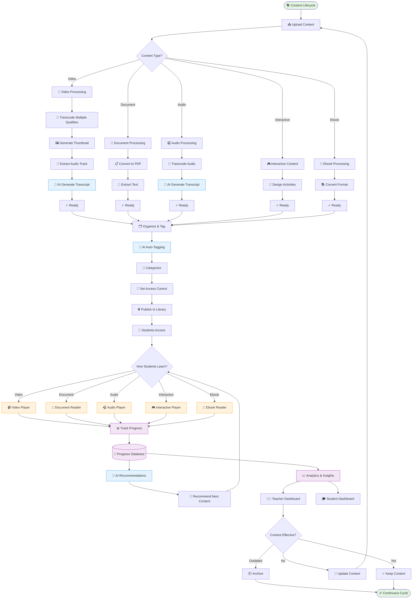

# 📚 WF-06: Digital Library & Content Management

> 🧭 **Triển khai**: xem [`IMPLEMENTATION-MAP.md`](./IMPLEMENTATION-MAP.md) §6 · **Scope**: 🚧 Roadmap P2

## Overview

**Workflow ID**: `wf_06`  
**Category**: Critical - Modern Learning Resources  
**Phases**: 6 stages  
**Duration**: Continuous lifecycle  
**Frequency**: Daily content updates  
**MVP Scope**: ✅ Phase 1 (Basic), Phase 2 (Enhanced)

---

## Description

Digital Library workflow quản lý toàn bộ vòng đời của nội dung học tập từ upload, organize, distribute đến track usage và analytics. Hệ thống hỗ trợ đa dạng loại content: video, document, audio, ebook, interactive content với AI-powered recommendations.

**Business Impact**: 
- Tăng engagement học viên (70%+ complete rate)
- Giảm workload giáo viên (tái sử dụng content)
- Học viên có thể học mọi lúc mọi nơi
- Tracking chi tiết tiến độ học tập
- Cá nhân hóa learning experience

---

## Workflow Diagram (Mermaid)



---

## Phase 1: Content Upload & Processing

**Objective**: Upload and prepare content for delivery

**Actors**: [[Teacher]], [[Librarian]], [[Academic Manager]], System

### Step 1: Upload Content

**Teacher/Librarian uploads content**:

```typescript
interface ContentUpload {
  title: string;
  description: string;
  type: 'video' | 'document' | 'audio' | 'interactive' | 'ebook';
  file: File;
  
  // Metadata
  program_id?: string;
  class_id?: string;
  lesson_id?: string;
  tags: string[];
  level: 'beginner' | 'intermediate' | 'advanced';
  language: 'vi' | 'en';
  
  // Access control
  access_level: 'public' | 'enrolled' | 'class' | 'paid';
  available_from?: Date;
  expires_at?: Date;
}

async function uploadContent(upload: ContentUpload, uploadedBy: string) {
  // 1. Validate file
  const validation = validateFile(upload.file, upload.type);
  if (!validation.valid) {
    throw new Error(validation.error);
  }
  
  // 2. Create content record
  const content = await Content.create({
    title: upload.title,
    description: upload.description,
    type: upload.type,
    status: 'processing',
    uploaded_by: uploadedBy,
    uploaded_at: new Date(),
    file_size: upload.file.size,
    file_name: upload.file.name,
    ...upload
  });
  
  // 3. Upload to storage
  const storagePath = `content/${content.type}/${content.id}/${upload.file.name}`;
  const uploadResult = await uploadToStorage(upload.file, storagePath);
  
  content.raw_url = uploadResult.url;
  await content.save();
  
  // 4. Queue for processing
  await contentProcessingQueue.add({
    content_id: content.id,
    type: upload.type,
    raw_url: uploadResult.url
  });
  
  return content;
}
```

### Step 2A: Video Processing

```typescript
async function processVideo(contentId: string) {
  const content = await Content.findOne(contentId);
  
  try {
    // 1. Download original
    const originalFile = await downloadFile(content.raw_url);
    
    // 2. Transcode to multiple qualities
    const transcoded = await transcodeVideo({
      input: originalFile,
      outputs: [
        { resolution: '1080p', bitrate: '4000k', format: 'mp4' },
        { resolution: '720p', bitrate: '2000k', format: 'mp4' },
        { resolution: '480p', bitrate: '1000k', format: 'mp4' },
        { resolution: '360p', bitrate: '500k', format: 'mp4' }
      ]
    });
    
    // 3. Generate thumbnail (at 10% point)
    const duration = await getVideoDuration(originalFile);
    const thumbnailTime = Math.floor(duration * 0.1);
    const thumbnail = await generateThumbnail(originalFile, thumbnailTime);
    
    // 4. Extract audio track (for accessibility)
    const audioTrack = await extractAudio(originalFile, 'mp3');
    
    // 5. Generate transcript with AI
    const transcript = await generateTranscript(audioTrack);
    
    // 6. Generate subtitles from transcript
    const subtitles = await generateSubtitles(transcript, duration);
    
    // 7. Upload all assets
    const assets = await uploadAssets({
      videos: transcoded,
      thumbnail: thumbnail,
      audio: audioTrack,
      transcript: transcript,
      subtitles: subtitles,
      path: `content/video/${contentId}`
    });
    
    // 8. Update content record
    content.status = 'ready';
    content.url = assets.videos['720p']; // Default quality
    content.thumbnail_url = assets.thumbnail;
    content.audio_url = assets.audio;
    content.transcript = transcript.text;
    content.subtitles_url = assets.subtitles;
    content.duration = duration;
    content.available_qualities = ['360p', '480p', '720p', '1080p'];
    content.processed_at = new Date();
    await content.save();
    
    // 9. Notify uploader
    await notifyUser(content.uploaded_by, {
      title: 'Video đã xử lý xong',
      message: `${content.title} đã sẵn sàng sử dụng`,
      link: `/library/videos/${content.id}`
    });
    
    return content;
    
  } catch (error) {
    content.status = 'failed';
    content.processing_error = error.message;
    await content.save();
    throw error;
  }
}

// AI Transcript Generation
async function generateTranscript(audioFile: Buffer): Promise<Transcript> {
  // Use OpenAI Whisper API
  const response = await openai.audio.transcriptions.create({
    file: audioFile,
    model: 'whisper-1',
    language: 'vi', // or detect automatically
    response_format: 'verbose_json',
    timestamp_granularities: ['word', 'segment']
  });
  
  return {
    text: response.text,
    language: response.language,
    duration: response.duration,
    segments: response.segments.map(seg => ({
      start: seg.start,
      end: seg.end,
      text: seg.text
    })),
    words: response.words.map(word => ({
      word: word.word,
      start: word.start,
      end: word.end
    }))
  };
}
```

### Step 2B: Document Processing

```typescript
async function processDocument(contentId: string) {
  const content = await Content.findOne(contentId);
  
  try {
    const originalFile = await downloadFile(content.raw_url);
    
    // 1. Convert to PDF (if not already)
    let pdfFile = originalFile;
    if (content.file_name.endsWith('.docx') || content.file_name.endsWith('.pptx')) {
      pdfFile = await convertToPDF(originalFile);
    }
    
    // 2. Extract text for search
    const extractedText = await extractTextFromPDF(pdfFile);
    
    // 3. Generate thumbnail (first page)
    const thumbnail = await generatePDFThumbnail(pdfFile, 1);
    
    // 4. Get page count
    const pageCount = await getPDFPageCount(pdfFile);
    
    // 5. Upload assets
    const assets = await uploadAssets({
      pdf: pdfFile,
      thumbnail: thumbnail,
      path: `content/documents/${contentId}`
    });
    
    // 6. Update content
    content.status = 'ready';
    content.url = assets.pdf;
    content.thumbnail_url = assets.thumbnail;
    content.extracted_text = extractedText;
    content.page_count = pageCount;
    content.processed_at = new Date();
    await content.save();
    
    // 7. Notify uploader
    await notifyUser(content.uploaded_by, {
      title: 'Tài liệu đã xử lý xong',
      message: `${content.title} đã sẵn sàng`,
      link: `/library/documents/${content.id}`
    });
    
    return content;
    
  } catch (error) {
    content.status = 'failed';
    content.processing_error = error.message;
    await content.save();
    throw error;
  }
}
```

### Step 2C: Interactive Content Creation

```typescript
interface InteractiveContent {
  type: 'drag_drop' | 'fill_blanks' | 'matching' | 'flashcards' | 'quiz';
  content: any; // Type-specific structure
  auto_gradable: boolean;
  max_attempts?: number;
  show_solution: boolean;
}

// Example: Fill in the blanks
interface FillBlanksContent {
  text: string; // "The capital of Vietnam is __blank__."
  blanks: Array<{
    id: string;
    position: number;
    correct_answers: string[]; // ["Hanoi", "Ha Noi"]
    case_sensitive: boolean;
  }>;
  instructions: string;
}

async function createInteractiveContent(
  contentData: ContentUpload,
  interactiveConfig: InteractiveContent
) {
  const content = await Content.create({
    ...contentData,
    type: 'interactive',
    interactive_type: interactiveConfig.type,
    interactive_config: interactiveConfig,
    status: 'ready',
    processed_at: new Date()
  });
  
  return content;
}
```

---

## Phase 2: Organization & Tagging

**Objective**: Organize content for easy discovery

**Actors**: [[Librarian]], [[Teacher]], AI System

### AI-Powered Auto-Tagging

```typescript
async function autoTagContent(contentId: string) {
  const content = await Content.findOne(contentId);
  
  // 1. Prepare content for AI analysis
  const analysisInput = {
    title: content.title,
    description: content.description,
    extracted_text: content.extracted_text || content.transcript,
    type: content.type,
    language: content.language
  };
  
  // 2. Call AI to generate tags
  const aiTags = await generateTags(analysisInput);
  
  // 3. Detect topics and categories
  const topics = await detectTopics(analysisInput);
  
  // 4. Determine difficulty level (if not set)
  if (!content.level) {
    content.level = await detectDifficultyLevel(analysisInput);
  }
  
  // 5. Suggest related content
  const relatedContent = await findRelatedContent(contentId, topics);
  
  // 6. Update content
  content.ai_generated_tags = aiTags;
  content.topics = topics;
  content.related_content_ids = relatedContent.map(c => c.id);
  await content.save();
  
  return { tags: aiTags, topics, level: content.level };
}

async function generateTags(input: any): Promise<string[]> {
  const prompt = `
Phân tích nội dung học tập sau và tạo tags phù hợp:

Tiêu đề: ${input.title}
Mô tả: ${input.description}
Nội dung: ${input.extracted_text?.substring(0, 1000)}

Hãy tạo 5-10 tags ngắn gọn (tiếng Việt) để mô tả:
- Chủ đề chính
- Kỹ năng liên quan
- Mức độ (nếu xác định được)
- Loại nội dung

Trả về JSON array: ["tag1", "tag2", ...]
  `;
  
  const response = await callAI({
    model: 'gpt-4',
    prompt: prompt,
    response_format: 'json'
  });
  
  return response.tags;
}
```

### Categorization

```typescript
interface ContentCategory {
  id: string;
  name: string;
  parent_id?: string;
  level: number;
}

// Example hierarchy:
// - English (level 0)
//   - Grammar (level 1)
//     - Tenses (level 2)
//       - Present Simple (level 3)
//   - Vocabulary (level 1)
//   - Speaking (level 1)
//   - Listening (level 1)

async function categorizeContent(contentId: string, categoryIds: string[]) {
  await ContentCategoryMapping.createMany(
    categoryIds.map(catId => ({
      content_id: contentId,
      category_id: catId
    }))
  );
  
  // Update content's primary category
  const content = await Content.findOne(contentId);
  content.primary_category_id = categoryIds[0];
  await content.save();
}
```

---

## Phase 3: Access Control & Publishing

**Objective**: Control who can access what content

**Actors**: [[Teacher]], [[Librarian]], [[Academic Manager]]

### Access Levels

```typescript
enum AccessLevel {
  PUBLIC = 'public',           // Anyone can view
  ENROLLED = 'enrolled',       // Enrolled students only
  CLASS = 'class',             // Specific class only
  PROGRAM = 'program',         // Specific program
  PAID = 'paid',               // Purchased separately
  PREMIUM = 'premium'          // Premium subscription
}

interface AccessControl {
  content_id: string;
  access_level: AccessLevel;
  
  // Specific restrictions
  allowed_class_ids?: string[];
  allowed_program_ids?: string[];
  allowed_student_ids?: string[];
  
  // Time-based
  available_from?: Date;
  expires_at?: Date;
  
  // Download control
  allow_download: boolean;
  max_downloads?: number;
  
  // DRM
  drm_enabled: boolean;
}

async function setAccessControl(
  contentId: string,
  accessControl: AccessControl
) {
  const content = await Content.findOne(contentId);
  
  content.access_level = accessControl.access_level;
  content.allowed_class_ids = accessControl.allowed_class_ids;
  content.allowed_program_ids = accessControl.allowed_program_ids;
  content.available_from = accessControl.available_from;
  content.expires_at = accessControl.expires_at;
  content.allow_download = accessControl.allow_download;
  content.drm_enabled = accessControl.drm_enabled;
  
  await content.save();
  
  return content;
}

// Check if student can access content
async function canAccessContent(
  studentId: string,
  contentId: string
): Promise<{ can_access: boolean; reason?: string }> {
  const content = await Content.findOne(contentId);
  const student = await Student.findOne(studentId);
  
  // Check time-based restrictions
  const now = new Date();
  if (content.available_from && now < content.available_from) {
    return { can_access: false, reason: 'Not yet available' };
  }
  if (content.expires_at && now > content.expires_at) {
    return { can_access: false, reason: 'Expired' };
  }
  
  // Check access level
  switch (content.access_level) {
    case AccessLevel.PUBLIC:
      return { can_access: true };
      
    case AccessLevel.ENROLLED:
      const hasEnrollment = await Enrollment.exists({
        student_id: studentId,
        status: 'active'
      });
      return {
        can_access: hasEnrollment,
        reason: hasEnrollment ? undefined : 'Must be enrolled in any class'
      };
      
    case AccessLevel.CLASS:
      if (!content.allowed_class_ids?.length) {
        return { can_access: false, reason: 'No classes configured' };
      }
      const inClass = await Enrollment.exists({
        student_id: studentId,
        class_id: In(content.allowed_class_ids),
        status: 'active'
      });
      return {
        can_access: inClass,
        reason: inClass ? undefined : 'Must be enrolled in this class'
      };
      
    case AccessLevel.PAID:
      const hasPurchased = await ContentPurchase.exists({
        student_id: studentId,
        content_id: contentId,
        status: 'completed'
      });
      return {
        can_access: hasPurchased,
        reason: hasPurchased ? undefined : 'Must purchase this content'
      };
      
    default:
      return { can_access: false, reason: 'Unknown access level' };
  }
}
```

---

## Phase 4: Student Consumption & Tracking

**Objective**: Deliver content and track learning progress

**Actors**: [[Student]], System

### Video Player with Tracking

```typescript
interface VideoPlayerState {
  content_id: string;
  student_id: string;
  
  // Playback
  current_time: number;
  duration: number;
  quality: '360p' | '480p' | '720p' | '1080p';
  playback_rate: number;
  
  // Features
  subtitles_enabled: boolean;
  volume: number;
  
  // User actions
  notes: Array<{
    timestamp: number;
    note: string;
  }>;
  bookmarks: number[];
  
  // Tracking
  watch_progress: number; // 0-100%
  total_watch_time: number; // seconds
  completed: boolean;
}

async function trackVideoProgress(
  studentId: string,
  contentId: string,
  currentTime: number,
  duration: number
) {
  const progress = Math.floor((currentTime / duration) * 100);
  
  let record = await ContentProgress.findOne({
    student_id: studentId,
    content_id: contentId
  });
  
  if (!record) {
    record = await ContentProgress.create({
      student_id: studentId,
      content_id: contentId,
      started_at: new Date(),
      progress: 0,
      watch_time: 0
    });
  }
  
  // Update progress (only increase, never decrease)
  record.progress = Math.max(record.progress, progress);
  record.last_accessed_at = new Date();
  record.watch_time += 5; // Assume 5 seconds since last update
  
  // Mark as completed if watched 90%+
  if (progress >= 90 && !record.completed) {
    record.completed = true;
    record.completed_at = new Date();
    
    // Award points/badges
    await awardCompletionReward(studentId, contentId);
    
    // Trigger AI recommendation
    await generateNextRecommendations(studentId);
  }
  
  await record.save();
  
  return record;
}
```

### Document Reader with Tracking

```typescript
interface DocumentReaderState {
  content_id: string;
  student_id: string;
  
  // Reading
  current_page: number;
  total_pages: number;
  
  // Annotations
  highlights: Array<{
    page: number;
    text: string;
    color: string;
  }>;
  notes: Array<{
    page: number;
    note: string;
  }>;
  bookmarks: number[];
  
  // Progress
  pages_read: number[];
  reading_progress: number; // 0-100%
}

async function trackDocumentProgress(
  studentId: string,
  contentId: string,
  currentPage: number,
  totalPages: number
) {
  let record = await ContentProgress.findOne({
    student_id: studentId,
    content_id: contentId
  });
  
  if (!record) {
    record = await ContentProgress.create({
      student_id: studentId,
      content_id: contentId,
      started_at: new Date(),
      progress: 0,
      pages_read: []
    });
  }
  
  // Track unique pages read
  if (!record.pages_read.includes(currentPage)) {
    record.pages_read.push(currentPage);
  }
  
  // Calculate progress
  record.progress = Math.floor((record.pages_read.length / totalPages) * 100);
  record.last_accessed_at = new Date();
  
  // Complete if read 80%+ pages
  if (record.progress >= 80 && !record.completed) {
    record.completed = true;
    record.completed_at = new Date();
    
    await awardCompletionReward(studentId, contentId);
    await generateNextRecommendations(studentId);
  }
  
  await record.save();
  
  return record;
}
```

### Interactive Content Tracking

```typescript
async function trackInteractiveProgress(
  studentId: string,
  contentId: string,
  attempt: InteractiveAttempt
) {
  // Save attempt
  const attemptRecord = await InteractiveAttempt.create({
    student_id: studentId,
    content_id: contentId,
    started_at: attempt.started_at,
    completed_at: attempt.completed_at,
    answers: attempt.answers,
    score: attempt.score,
    max_score: attempt.max_score,
    passed: attempt.score >= (attempt.max_score * 0.7) // 70% to pass
  });
  
  // Update progress
  let progress = await ContentProgress.findOne({
    student_id: studentId,
    content_id: contentId
  });
  
  if (!progress) {
    progress = await ContentProgress.create({
      student_id: studentId,
      content_id: contentId,
      started_at: new Date(),
      progress: 0
    });
  }
  
  progress.attempts_count += 1;
  progress.best_score = Math.max(progress.best_score || 0, attempt.score);
  progress.last_accessed_at = new Date();
  
  if (attemptRecord.passed && !progress.completed) {
    progress.completed = true;
    progress.completed_at = new Date();
    progress.progress = 100;
    
    await awardCompletionReward(studentId, contentId);
  }
  
  await progress.save();
  
  return { attempt: attemptRecord, progress };
}
```

---

## Phase 5: AI Recommendations

**Objective**: Personalize content discovery for each student

**Actors**: AI System, [[Student]]

### Recommendation Engine

```typescript
async function generateRecommendations(studentId: string): Promise<Content[]> {
  const student = await Student.findOne(studentId);
  const enrollments = await getActiveEnrollments(studentId);
  const viewHistory = await getViewHistory(studentId, 30); // Last 30 days
  const progress = await getContentProgress(studentId);
  
  // 1. Get student's learning profile
  const profile = {
    level: student.level,
    interests: extractInterests(viewHistory),
    strengths: identifyStrengths(progress),
    gaps: identifyGaps(progress),
    preferred_content_types: getPreferredTypes(viewHistory),
    active_programs: enrollments.map(e => e.program_id)
  };
  
  // 2. Generate recommendations using multiple strategies
  const recommendations = await Promise.all([
    // Strategy 1: Continue where left off
    getIncompleteContent(studentId),
    
    // Strategy 2: Next in sequence
    getNextInSequence(studentId, enrollments),
    
    // Strategy 3: Fill knowledge gaps
    getGapFillingContent(profile.gaps, profile.level),
    
    // Strategy 4: Similar to what student liked
    getSimilarContent(viewHistory, 5),
    
    // Strategy 5: Popular among peers
    getPopularAmongPeers(student.level, enrollments),
    
    // Strategy 6: AI-powered personalization
    getAIRecommendations(profile)
  ]);
  
  // 3. Deduplicate and rank
  const uniqueContent = deduplicateContent(recommendations.flat());
  const rankedContent = rankRecommendations(uniqueContent, profile);
  
  // 4. Return top 20
  return rankedContent.slice(0, 20);
}

async function getAIRecommendations(profile: StudentProfile): Promise<Content[]> {
  const prompt = `
Dựa trên profile học viên sau, hãy recommend 10 nội dung học tập phù hợp:

Trình độ: ${profile.level}
Sở thích: ${profile.interests.join(', ')}
Điểm mạnh: ${profile.strengths.join(', ')}
Cần cải thiện: ${profile.gaps.join(', ')}
Loại nội dung ưa thích: ${profile.preferred_content_types.join(', ')}

Hãy chọn từ thư viện content có sẵn và xếp theo thứ tự ưu tiên.
Giải thích tại sao recommend mỗi content.

Trả về JSON:
[
  {
    "content_id": "...",
    "reason": "..."
  }
]
  `;
  
  // Get available content
  const availableContent = await getAccessibleContent(profile.student_id);
  
  // Call AI
  const aiResponse = await callAI({
    model: 'gpt-4',
    prompt: prompt,
    context: {
      available_content: availableContent.map(c => ({
        id: c.id,
        title: c.title,
        description: c.description,
        tags: c.tags,
        level: c.level
      }))
    }
  });
  
  // Fetch recommended content
  const contentIds = aiResponse.map(r => r.content_id);
  return await Content.find({ id: In(contentIds) });
}
```

### Smart Playlist Generation

```typescript
async function generateLearningPlaylist(
  studentId: string,
  topic: string,
  duration_minutes: number
): Promise<LearningPlaylist> {
  const student = await Student.findOne(studentId);
  
  // Find content related to topic
  const relatedContent = await searchContent({
    query: topic,
    level: student.level,
    types: ['video', 'document', 'interactive'],
    order_by: 'relevance'
  });
  
  // Build playlist that fits duration
  const playlist = buildPlaylist(relatedContent, duration_minutes);
  
  // Save playlist
  const savedPlaylist = await LearningPlaylist.create({
    student_id: studentId,
    title: `Học ${topic} - ${duration_minutes} phút`,
    description: `Playlist được tạo tự động cho chủ đề ${topic}`,
    content_items: playlist.map((item, index) => ({
      content_id: item.id,
      order: index + 1,
      estimated_duration: item.duration || estimateDuration(item)
    })),
    total_duration: playlist.reduce((sum, item) => 
      sum + (item.duration || estimateDuration(item)), 0
    ),
    created_at: new Date()
  });
  
  return savedPlaylist;
}
```

---

## Phase 6: Analytics & Insights

**Objective**: Measure content effectiveness and student engagement

**Actors**: [[Teacher]], [[Academic Manager]], [[Librarian]]

### Content Analytics Dashboard

```typescript
interface ContentAnalytics {
  content_id: string;
  
  // Usage metrics
  views: number;
  unique_viewers: number;
  total_watch_time: number;
  average_watch_time: number;
  
  // Engagement
  completion_rate: number; // %
  average_progress: number; // %
  likes: number;
  downloads: number;
  shares: number;
  
  // Performance
  average_grade?: number; // For interactive content
  pass_rate?: number;
  
  // Trends
  views_trend: TimeSeriesData[];
  completion_trend: TimeSeriesData[];
  
  // Demographics
  by_level: Record<string, number>;
  by_program: Record<string, number>;
}

async function getContentAnalytics(contentId: string): Promise<ContentAnalytics> {
  const content = await Content.findOne(contentId);
  
  // Get all progress records
  const progressRecords = await ContentProgress.find({ content_id: contentId });
  
  const analytics: ContentAnalytics = {
    content_id: contentId,
    
    views: progressRecords.length,
    unique_viewers: new Set(progressRecords.map(p => p.student_id)).size,
    
    total_watch_time: sumBy(progressRecords, 'watch_time'),
    average_watch_time: averageBy(progressRecords, 'watch_time'),
    
    completion_rate: (progressRecords.filter(p => p.completed).length / progressRecords.length) * 100,
    average_progress: averageBy(progressRecords, 'progress'),
    
    likes: await ContentLike.count({ content_id: contentId }),
    downloads: await ContentDownload.count({ content_id: contentId }),
    shares: await ContentShare.count({ content_id: contentId }),
    
    views_trend: await getViewsTrend(contentId, 30),
    completion_trend: await getCompletionTrend(contentId, 30),
    
    by_level: await groupByLevel(progressRecords),
    by_program: await groupByProgram(progressRecords)
  };
  
  // For interactive content
  if (content.type === 'interactive') {
    const attempts = await InteractiveAttempt.find({ content_id: contentId });
    analytics.average_grade = averageBy(attempts, 'score');
    analytics.pass_rate = (attempts.filter(a => a.passed).length / attempts.length) * 100;
  }
  
  return analytics;
}
```

### Student Learning Dashboard

```typescript
async function getStudentLearningDashboard(studentId: string) {
  const student = await Student.findOne(studentId);
  
  // Get all content progress
  const allProgress = await ContentProgress.find({ student_id: studentId });
  
  // Time-based stats
  const last7Days = allProgress.filter(p => 
    isWithinDays(p.last_accessed_at, 7)
  );
  const last30Days = allProgress.filter(p =>
    isWithinDays(p.last_accessed_at, 30)
  );
  
  return {
    student_id: studentId,
    student_name: student.name,
    
    // Overall stats
    total_content_accessed: allProgress.length,
    total_completed: allProgress.filter(p => p.completed).length,
    total_watch_time: sumBy(allProgress, 'watch_time'),
    
    // Recent activity
    last_7_days: {
      content_accessed: last7Days.length,
      completed: last7Days.filter(p => p.completed).length,
      watch_time: sumBy(last7Days, 'watch_time')
    },
    
    last_30_days: {
      content_accessed: last30Days.length,
      completed: last30Days.filter(p => p.completed).length,
      watch_time: sumBy(last30Days, 'watch_time')
    },
    
    // By type
    by_content_type: {
      video: countByType(allProgress, 'video'),
      document: countByType(allProgress, 'document'),
      audio: countByType(allProgress, 'audio'),
      interactive: countByType(allProgress, 'interactive'),
      ebook: countByType(allProgress, 'ebook')
    },
    
    // Engagement score (0-100)
    engagement_score: calculateEngagementScore(allProgress),
    
    // Learning streak
    current_streak_days: calculateStreak(allProgress),
    longest_streak_days: calculateLongestStreak(allProgress),
    
    // Recommendations
    recommended_content: await generateRecommendations(studentId),
    
    // In progress
    in_progress: allProgress.filter(p => 
      p.progress > 0 && p.progress < 100 && !p.completed
    ).slice(0, 10)
  };
}
```

---

## Success Metrics

### Content Engagement
- **Average Completion Rate**: 70%+ (Target: 65%+)
- **Average Watch Time**: 80%+ of duration (Target: 75%+)
- **Daily Active Users**: 40%+ of enrolled students (Target: 35%+)
- **Content Likes**: 60%+ positive rating (Target: 55%+)

### Content Quality
- **Processing Success Rate**: 98%+ (Target: 95%+)
- **Average Load Time**: <2s for videos (Target: <3s)
- **Uptime**: 99.5%+ (Target: 99%+)
- **User Satisfaction**: 4.2/5 (Target: 4.0/5)

### Learning Outcomes
- **Students with 80%+ completion**: 60%+ (Target: 50%+)
- **Average Learning Streak**: 5+ days (Target: 3+ days)
- **Content Sharing Rate**: 10%+ students share (Target: 5%+)

---

## Related Workflows

- [[WF-02 Teaching & Learning Cycle]] - Content used in lessons
- [[WF-05 Online & Hybrid Learning]] - Recording management
- [[WF-07 AI-Powered Assessment]] - Interactive assessments

---

## Related Roles

- [[Teacher]] - Upload and curate content
- [[Student]] - Consume content and learn
- [[Librarian]] - Organize and manage library
- [[Academic Manager]] - Quality control

---

**Last Updated**: 2026-08-25  
**Reviewed By**: Academic Manager, Librarian  
**Next Review**: 2026-09-25
