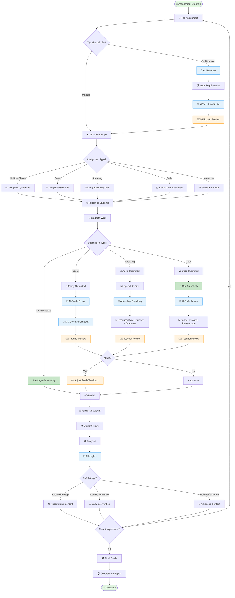

# 🤖 WF-07: AI-Powered Assessment & Grading

> 🧭 **Triển khai**: xem [`IMPLEMENTATION-MAP.md`](./IMPLEMENTATION-MAP.md) §7 · **Scope**: 🚧 Roadmap P3 (không AI trong MVP)

## Overview

**Workflow ID**: `wf_07`  
**Category**: Critical - AI-Enhanced Learning  
**Phases**: 5 stages  
**Duration**: 1-7 days per assignment cycle  
**Frequency**: Weekly  
**MVP Scope**: ✅ Phase 3 (AI Integration)

---

## Description

AI-Powered Assessment workflow tự động hóa quy trình tạo đề, chấm bài, và đưa feedback cho học viên sử dụng AI. Giảm 50-70% thời gian chấm bài của giáo viên đồng thời cung cấp feedback chi tiết và cá nhân hóa cho từng học viên.

**Business Impact**: 
- Giáo viên tiết kiệm 50-70% thời gian chấm bài
- Feedback nhanh hơn (từ 7 ngày → 1 ngày)
- Feedback chi tiết và cá nhân hóa
- Phát hiện học viên yếu sớm
- Adaptive testing cá nhân hóa

---

## Workflow Diagram (Mermaid)



---

## Phase 1: Assignment Creation

**Objective**: Tạo assignment với AI hoặc manual

**Actors**: [[Teacher]], AI System

### Option 1: AI-Generated Assignment

```typescript
interface AIAssignmentRequest {
  topic: string;
  level: 'beginner' | 'intermediate' | 'advanced';
  type: 'multiple_choice' | 'essay' | 'speaking' | 'code' | 'mixed';
  question_count: number;
  duration_minutes: number;
  focus_areas?: string[]; // ['grammar', 'vocabulary', 'reading']
  learning_objectives?: string[];
}

async function generateAssignmentWithAI(
  request: AIAssignmentRequest,
  teacherId: string
) {
  // 1. Build AI prompt
  const prompt = `
Tạo bài tập tiếng Anh với yêu cầu sau:

Chủ đề: ${request.topic}
Trình độ: ${request.level}
Loại câu hỏi: ${request.type}
Số lượng: ${request.question_count} câu
Thời gian: ${request.duration_minutes} phút
Tập trung vào: ${request.focus_areas?.join(', ') || 'Tất cả kỹ năng'}
Mục tiêu học tập: ${request.learning_objectives?.join(', ') || 'Đánh giá tổng quát'}

Yêu cầu:
1. Câu hỏi phải phù hợp với trình độ
2. Độ khó tăng dần
3. Đa dạng dạng bài
4. Có đáp án chi tiết
5. Có rubric chấm điểm (nếu là essay)

Trả về JSON theo format:
{
  "title": "...",
  "instructions": "...",
  "questions": [
    {
      "type": "multiple_choice",
      "question": "...",
      "options": ["A", "B", "C", "D"],
      "correct_answer": "B",
      "explanation": "...",
      "points": 1
    }
  ],
  "total_points": 10,
  "rubric": {...} // if essay
}
  `;
  
  // 2. Call AI
  const aiResponse = await callAI({
    model: 'gpt-4',
    prompt: prompt,
    response_format: 'json',
    temperature: 0.7 // Some creativity
  });
  
  // 3. Create draft assignment
  const assignment = await Assignment.create({
    title: aiResponse.title,
    instructions: aiResponse.instructions,
    type: request.type,
    questions: aiResponse.questions,
    total_points: aiResponse.total_points,
    rubric: aiResponse.rubric,
    duration_minutes: request.duration_minutes,
    
    // Metadata
    teacher_id: teacherId,
    ai_generated: true,
    ai_prompt: request,
    status: 'draft',
    created_at: new Date()
  });
  
  // 4. Notify teacher to review
  await notifyTeacher(teacherId, {
    title: 'Bài tập AI đã tạo xong',
    message: 'Vui lòng review trước khi publish',
    assignment_id: assignment.id,
    action: 'review'
  });
  
  return assignment;
}
```

### Option 2: Manual Creation

```typescript
interface ManualAssignment {
  title: string;
  instructions: string;
  type: AssignmentType;
  questions: Question[];
  
  // Grading
  rubric?: GradingRubric;
  total_points: number;
  passing_score: number;
  
  // Settings
  duration_minutes?: number;
  max_attempts: number;
  show_correct_answers: boolean;
  allow_late_submission: boolean;
  late_penalty_percent: number;
  
  // AI features
  enable_ai_grading: boolean;
  require_teacher_review: boolean;
}

async function createManualAssignment(
  data: ManualAssignment,
  classId: string,
  teacherId: string
) {
  const assignment = await Assignment.create({
    ...data,
    class_id: classId,
    teacher_id: teacherId,
    ai_generated: false,
    status: 'draft',
    created_at: new Date()
  });
  
  return assignment;
}
```

### Question Types Setup

**Multiple Choice**:
```typescript
interface MultipleChoiceQuestion {
  question: string;
  options: string[];
  correct_answer: number; // Index
  explanation?: string;
  points: number;
}
```

**Essay**:
```typescript
interface EssayQuestion {
  question: string;
  min_words: number;
  max_words: number;
  rubric: EssayRubric;
  points: number;
}

interface EssayRubric {
  criteria: Array<{
    name: string; // 'Content', 'Grammar', 'Structure'
    description: string;
    max_points: number;
    levels: Array<{
      score: number;
      description: string;
    }>;
  }>;
}
```

**Speaking**:
```typescript
interface SpeakingQuestion {
  prompt: string;
  preparation_time_seconds: number;
  response_time_seconds: number;
  evaluation_criteria: {
    pronunciation: number; // out of 25
    fluency: number; // out of 25
    grammar: number; // out of 25
    vocabulary: number; // out of 25
  };
  sample_answer?: string;
}
```

**Code**:
```typescript
interface CodeQuestion {
  problem_description: string;
  starter_code?: string;
  test_cases: Array<{
    input: string;
    expected_output: string;
    hidden: boolean; // Hidden test cases
  }>;
  constraints: string[];
  time_limit_ms: number;
  memory_limit_mb: number;
  points: number;
}
```

---

## Phase 2: Student Submission

**Objective**: Students complete and submit assignments

**Actors**: [[Student]], System

### Taking Assignment

```typescript
async function startAssignment(studentId: string, assignmentId: string) {
  const assignment = await Assignment.findOne(assignmentId);
  
  // Check access
  const canAccess = await canAccessAssignment(studentId, assignmentId);
  if (!canAccess.allowed) {
    throw new Error(canAccess.reason);
  }
  
  // Check attempts
  const previousAttempts = await Submission.count({
    student_id: studentId,
    assignment_id: assignmentId
  });
  
  if (previousAttempts >= assignment.max_attempts) {
    throw new Error('Maximum attempts reached');
  }
  
  // Create attempt
  const attempt = await Submission.create({
    student_id: studentId,
    assignment_id: assignmentId,
    attempt_number: previousAttempts + 1,
    started_at: new Date(),
    status: 'in_progress',
    answers: []
  });
  
  return {
    attempt,
    assignment,
    time_limit: assignment.duration_minutes * 60 // seconds
  };
}

async function submitAnswer(
  submissionId: string,
  questionId: string,
  answer: any
) {
  const submission = await Submission.findOne(submissionId);
  
  // Add/update answer
  const existingIndex = submission.answers.findIndex(
    a => a.question_id === questionId
  );
  
  if (existingIndex >= 0) {
    submission.answers[existingIndex].answer = answer;
    submission.answers[existingIndex].answered_at = new Date();
  } else {
    submission.answers.push({
      question_id: questionId,
      answer: answer,
      answered_at: new Date()
    });
  }
  
  await submission.save();
  
  return submission;
}

async function submitAssignment(submissionId: string) {
  const submission = await Submission.findOne(submissionId);
  const assignment = await Assignment.findOne(submission.assignment_id);
  
  submission.status = 'submitted';
  submission.submitted_at = new Date();
  
  // Calculate time taken
  submission.time_taken_minutes = differenceInMinutes(
    submission.submitted_at,
    submission.started_at
  );
  
  await submission.save();
  
  // Trigger grading
  if (assignment.type === 'multiple_choice' || assignment.type === 'interactive') {
    // Auto-grade instantly
    await autoGradeSubmission(submissionId);
  } else {
    // Queue for AI grading
    await gradingQueue.add({
      submission_id: submissionId,
      assignment_type: assignment.type,
      enable_ai: assignment.enable_ai_grading
    });
  }
  
  return submission;
}
```

---

## Phase 3: AI Grading

**Objective**: AI automatically grades submissions

**Actors**: AI System, [[Teacher]]

### Auto-grade Multiple Choice

```typescript
async function autoGradeMultipleChoice(submissionId: string) {
  const submission = await Submission.findOne(submissionId);
  const assignment = await Assignment.findOne(submission.assignment_id);
  
  let totalScore = 0;
  const gradedAnswers = [];
  
  for (const question of assignment.questions) {
    const studentAnswer = submission.answers.find(
      a => a.question_id === question.id
    );
    
    if (!studentAnswer) {
      gradedAnswers.push({
        question_id: question.id,
        student_answer: null,
        correct_answer: question.correct_answer,
        is_correct: false,
        points_earned: 0,
        points_possible: question.points
      });
      continue;
    }
    
    const isCorrect = studentAnswer.answer === question.correct_answer;
    const pointsEarned = isCorrect ? question.points : 0;
    totalScore += pointsEarned;
    
    gradedAnswers.push({
      question_id: question.id,
      student_answer: studentAnswer.answer,
      correct_answer: question.correct_answer,
      is_correct: isCorrect,
      points_earned: pointsEarned,
      points_possible: question.points,
      explanation: question.explanation
    });
  }
  
  submission.graded_answers = gradedAnswers;
  submission.score = totalScore;
  submission.max_score = assignment.total_points;
  submission.percentage = (totalScore / assignment.total_points) * 100;
  submission.passed = submission.percentage >= assignment.passing_score;
  submission.status = 'graded';
  submission.graded_at = new Date();
  submission.graded_by = 'system';
  
  await submission.save();
  
  // Notify student
  await notifyStudent(submission.student_id, {
    title: 'Bài làm đã được chấm',
    message: `Điểm: ${totalScore}/${assignment.total_points}`,
    submission_id: submissionId
  });
  
  return submission;
}
```

### AI Grade Essay

```typescript
async function aiGradeEssay(submissionId: string) {
  const submission = await Submission.findOne(submissionId);
  const assignment = await Assignment.findOne(submission.assignment_id);
  const question = assignment.questions[0]; // Essay usually has 1 question
  const studentEssay = submission.answers[0].answer;
  
  // Build grading prompt
  const prompt = `
Bạn là giáo viên tiếng Anh chấm bài luận.

Đề bài:
${question.question}

Yêu cầu: ${question.min_words}-${question.max_words} từ

Rubric chấm điểm:
${JSON.stringify(question.rubric, null, 2)}

Bài làm của học viên:
${studentEssay}

Hãy:
1. Đánh giá theo từng tiêu chí trong rubric
2. Cho điểm cụ thể cho mỗi tiêu chí
3. Tính tổng điểm
4. Đưa ra nhận xét chi tiết:
   - Điểm mạnh (3-5 điểm cụ thể)
   - Điểm yếu (3-5 điểm cụ thể)
   - Lỗi ngữ pháp chính (nếu có)
   - Từ vựng tốt đã dùng
   - Gợi ý cải thiện (3-5 gợi ý)

Trả về JSON:
{
  "criteria_scores": {
    "Content": {
      "score": 8,
      "max": 10,
      "comment": "..."
    },
    "Grammar": {...},
    "Structure": {...},
    "Vocabulary": {...}
  },
  "total_score": 32,
  "max_score": 40,
  "percentage": 80,
  "strengths": ["...", "...", "..."],
  "weaknesses": ["...", "...", "..."],
  "grammar_errors": [
    {
      "error": "went → gone",
      "context": "I have went to school",
      "correction": "I have gone to school"
    }
  ],
  "good_vocabulary": ["eloquent", "sophisticated", ...],
  "suggestions": ["...", "...", "..."],
  "overall_feedback": "..."
}
  `;
  
  // Call AI
  const aiGrade = await callAI({
    model: 'gpt-4',
    prompt: prompt,
    response_format: 'json',
    temperature: 0.3 // More consistent grading
  });
  
  // Save AI grading
  submission.ai_grade = aiGrade.total_score;
  submission.ai_feedback = {
    criteria_scores: aiGrade.criteria_scores,
    strengths: aiGrade.strengths,
    weaknesses: aiGrade.weaknesses,
    grammar_errors: aiGrade.grammar_errors,
    good_vocabulary: aiGrade.good_vocabulary,
    suggestions: aiGrade.suggestions,
    overall_feedback: aiGrade.overall_feedback
  };
  
  if (assignment.require_teacher_review) {
    submission.status = 'pending_review';
    
    // Notify teacher
    await notifyTeacher(assignment.teacher_id, {
      title: 'Bài luận cần review',
      message: `AI đã chấm: ${aiGrade.total_score}/${aiGrade.max_score}`,
      submission_id: submissionId,
      priority: 'normal'
    });
  } else {
    // Auto-approve AI grade
    submission.score = aiGrade.total_score;
    submission.max_score = aiGrade.max_score;
    submission.percentage = aiGrade.percentage;
    submission.passed = aiGrade.percentage >= assignment.passing_score;
    submission.feedback = aiGrade.overall_feedback;
    submission.status = 'graded';
    submission.graded_at = new Date();
    submission.graded_by = 'ai';
    
    // Notify student
    await notifyStudent(submission.student_id, {
      title: 'Bài luận đã được chấm',
      message: `Điểm: ${aiGrade.total_score}/${aiGrade.max_score}`,
      submission_id: submissionId
    });
  }
  
  await submission.save();
  
  return submission;
}
```

### AI Grade Speaking

```typescript
async function aiGradeSpeaking(submissionId: string) {
  const submission = await Submission.findOne(submissionId);
  const assignment = await Assignment.findOne(submission.assignment_id);
  const question = assignment.questions[0];
  const audioFile = submission.answers[0].answer; // Audio file URL
  
  // 1. Download audio
  const audioBuffer = await downloadFile(audioFile);
  
  // 2. Speech-to-text with Whisper
  const transcript = await openai.audio.transcriptions.create({
    file: audioBuffer,
    model: 'whisper-1',
    language: 'en',
    response_format: 'verbose_json'
  });
  
  // 3. Analyze pronunciation
  const pronunciationAnalysis = await analyzePronunciation(
    audioBuffer,
    transcript.text
  );
  
  // 4. Analyze fluency
  const fluencyAnalysis = analyzeFluency(transcript);
  
  // 5. Analyze grammar
  const grammarAnalysis = await analyzeGrammar(transcript.text);
  
  // 6. Analyze vocabulary
  const vocabularyAnalysis = await analyzeVocabulary(
    transcript.text,
    question.prompt
  );
  
  // 7. Calculate scores
  const scores = {
    pronunciation: pronunciationAnalysis.score, // 0-25
    fluency: fluencyAnalysis.score, // 0-25
    grammar: grammarAnalysis.score, // 0-25
    vocabulary: vocabularyAnalysis.score, // 0-25
    total: 0
  };
  scores.total = Object.values(scores).slice(0, 4).reduce((a, b) => a + b, 0);
  
  // 8. Generate detailed feedback with AI
  const feedbackPrompt = `
Đánh giá bài nói tiếng Anh của học viên:

Đề bài: ${question.prompt}

Transcript: ${transcript.text}

Phân tích:
- Pronunciation: ${scores.pronunciation}/25 - ${pronunciationAnalysis.details}
- Fluency: ${scores.fluency}/25 - ${fluencyAnalysis.details}
- Grammar: ${scores.grammar}/25 - ${grammarAnalysis.details}
- Vocabulary: ${vocabularyAnalysis.score}/25 - ${vocabularyAnalysis.details}

Hãy đưa ra nhận xét chi tiết và gợi ý cải thiện.

Trả về JSON:
{
  "strengths": ["...", "...", "..."],
  "weaknesses": ["...", "...", "..."],
  "pronunciation_tips": ["...", "..."],
  "grammar_corrections": [{error: "...", correction: "..."}],
  "vocabulary_suggestions": ["...", "..."],
  "overall_feedback": "..."
}
  `;
  
  const feedback = await callAI({
    model: 'gpt-4',
    prompt: feedbackPrompt,
    response_format: 'json'
  });
  
  // 9. Save results
  submission.transcript = transcript.text;
  submission.ai_grade = scores.total;
  submission.score_breakdown = scores;
  submission.ai_feedback = feedback;
  submission.status = assignment.require_teacher_review ? 'pending_review' : 'graded';
  
  if (!assignment.require_teacher_review) {
    submission.score = scores.total;
    submission.max_score = 100;
    submission.percentage = scores.total;
    submission.passed = scores.total >= assignment.passing_score;
    submission.graded_at = new Date();
    submission.graded_by = 'ai';
    
    await notifyStudent(submission.student_id, {
      title: 'Bài nói đã được chấm',
      message: `Điểm: ${scores.total}/100`,
      submission_id: submissionId
    });
  } else {
    await notifyTeacher(assignment.teacher_id, {
      title: 'Bài nói cần review',
      message: `AI đã chấm: ${scores.total}/100`,
      submission_id: submissionId
    });
  }
  
  await submission.save();
  
  return submission;
}

// Pronunciation analysis helper
async function analyzePronunciation(
  audioBuffer: Buffer,
  transcript: string
): Promise<{ score: number; details: string }> {
  // Use specialized pronunciation API
  // Example: Azure Speech Services, Google Cloud Speech-to-Text
  
  const analysis = await azureSpeech.pronunciationAssessment({
    audio: audioBuffer,
    reference_text: transcript,
    granularity: 'phoneme'
  });
  
  return {
    score: Math.round((analysis.accuracy_score / 100) * 25),
    details: `Accuracy: ${analysis.accuracy_score}/100, Fluency: ${analysis.fluency_score}/100, Completeness: ${analysis.completeness_score}/100`
  };
}

// Fluency analysis helper
function analyzeFluency(transcript: any): { score: number; details: string } {
  const words = transcript.words || [];
  
  // Calculate speech rate
  const duration = transcript.duration;
  const wordCount = words.length;
  const speechRate = (wordCount / duration) * 60; // words per minute
  
  // Calculate pauses
  const pauses = [];
  for (let i = 1; i < words.length; i++) {
    const gap = words[i].start - words[i - 1].end;
    if (gap > 0.5) { // Pause > 0.5s
      pauses.push(gap);
    }
  }
  
  const avgPause = pauses.length > 0 
    ? pauses.reduce((a, b) => a + b, 0) / pauses.length 
    : 0;
  
  // Score based on ideal range: 130-170 wpm
  let score = 25;
  if (speechRate < 100 || speechRate > 200) score -= 10;
  if (speechRate < 80 || speechRate > 220) score -= 5;
  if (avgPause > 1.5) score -= 5;
  if (pauses.filter(p => p > 3).length > 0) score -= 5;
  
  return {
    score: Math.max(0, score),
    details: `Speech rate: ${speechRate.toFixed(0)} wpm, Average pause: ${avgPause.toFixed(1)}s, Long pauses: ${pauses.filter(p => p > 3).length}`
  };
}
```

### AI Grade Code

```typescript
async function aiGradeCode(submissionId: string) {
  const submission = await Submission.findOne(submissionId);
  const assignment = await Assignment.findOne(submission.assignment_id);
  const question = assignment.questions[0];
  const studentCode = submission.answers[0].answer;
  
  // 1. Run test cases
  const testResults = await runCodeTests({
    code: studentCode,
    test_cases: question.test_cases,
    time_limit: question.time_limit_ms,
    memory_limit: question.memory_limit_mb
  });
  
  // 2. Calculate test score
  const passedTests = testResults.filter(r => r.passed).length;
  const testScore = (passedTests / testResults.length) * 50; // 50% for tests
  
  // 3. AI code review
  const codeReviewPrompt = `
Đánh giá code của học viên cho bài toán sau:

Problem:
${question.problem_description}

Student Code:
\`\`\`
${studentCode}
\`\`\`

Test Results:
- Passed: ${passedTests}/${testResults.length}
- Failed tests: ${testResults.filter(r => !r.passed).map(r => r.name).join(', ')}

Hãy đánh giá:
1. Code Quality (0-25 điểm):
   - Readability, naming conventions
   - Code structure, organization
   - Comments
2. Efficiency (0-25 điểm):
   - Time complexity
   - Space complexity
   - Optimization

Trả về JSON:
{
  "code_quality": {
    "score": 20,
    "comments": ["...", "..."]
  },
  "efficiency": {
    "score": 18,
    "time_complexity": "O(n)",
    "space_complexity": "O(1)",
    "comments": ["...", "..."]
  },
  "suggestions": ["...", "...", "..."],
  "overall_feedback": "..."
}
  `;
  
  const codeReview = await callAI({
    model: 'gpt-4',
    prompt: codeReviewPrompt,
    response_format: 'json'
  });
  
  // 4. Calculate total score
  const totalScore = testScore + codeReview.code_quality.score + codeReview.efficiency.score;
  
  // 5. Save results
  submission.test_results = testResults;
  submission.tests_passed = passedTests;
  submission.tests_total = testResults.length;
  submission.ai_grade = totalScore;
  submission.code_review = codeReview;
  submission.status = assignment.require_teacher_review ? 'pending_review' : 'graded';
  
  if (!assignment.require_teacher_review) {
    submission.score = totalScore;
    submission.max_score = 100;
    submission.percentage = totalScore;
    submission.passed = totalScore >= assignment.passing_score;
    submission.graded_at = new Date();
    submission.graded_by = 'ai';
    
    await notifyStudent(submission.student_id, {
      title: 'Code đã được chấm',
      message: `Điểm: ${totalScore}/100 (Tests: ${passedTests}/${testResults.length})`,
      submission_id: submissionId
    });
  } else {
    await notifyTeacher(assignment.teacher_id, {
      title: 'Code cần review',
      message: `AI đã chấm: ${totalScore}/100`,
      submission_id: submissionId
    });
  }
  
  await submission.save();
  
  return submission;
}
```

---

## Phase 4: Teacher Review & Adjustment

**Objective**: Teacher verifies and adjusts AI grades

**Actors**: [[Teacher]]

### Review AI Grading

```typescript
async function reviewAIGrading(submissionId: string, teacherId: string) {
  const submission = await Submission.findOne(submissionId);
  const assignment = await Assignment.findOne(submission.assignment_id);
  
  return {
    submission,
    assignment,
    ai_grade: submission.ai_grade,
    ai_feedback: submission.ai_feedback,
    student_work: submission.answers,
    
    // For teacher to review
    suggested_adjustments: await suggestAdjustments(submission),
    similar_submissions: await findSimilarSubmissions(submissionId)
  };
}

async function adjustGrade(
  submissionId: string,
  teacherId: string,
  adjustments: {
    final_score?: number;
    additional_feedback?: string;
    override_ai?: boolean;
  }
) {
  const submission = await Submission.findOne(submissionId);
  
  // Keep AI grade for reference
  submission.ai_grade_original = submission.ai_grade;
  submission.ai_feedback_original = submission.ai_feedback;
  
  // Apply teacher adjustments
  if (adjustments.final_score !== undefined) {
    submission.score = adjustments.final_score;
    submission.teacher_adjusted = true;
  } else {
    submission.score = submission.ai_grade;
  }
  
  submission.max_score = submission.max_score || 100;
  submission.percentage = (submission.score / submission.max_score) * 100;
  submission.passed = submission.percentage >= submission.assignment.passing_score;
  
  // Combine feedback
  if (adjustments.additional_feedback) {
    submission.feedback = `
${submission.ai_feedback?.overall_feedback || ''}

---
Nhận xét thêm từ giáo viên:
${adjustments.additional_feedback}
    `.trim();
  } else {
    submission.feedback = submission.ai_feedback?.overall_feedback;
  }
  
  submission.status = 'graded';
  submission.graded_at = new Date();
  submission.graded_by = teacherId;
  
  await submission.save();
  
  // Notify student
  await notifyStudent(submission.student_id, {
    title: 'Bài làm đã được chấm',
    message: `Điểm: ${submission.score}/${submission.max_score}`,
    submission_id: submissionId
  });
  
  return submission;
}
```

---

## Phase 5: Analytics & Insights

**Objective**: Generate insights from grading data

**Actors**: AI System, [[Teacher]], [[Academic Manager]]

### Assignment Analytics

```typescript
async function getAssignmentAnalytics(assignmentId: string) {
  const assignment = await Assignment.findOne(assignmentId);
  const submissions = await Submission.find({ 
    assignment_id: assignmentId,
    status: 'graded'
  });
  
  const analytics = {
    assignment_id: assignmentId,
    
    // Completion
    total_students: await countEnrolledStudents(assignment.class_id),
    submitted: submissions.length,
    completion_rate: (submissions.length / total_students) * 100,
    
    // Scores
    average_score: average(submissions.map(s => s.score)),
    median_score: median(submissions.map(s => s.score)),
    highest_score: Math.max(...submissions.map(s => s.score)),
    lowest_score: Math.min(...submissions.map(s => s.score)),
    pass_rate: (submissions.filter(s => s.passed).length / submissions.length) * 100,
    
    // Distribution
    score_distribution: getScoreDistribution(submissions),
    
    // Time
    average_time_minutes: average(submissions.map(s => s.time_taken_minutes)),
    
    // AI performance (if used)
    ai_grading_used: submissions.filter(s => s.ai_grade).length,
    ai_accuracy: calculateAIAccuracy(submissions),
    teacher_adjustment_rate: (submissions.filter(s => s.teacher_adjusted).length / submissions.length) * 100,
    
    // Question analysis
    question_performance: await analyzeQuestionPerformance(assignmentId, submissions)
  };
  
  return analytics;
}

// AI Insights
async function generateAssignmentInsights(assignmentId: string) {
  const analytics = await getAssignmentAnalytics(assignmentId);
  const submissions = await Submission.find({ 
    assignment_id: assignmentId,
    status: 'graded'
  });
  
  const insights = [];
  
  // Low pass rate
  if (analytics.pass_rate < 60) {
    insights.push({
      type: 'warning',
      title: 'Tỷ lệ đạt thấp',
      message: `Chỉ ${analytics.pass_rate.toFixed(0)}% học viên đạt yêu cầu`,
      suggestions: [
        'Xem lại độ khó của bài tập',
        'Cung cấp thêm tài liệu hỗ trợ',
        'Tổ chức buổi ôn tập',
        'Giảm passing score nếu phù hợp'
      ]
    });
  }
  
  // High variation
  const stdDev = standardDeviation(submissions.map(s => s.score));
  if (stdDev > 20) {
    insights.push({
      type: 'info',
      title: 'Độ chênh lệch cao',
      message: 'Điểm số giữa các học viên chênh lệch lớn',
      suggestions: [
        'Phân nhóm học viên theo trình độ',
        'Hỗ trợ thêm cho nhóm yếu',
        'Thách thức thêm cho nhóm giỏi'
      ]
    });
  }
  
  // Difficult questions
  const difficultQuestions = analytics.question_performance
    .filter(q => q.correct_rate < 40);
  
  if (difficultQuestions.length > 0) {
    insights.push({
      type: 'warning',
      title: `${difficultQuestions.length} câu hỏi quá khó`,
      message: 'Dưới 40% học viên trả lời đúng',
      questions: difficultQuestions.map(q => q.question_text),
      suggestions: [
        'Giảng lại phần này trên lớp',
        'Cung cấp thêm ví dụ',
        'Tạo bài tập dễ hơn trước'
      ]
    });
  }
  
  // Knowledge gaps
  const commonErrors = await identifyCommonErrors(submissions);
  if (commonErrors.length > 0) {
    insights.push({
      type: 'action',
      title: 'Lỗi phổ biến phát hiện',
      errors: commonErrors,
      suggestions: [
        'Tạo lesson focused vào điểm này',
        'Giao thêm bài tập chuyên sâu',
        'Thêm vào FAQ'
      ]
    });
  }
  
  return insights;
}

// Student-level insights
async function generateStudentInsights(studentId: string) {
  const recentSubmissions = await Submission.find({
    student_id: studentId,
    status: 'graded',
    submitted_at: GreaterThan(addDays(new Date(), -30))
  }).orderBy('submitted_at', 'DESC');
  
  const insights = {
    student_id: studentId,
    
    // Performance trend
    performance_trend: analyzePerformanceTrend(recentSubmissions),
    
    // Strengths
    strengths: identifyStrengths(recentSubmissions),
    
    // Weaknesses
    weaknesses: identifyWeaknesses(recentSubmissions),
    
    // Knowledge gaps
    knowledge_gaps: identifyKnowledgeGaps(recentSubmissions),
    
    // Recommendations
    recommendations: await generatePersonalizedRecommendations(studentId, recentSubmissions),
    
    // At-risk alert
    at_risk: isStudentAtRisk(recentSubmissions),
    at_risk_reasons: []
  };
  
  // At-risk detection
  if (insights.performance_trend === 'declining') {
    insights.at_risk = true;
    insights.at_risk_reasons.push('Xu hướng giảm điểm');
  }
  
  const avgScore = average(recentSubmissions.map(s => s.percentage));
  if (avgScore < 60) {
    insights.at_risk = true;
    insights.at_risk_reasons.push(`Điểm TB thấp: ${avgScore.toFixed(0)}%`);
  }
  
  const completionRate = (recentSubmissions.length / expectedAssignments) * 100;
  if (completionRate < 70) {
    insights.at_risk = true;
    insights.at_risk_reasons.push(`Tỷ lệ hoàn thành thấp: ${completionRate.toFixed(0)}%`);
  }
  
  // Trigger intervention if at risk
  if (insights.at_risk) {
    await triggerEarlyIntervention(studentId, insights);
  }
  
  return insights;
}

async function triggerEarlyIntervention(studentId: string, insights: any) {
  const student = await Student.findOne(studentId);
  const teacher = await getStudentTeacher(studentId);
  
  // 1. Notify teacher
  await notifyTeacher(teacher.id, {
    title: `⚠️ Học viên cần hỗ trợ: ${student.name}`,
    priority: 'high',
    message: `
Lý do:
${insights.at_risk_reasons.map(r => `- ${r}`).join('\n')}

Điểm yếu:
${insights.weaknesses.join(', ')}

Gợi ý:
${insights.recommendations.map(r => `- ${r}`).join('\n')}
    `,
    student_id: studentId,
    action_required: true
  });
  
  // 2. Send support resources to student
  const supportContent = await findSupportContent(insights.knowledge_gaps);
  
  await notifyStudent(studentId, {
    title: 'Tài liệu hỗ trợ dành cho bạn',
    message: 'Chúng tôi nhận thấy bạn cần hỗ trợ thêm ở một số phần',
    content_links: supportContent.map(c => ({
      title: c.title,
      url: `/library/${c.id}`
    }))
  });
  
  // 3. Create intervention record
  await Intervention.create({
    student_id: studentId,
    teacher_id: teacher.id,
    type: 'early_warning',
    reason: insights.at_risk_reasons,
    recommendations: insights.recommendations,
    created_at: new Date(),
    status: 'pending'
  });
}
```

---

## Success Metrics

### Efficiency Gains
- **Teacher Time Saved**: 50-70% on grading
- **Grading Speed**: From 7 days → 1 day average
- **Feedback Quality**: 4.5/5 student satisfaction (Target: 4.0/5)

### AI Performance
- **Auto-grade Accuracy**: 95%+ for MC (Target: 90%+)
- **AI Essay Grading Accuracy**: 85%+ vs teacher (Target: 80%+)
- **Teacher Adjustment Rate**: <20% (Target: <25%)
- **AI Uptime**: 99%+ (Target: 98%+)

### Learning Outcomes
- **Early Intervention Success**: 75%+ improve after intervention (Target: 70%+)
- **Student Satisfaction**: 4.2/5 with AI feedback (Target: 4.0/5)
- **Pass Rate Improvement**: +10% after AI recommendations

---

## Related Workflows

- [[WF-02 Teaching & Learning Cycle]] - Assessment in teaching
- [[WF-06 Digital Library & Content Management]] - Content recommendations
- [[WF-08 Communication Hub]] - Notifications and feedback delivery

---

## Related Roles

- [[Teacher]] - Create assignments, review AI grading
- [[Student]] - Complete assignments, receive feedback
- [[Academic Manager]] - Monitor assessment quality

---

**Last Updated**: 2026-08-25  
**Reviewed By**: Academic Manager, AI Specialist  
**Next Review**: 2026-09-25
