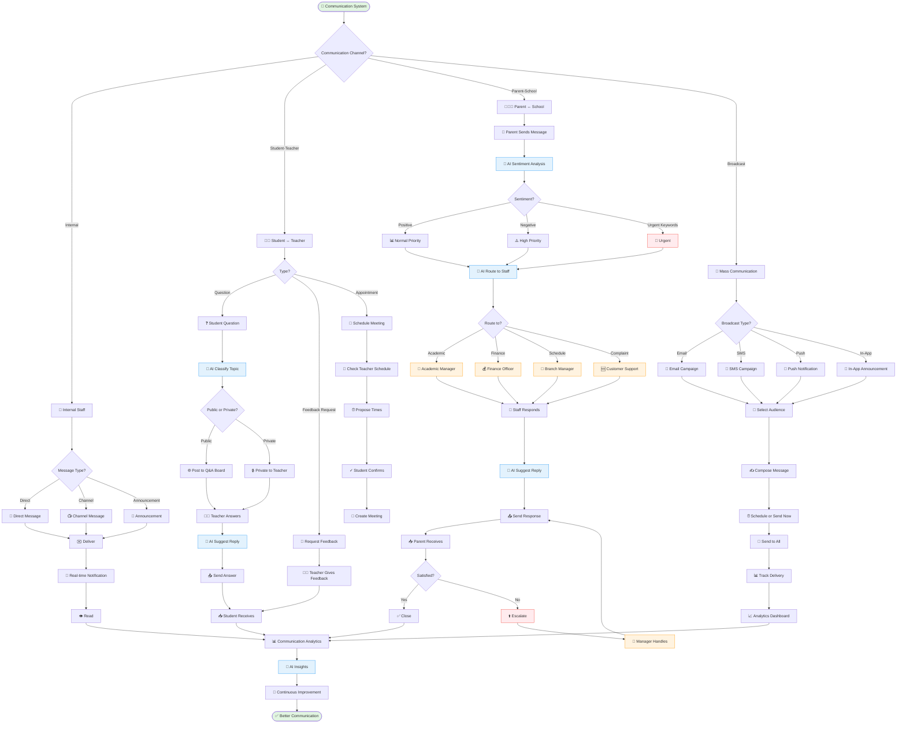

# 💬 WF-08: Communication Hub Workflow

> 🧭 **Triển khai**: `IMPLEMENTATION-MAP.md` §8 · **Scope**: 🚧 Roadmap P2

## Overview

**Workflow ID**: `wf_08`  
**Category**: Critical - Stakeholder Communication  
**Phases**: 4 major channels  
**Duration**: Real-time to 24 hours response  
**Frequency**: Daily, continuous  
**MVP Scope**: ✅ Phase 1 (Basic), Phase 2 (Enhanced)

---

## Description

Communication Hub workflow quản lý toàn bộ giao tiếp giữa các stakeholders: nhân viên nội bộ, giáo viên-học viên, phụ huynh-trung tâm, và broadcast messaging. Hệ thống tích hợp AI để auto-routing, sentiment analysis, và suggested replies.

**Business Impact**: 
- Response time nhanh hơn (từ 24h → 2h)
- Satisfaction tăng (từ 3.5/5 → 4.5/5)
- Giảm missed messages (từ 15% → 2%)
- Auto-route 80% messages đúng người
- Giảm workload support 40%

---

## Workflow Diagram (Mermaid)



---

## Channel 1: Internal Communication (Staff)

**Objective**: Efficient internal collaboration

**Actors**: All Staff Roles

### Direct Messages

```typescript
interface DirectMessage {
  id: string;
  from_user_id: string;
  to_user_id: string;
  
  message: string;
  attachments?: Attachment[];
  
  // Threading
  reply_to_message_id?: string;
  thread_id?: string;
  
  // Status
  sent_at: Date;
  delivered_at?: Date;
  read_at?: Date;
  
  // Features
  is_urgent: boolean;
  requires_response: boolean;
}

async function sendDirectMessage(
  fromUserId: string,
  toUserId: string,
  message: string,
  options: {
    attachments?: File[];
    reply_to?: string;
    urgent?: boolean;
  } = {}
) {
  // 1. Create message
  const dm = await DirectMessage.create({
    from_user_id: fromUserId,
    to_user_id: toUserId,
    message: message,
    reply_to_message_id: options.reply_to,
    is_urgent: options.urgent || false,
    sent_at: new Date()
  });
  
  // 2. Handle attachments
  if (options.attachments) {
    for (const file of options.attachments) {
      const uploaded = await uploadAttachment(file);
      await MessageAttachment.create({
        message_id: dm.id,
        file_name: file.name,
        file_url: uploaded.url,
        file_size: file.size
      });
    }
  }
  
  // 3. Real-time delivery via WebSocket
  await websocket.send(toUserId, {
    type: 'direct_message',
    message: dm,
    from_user: await getUserInfo(fromUserId)
  });
  
  // 4. Push notification if offline
  const isOnline = await websocket.isUserOnline(toUserId);
  if (!isOnline) {
    await sendPushNotification(toUserId, {
      title: `Tin nhắn từ ${await getUserName(fromUserId)}`,
      body: message.substring(0, 100),
      data: { message_id: dm.id }
    });
  }
  
  // 5. Email if urgent and offline >5 minutes
  if (options.urgent && !isOnline) {
    setTimeout(async () => {
      if (!dm.read_at) {
        await sendEmail(toUserId, {
          subject: '🚨 Tin nhắn khẩn',
          body: `
Bạn có tin nhắn khẩn từ ${await getUserName(fromUserId)}:

${message}

Vui lòng đăng nhập để xem chi tiết.
          `
        });
      }
    }, 5 * 60 * 1000); // 5 minutes
  }
  
  return dm;
}

async function markAsRead(messageId: string, userId: string) {
  const message = await DirectMessage.findOne(messageId);
  
  if (message.to_user_id !== userId) {
    throw new Error('Not recipient');
  }
  
  if (!message.read_at) {
    message.read_at = new Date();
    await message.save();
    
    // Notify sender
    await websocket.send(message.from_user_id, {
      type: 'message_read',
      message_id: messageId,
      read_at: message.read_at
    });
  }
  
  return message;
}
```

### Department Channels

```typescript
interface Channel {
  id: string;
  name: string;
  type: 'public' | 'private' | 'department';
  description: string;
  
  // Members
  created_by: string;
  members: string[]; // user_ids
  admins: string[]; // user_ids who can manage
  
  // Settings
  anyone_can_post: boolean;
  archived: boolean;
}

// Pre-defined channels
const defaultChannels = [
  { name: 'general', description: 'Thông báo chung', type: 'public' },
  { name: 'academic', description: 'Khoa học thuật', type: 'department' },
  { name: 'finance', description: 'Tài chính', type: 'department' },
  { name: 'it-support', description: 'Hỗ trợ kỹ thuật', type: 'department' },
  { name: 'random', description: 'Tán gẫu', type: 'public' }
];

async function postToChannel(
  userId: string,
  channelId: string,
  message: string,
  options: {
    attachments?: File[];
    mentions?: string[]; // @user_id
  } = {}
) {
  const channel = await Channel.findOne(channelId);
  
  // Check permission
  if (!channel.anyone_can_post && !channel.admins.includes(userId)) {
    throw new Error('No permission to post');
  }
  
  if (!channel.members.includes(userId)) {
    throw new Error('Not a member');
  }
  
  // Create message
  const channelMessage = await ChannelMessage.create({
    channel_id: channelId,
    user_id: userId,
    message: message,
    posted_at: new Date()
  });
  
  // Handle attachments
  if (options.attachments) {
    for (const file of options.attachments) {
      const uploaded = await uploadAttachment(file);
      await MessageAttachment.create({
        message_id: channelMessage.id,
        file_name: file.name,
        file_url: uploaded.url
      });
    }
  }
  
  // Broadcast to all channel members
  for (const memberId of channel.members) {
    await websocket.send(memberId, {
      type: 'channel_message',
      channel: channel,
      message: channelMessage,
      user: await getUserInfo(userId)
    });
  }
  
  // Notify mentioned users
  if (options.mentions) {
    for (const mentionedId of options.mentions) {
      if (mentionedId !== userId) {
        await sendNotification(mentionedId, {
          type: 'mention',
          title: `${await getUserName(userId)} đã mention bạn`,
          message: message.substring(0, 100),
          link: `/channels/${channelId}/messages/${channelMessage.id}`
        });
      }
    }
  }
  
  return channelMessage;
}
```

### Announcements

```typescript
interface Announcement {
  id: string;
  title: string;
  content: string;
  
  // Targeting
  target_audience: 'all' | 'branch' | 'department' | 'role';
  target_branches?: string[];
  target_departments?: string[];
  target_roles?: string[];
  
  // Scheduling
  published_at?: Date;
  expires_at?: Date;
  
  // Priority
  priority: 'normal' | 'important' | 'urgent';
  pin_to_top: boolean;
  
  // Tracking
  views: number;
  read_by: string[];
  
  // Created by
  created_by: string;
  created_at: Date;
}

async function createAnnouncement(announcement: Announcement) {
  const created = await Announcement.create(announcement);
  
  // Determine recipients
  const recipients = await getAnnouncementRecipients(announcement);
  
  // Send to all recipients
  for (const userId of recipients) {
    // Real-time notification
    await websocket.send(userId, {
      type: 'announcement',
      announcement: created,
      priority: announcement.priority
    });
    
    // Email for important/urgent
    if (announcement.priority !== 'normal') {
      await sendEmail(userId, {
        subject: `${announcement.priority === 'urgent' ? '🚨' : '⚠️'} ${announcement.title}`,
        body: announcement.content
      });
    }
  }
  
  return created;
}
```

---

## Channel 2: Student-Teacher Communication

**Objective**: Support learning with Q&A and feedback

**Actors**: [[Student]], [[Teacher]]

### Q&A System

```typescript
interface StudentQuestion {
  id: string;
  student_id: string;
  class_id: string;
  
  // Question
  question: string;
  context?: string; // Related to assignment, lesson, etc.
  attachments?: string[];
  
  // AI classification
  topic: string; // Detected by AI
  urgency: 'low' | 'medium' | 'high';
  
  // Visibility
  visibility: 'public' | 'private';
  
  // Answer
  answer?: string;
  answered_by?: string;
  answered_at?: Date;
  
  // Status
  status: 'pending' | 'answered' | 'resolved';
  
  // Engagement
  upvotes: number;
  helpful_count: number;
  
  created_at: Date;
}

async function askQuestion(
  studentId: string,
  classId: string,
  question: string,
  options: {
    context?: string;
    visibility?: 'public' | 'private';
  } = {}
) {
  // 1. AI classifies question
  const classification = await classifyQuestion(question, options.context);
  
  // 2. Create question
  const studentQuestion = await StudentQuestion.create({
    student_id: studentId,
    class_id: classId,
    question: question,
    context: options.context,
    visibility: options.visibility || 'public',
    topic: classification.topic,
    urgency: classification.urgency,
    status: 'pending',
    created_at: new Date()
  });
  
  // 3. Notify teacher
  const classData = await Class.findOne(classId);
  await notifyTeacher(classData.teacher_id, {
    title: 'Câu hỏi mới từ học viên',
    message: `${await getStudentName(studentId)}: ${question.substring(0, 100)}`,
    urgency: classification.urgency,
    question_id: studentQuestion.id
  });
  
  // 4. If public, add to Q&A board
  if (options.visibility === 'public') {
    await addToQABoard(classId, studentQuestion.id);
  }
  
  return studentQuestion;
}

// AI classification
async function classifyQuestion(
  question: string,
  context?: string
): Promise<{ topic: string; urgency: string }> {
  const prompt = `
Phân tích câu hỏi của học viên:

Câu hỏi: ${question}
${context ? `Bối cảnh: ${context}` : ''}

Xác định:
1. Topic chính (grammar, vocabulary, speaking, listening, writing, reading, homework, assignment, technical, other)
2. Urgency (low, medium, high) dựa trên:
   - High: Cần gấp, có deadline sắp tới, blocking progress
   - Medium: Quan trọng nhưng không gấp
   - Low: Thắc mắc chung, optional

Trả về JSON: {"topic": "...", "urgency": "..."}
  `;
  
  const result = await callAI({
    model: 'gpt-4',
    prompt: prompt,
    response_format: 'json'
  });
  
  return result;
}

// Teacher answers
async function answerQuestion(
  questionId: string,
  teacherId: string,
  answer: string,
  options: {
    ai_assist?: boolean;
  } = {}
) {
  const question = await StudentQuestion.findOne(questionId);
  
  let finalAnswer = answer;
  
  // AI suggests improvements
  if (options.ai_assist) {
    const suggestion = await suggestAnswerImprovements(question.question, answer);
    // Teacher can choose to use AI suggestion or their original
  }
  
  // Save answer
  question.answer = finalAnswer;
  question.answered_by = teacherId;
  question.answered_at = new Date();
  question.status = 'answered';
  await question.save();
  
  // Notify student
  await notifyStudent(question.student_id, {
    title: 'Giáo viên đã trả lời câu hỏi',
    message: finalAnswer.substring(0, 100),
    question_id: questionId
  });
  
  // If public, notify other students in class
  if (question.visibility === 'public') {
    const classStudents = await getEnrolledStudents(question.class_id);
    for (const student of classStudents) {
      if (student.id !== question.student_id) {
        await sendNotification(student.id, {
          type: 'qa_answered',
          title: 'Câu hỏi mới được trả lời',
          message: `Q: ${question.question}`,
          question_id: questionId
        });
      }
    }
  }
  
  return question;
}

// AI suggest answer improvements
async function suggestAnswerImprovements(
  question: string,
  answer: string
): Promise<string> {
  const prompt = `
Học viên hỏi: ${question}

Giáo viên trả lời: ${answer}

Hãy cải thiện câu trả lời để:
1. Rõ ràng hơn
2. Thêm ví dụ cụ thể
3. Tone thân thiện, khuyến khích
4. Dễ hiểu với học viên

Trả về câu trả lời đã cải thiện.
  `;
  
  return await callAI({
    model: 'gpt-4',
    prompt: prompt
  });
}
```

### Appointment Scheduling

```typescript
async function requestAppointment(
  studentId: string,
  teacherId: string,
  purpose: string,
  preferredDates: Date[]
) {
  // 1. Get teacher availability
  const availability = await getTeacherAvailability(teacherId, preferredDates);
  
  // 2. Suggest time slots
  const suggestions = findMatchingSlots(preferredDates, availability);
  
  if (suggestions.length === 0) {
    // No match, suggest teacher's available times
    const alternativeSlots = await getTeacherAvailableSlots(teacherId, 7); // Next 7 days
    
    return {
      success: false,
      reason: 'No matching availability',
      alternative_slots: alternativeSlots
    };
  }
  
  // 3. Create appointment request
  const appointment = await Appointment.create({
    student_id: studentId,
    teacher_id: teacherId,
    purpose: purpose,
    suggested_times: suggestions,
    status: 'pending',
    created_at: new Date()
  });
  
  // 4. Notify teacher
  await notifyTeacher(teacherId, {
    title: 'Yêu cầu hẹn gặp',
    message: `${await getStudentName(studentId)} muốn gặp: ${purpose}`,
    appointment_id: appointment.id,
    action: 'approve_time'
  });
  
  return appointment;
}

async function confirmAppointment(
  appointmentId: string,
  teacherId: string,
  confirmedTime: Date
) {
  const appointment = await Appointment.findOne(appointmentId);
  
  appointment.confirmed_time = confirmedTime;
  appointment.status = 'confirmed';
  await appointment.save();
  
  // Create calendar event
  await createCalendarEvent({
    title: `Meeting: ${await getStudentName(appointment.student_id)}`,
    start_time: confirmedTime,
    duration: 30, // minutes
    attendees: [teacherId, appointment.student_id],
    location: 'TBD' // or meeting room
  });
  
  // Notify student
  await notifyStudent(appointment.student_id, {
    title: 'Lịch hẹn đã được xác nhận',
    message: `${formatDateTime(confirmedTime)}`,
    appointment_id: appointmentId
  });
  
  // Send calendar invite via email
  await sendCalendarInvite(appointment);
  
  return appointment;
}
```

---

## Channel 3: Parent-School Communication

**Objective**: Keep parents informed and engaged

**Actors**: Parent (addon), [[Teacher]], [[Academic Manager]], Support Staff

### Parent Messaging

```typescript
interface ParentMessage {
  id: string;
  parent_id: string;
  student_id: string;
  
  // Message
  subject: string;
  message: string;
  attachments?: string[];
  
  // AI analysis
  sentiment: 'positive' | 'neutral' | 'negative';
  detected_topic: string;
  urgency: 'low' | 'normal' | 'high' | 'urgent';
  
  // Routing
  assigned_to?: string; // staff member
  department?: string;
  
  // Thread
  thread_id: string;
  replies: ParentMessageReply[];
  
  // Status
  status: 'unread' | 'read' | 'in_progress' | 'resolved';
  
  // SLA
  received_at: Date;
  first_response_at?: Date;
  resolved_at?: Date;
  
  // Priority
  is_urgent: boolean;
  escalated: boolean;
}

async function receiveParentMessage(
  parentId: string,
  studentId: string,
  subject: string,
  message: string
) {
  // 1. AI sentiment analysis
  const sentiment = await analyzeSentiment(message);
  
  // 2. AI topic classification
  const topic = await classifyTopic(message);
  
  // 3. Detect urgency
  const urgency = detectUrgency(message, sentiment);
  
  // 4. Create message
  const parentMessage = await ParentMessage.create({
    parent_id: parentId,
    student_id: studentId,
    subject: subject,
    message: message,
    sentiment: sentiment.label,
    detected_topic: topic,
    urgency: urgency,
    is_urgent: urgency === 'urgent',
    status: 'unread',
    received_at: new Date()
  });
  
  // 5. Auto-route to appropriate staff
  const assignedStaff = await autoRouteMessage(parentMessage);
  
  parentMessage.assigned_to = assignedStaff.id;
  parentMessage.department = assignedStaff.department;
  await parentMessage.save();
  
  // 6. Notify assigned staff
  const priority = urgency === 'urgent' ? 'high' : 
                   sentiment.label === 'negative' ? 'medium' : 'normal';
  
  await notifyStaff(assignedStaff.id, {
    title: urgency === 'urgent' ? '🚨 Tin nhắn khẩn từ phụ huynh' : 'Tin nhắn mới từ phụ huynh',
    message: `${await getParentName(parentId)}: ${subject}`,
    priority: priority,
    message_id: parentMessage.id,
    sentiment: sentiment.label
  });
  
  // 7. Auto-reply acknowledgment
  await sendAutoReply(parentId, parentMessage.id, urgency);
  
  return parentMessage;
}

// AI sentiment analysis
async function analyzeSentiment(text: string): Promise<{ label: string; score: number }> {
  const prompt = `
Phân tích sentiment của tin nhắn từ phụ huynh:

"${text}"

Xác định:
- Sentiment: positive (hài lòng, khen ngợi), neutral (trung lập, hỏi thông tin), negative (không hài lòng, phàn nàn, giận dữ)
- Score: 0-1 (mức độ tự tin)

Trả về JSON: {"label": "...", "score": 0.95}
  `;
  
  const result = await callAI({
    model: 'gpt-4',
    prompt: prompt,
    response_format: 'json'
  });
  
  return result;
}

// Auto-routing logic
async function autoRouteMessage(message: ParentMessage): Promise<Staff> {
  const routingRules = {
    'academic': ['grade', 'homework', 'teacher', 'progress', 'learning', 'study'],
    'finance': ['fee', 'payment', 'invoice', 'refund', 'money', 'price'],
    'schedule': ['schedule', 'time', 'class', 'absent', 'makeup', 'holiday'],
    'complaint': ['complaint', 'unhappy', 'dissatisfied', 'angry', 'problem'],
    'general': []
  };
  
  let department = 'general';
  const lowerMessage = message.message.toLowerCase();
  
  for (const [dept, keywords] of Object.entries(routingRules)) {
    if (keywords.some(keyword => lowerMessage.includes(keyword))) {
      department = dept;
      break;
    }
  }
  
  // Get available staff from that department
  const availableStaff = await findAvailableStaff(department, message.urgency);
  
  return availableStaff;
}

// Auto-reply
async function sendAutoReply(parentId: string, messageId: string, urgency: string) {
  const expectedResponseTime = urgency === 'urgent' ? '2 giờ' :
                                urgency === 'high' ? '4 giờ' : '24 giờ';
  
  const autoReply = `
Xin chào quý phụ huynh,

Cảm ơn quý phụ huynh đã liên hệ với chúng tôi. Tin nhắn của quý phụ huynh đã được tiếp nhận và chuyển đến bộ phận phụ trách.

Chúng tôi sẽ phản hồi trong vòng ${expectedResponseTime}.

${urgency === 'urgent' ? '⚠️ Tin nhắn của quý phụ huynh được đánh dấu KHẨN CẤP và sẽ được ưu tiên xử lý.' : ''}

Trân trọng,
${await getOrganizationName()}
  `;
  
  await ParentMessageReply.create({
    message_id: messageId,
    from_user_id: 'system',
    reply: autoReply,
    is_auto_reply: true,
    sent_at: new Date()
  });
  
  await sendEmail(parentId, {
    subject: 'Đã nhận được tin nhắn của quý phụ huynh',
    body: autoReply
  });
}

// Staff responds
async function replyToParent(
  messageId: string,
  staffId: string,
  reply: string,
  options: {
    ai_assist?: boolean;
    resolve?: boolean;
  } = {}
) {
  const message = await ParentMessage.findOne(messageId);
  
  let finalReply = reply;
  
  // AI suggests improvements
  if (options.ai_assist) {
    const improved = await improveReply(message.message, reply, message.sentiment);
    // Staff can choose to use improved version
  }
  
  // Create reply
  const replyRecord = await ParentMessageReply.create({
    message_id: messageId,
    from_user_id: staffId,
    reply: finalReply,
    sent_at: new Date()
  });
  
  // Update message status
  if (!message.first_response_at) {
    message.first_response_at = new Date();
  }
  
  if (options.resolve) {
    message.status = 'resolved';
    message.resolved_at = new Date();
  } else {
    message.status = 'in_progress';
  }
  
  await message.save();
  
  // Send to parent
  await sendEmail(message.parent_id, {
    subject: `Re: ${message.subject}`,
    body: finalReply,
    in_reply_to: messageId
  });
  
  await sendNotification(message.parent_id, {
    type: 'message_reply',
    title: 'Trường đã phản hồi',
    message: finalReply.substring(0, 100),
    message_id: messageId
  });
  
  // Calculate response time
  const responseTime = differenceInMinutes(
    message.first_response_at,
    message.received_at
  );
  
  // Track SLA
  await trackSLA(message, responseTime);
  
  return replyRecord;
}

// AI improve reply
async function improveReply(
  originalMessage: string,
  reply: string,
  sentiment: string
): Promise<string> {
  const prompt = `
Phụ huynh gửi tin nhắn:
"${originalMessage}"

Sentiment: ${sentiment}

Nhân viên trả lời:
"${reply}"

Hãy cải thiện câu trả lời để:
1. Thể hiện empathy (đặc biệt nếu sentiment negative)
2. Chuyên nghiệp và lịch sự
3. Rõ ràng, cụ thể
4. Giải quyết được vấn đề
5. Tone phù hợp với văn hóa Việt Nam

Trả về câu trả lời đã cải thiện (giữ nguyên nội dung chính, chỉ cải thiện cách diễn đạt).
  `;
  
  return await callAI({
    model: 'gpt-4',
    prompt: prompt
  });
}
```

### Progress Reports (Auto-sent)

```typescript
async function sendProgressReport(studentId: string, reportType: 'weekly' | 'monthly') {
  const student = await Student.findOne(studentId);
  const parent = await getParent(studentId);
  
  if (!parent) return; // No parent linked
  
  // Generate report
  const report = await generateProgressReport(studentId, reportType);
  
  // Send email
  await sendEmail(parent.id, {
    subject: `Báo cáo ${reportType === 'weekly' ? 'tuần' : 'tháng'} - ${student.name}`,
    template: 'progress_report',
    data: {
      student_name: student.name,
      period: report.period,
      attendance: report.attendance,
      grades: report.grades,
      teacher_comments: report.comments,
      next_focus: report.next_focus
    },
    attachments: [
      {
        filename: 'progress_report.pdf',
        content: await generatePDF(report)
      }
    ]
  });
  
  // Create message record
  await ParentMessage.create({
    parent_id: parent.id,
    student_id: studentId,
    subject: `Báo cáo ${reportType === 'weekly' ? 'tuần' : 'tháng'}`,
    message: 'Báo cáo tiến độ học tập đính kèm',
    sentiment: 'neutral',
    detected_topic: 'progress_report',
    status: 'resolved',
    is_system_message: true,
    received_at: new Date()
  });
}

// Schedule auto-reports
async function scheduleProgressReports() {
  // Weekly: Every Friday 6pm
  cron.schedule('0 18 * * 5', async () => {
    const activeStudents = await getActiveStudents();
    for (const student of activeStudents) {
      await sendProgressReport(student.id, 'weekly');
    }
  });
  
  // Monthly: 1st day of month
  cron.schedule('0 9 1 * *', async () => {
    const activeStudents = await getActiveStudents();
    for (const student of activeStudents) {
      await sendProgressReport(student.id, 'monthly');
    }
  });
}
```

---

## Channel 4: Broadcast Communications

**Objective**: Mass communications to targeted audiences

**Actors**: [[Branch Manager]], [[Academic Manager]], Marketing

### Email Campaigns

```typescript
interface EmailCampaign {
  id: string;
  name: string;
  subject: string;
  template: string;
  
  // Targeting
  audience: {
    type: 'all' | 'students' | 'parents' | 'teachers' | 'custom';
    filters?: {
      branches?: string[];
      programs?: string[];
      classes?: string[];
      roles?: string[];
    };
  };
  
  // Scheduling
  send_at?: Date; // null = send now
  
  // Tracking
  total_recipients: number;
  sent: number;
  delivered: number;
  opened: number;
  clicked: number;
  bounced: number;
  
  status: 'draft' | 'scheduled' | 'sending' | 'sent' | 'failed';
  
  created_by: string;
  created_at: Date;
}

async function createEmailCampaign(campaign: EmailCampaign) {
  // 1. Calculate recipients
  const recipients = await getRecipients(campaign.audience);
  
  campaign.total_recipients = recipients.length;
  
  // 2. Save campaign
  const created = await EmailCampaign.create(campaign);
  
  // 3. Schedule or send
  if (campaign.send_at) {
    // Schedule
    await scheduleJob(campaign.send_at, () => {
      sendEmailCampaign(created.id);
    });
    
    created.status = 'scheduled';
  } else {
    // Send now
    await sendEmailCampaign(created.id);
  }
  
  await created.save();
  
  return created;
}

async function sendEmailCampaign(campaignId: string) {
  const campaign = await EmailCampaign.findOne(campaignId);
  const recipients = await getRecipients(campaign.audience);
  
  campaign.status = 'sending';
  await campaign.save();
  
  // Send in batches (100 at a time)
  const batches = chunk(recipients, 100);
  
  for (const batch of batches) {
    await Promise.all(
      batch.map(async recipient => {
        try {
          await sendEmail(recipient.email, {
            subject: campaign.subject,
            template: campaign.template,
            data: {
              name: recipient.name,
              // ... other personalization
            },
            tracking_id: `${campaignId}_${recipient.id}`
          });
          
          campaign.sent += 1;
          
        } catch (error) {
          console.error(`Failed to send to ${recipient.email}:`, error);
          campaign.bounced += 1;
        }
      })
    );
    
    await campaign.save();
    
    // Rate limiting
    await sleep(1000); // 1 second between batches
  }
  
  campaign.status = 'sent';
  await campaign.save();
}

// Track email opens and clicks
async function trackEmailEvent(
  trackingId: string,
  event: 'delivered' | 'opened' | 'clicked',
  metadata?: any
) {
  const [campaignId, recipientId] = trackingId.split('_');
  const campaign = await EmailCampaign.findOne(campaignId);
  
  switch (event) {
    case 'delivered':
      campaign.delivered += 1;
      break;
    case 'opened':
      campaign.opened += 1;
      break;
    case 'clicked':
      campaign.clicked += 1;
      break;
  }
  
  await campaign.save();
  
  // Record individual event
  await EmailEvent.create({
    campaign_id: campaignId,
    recipient_id: recipientId,
    event: event,
    metadata: metadata,
    timestamp: new Date()
  });
}
```

### SMS Campaigns

```typescript
async function sendSMSCampaign(
  audience: Audience,
  message: string,
  options: {
    schedule?: Date;
  } = {}
) {
  const recipients = await getRecipients(audience);
  
  // Validate SMS length (max 160 chars for single SMS)
  if (message.length > 160) {
    console.warn('SMS longer than 160 chars will be split into multiple messages');
  }
  
  const campaign = await SMSCampaign.create({
    message: message,
    audience: audience,
    total_recipients: recipients.length,
    scheduled_at: options.schedule,
    status: options.schedule ? 'scheduled' : 'sending'
  });
  
  if (options.schedule) {
    await scheduleJob(options.schedule, () => {
      executeSMSCampaign(campaign.id);
    });
  } else {
    await executeSMSCampaign(campaign.id);
  }
  
  return campaign;
}

async function executeSMSCampaign(campaignId: string) {
  const campaign = await SMSCampaign.findOne(campaignId);
  const recipients = await getRecipients(campaign.audience);
  
  for (const recipient of recipients) {
    try {
      await sendSMS(recipient.phone, campaign.message);
      campaign.sent += 1;
    } catch (error) {
      console.error(`Failed to send SMS to ${recipient.phone}:`, error);
      campaign.failed += 1;
    }
    
    // Rate limiting (1 SMS per second)
    await sleep(1000);
  }
  
  campaign.status = 'sent';
  await campaign.save();
}
```

### Push Notifications

```typescript
async function sendPushNotificationCampaign(
  audience: Audience,
  notification: {
    title: string;
    body: string;
    image?: string;
    action_url?: string;
  },
  options: {
    schedule?: Date;
  } = {}
) {
  const recipients = await getRecipients(audience);
  
  // Filter to users with push tokens
  const pushRecipients = recipients.filter(r => r.push_token);
  
  const campaign = await PushCampaign.create({
    title: notification.title,
    body: notification.body,
    audience: audience,
    total_recipients: pushRecipients.length,
    scheduled_at: options.schedule,
    status: options.schedule ? 'scheduled' : 'sending'
  });
  
  if (options.schedule) {
    await scheduleJob(options.schedule, () => {
      executePushCampaign(campaign.id);
    });
  } else {
    await executePushCampaign(campaign.id);
  }
  
  return campaign;
}

async function executePushCampaign(campaignId: string) {
  const campaign = await PushCampaign.findOne(campaignId);
  const recipients = await getRecipients(campaign.audience);
  
  // Send in batches using Firebase/OneSignal
  const batches = chunk(recipients, 500); // 500 per batch
  
  for (const batch of batches) {
    const tokens = batch.map(r => r.push_token).filter(Boolean);
    
    try {
      await firebase.messaging().sendMulticast({
        tokens: tokens,
        notification: {
          title: campaign.title,
          body: campaign.body
        },
        data: {
          campaign_id: campaignId
        }
      });
      
      campaign.sent += tokens.length;
      
    } catch (error) {
      console.error('Batch send failed:', error);
      campaign.failed += tokens.length;
    }
    
    await campaign.save();
  }
  
  campaign.status = 'sent';
  await campaign.save();
}
```

---

## Communication Analytics

**Objective**: Measure and improve communication effectiveness

**Actors**: [[Branch Manager]], [[Academic Manager]]

### Analytics Dashboard

```typescript
async function getCommunicationAnalytics(
  period: { start: Date; end: Date }
) {
  return {
    // Internal
    internal: {
      direct_messages: await DirectMessage.count({
        sent_at: Between(period.start, period.end)
      }),
      channel_messages: await ChannelMessage.count({
        posted_at: Between(period.start, period.end)
      }),
      announcements: await Announcement.count({
        created_at: Between(period.start, period.end)
      }),
      average_response_time: await calculateAvgResponseTime('internal', period)
    },
    
    // Student-Teacher
    student_teacher: {
      questions_asked: await StudentQuestion.count({
        created_at: Between(period.start, period.end)
      }),
      questions_answered: await StudentQuestion.count({
        created_at: Between(period.start, period.end),
        status: In(['answered', 'resolved'])
      }),
      average_response_time: await calculateAvgResponseTime('student_teacher', period),
      satisfaction_score: await calculateSatisfactionScore('student_teacher', period)
    },
    
    // Parent-School
    parent_school: {
      messages_received: await ParentMessage.count({
        received_at: Between(period.start, period.end)
      }),
      messages_resolved: await ParentMessage.count({
        received_at: Between(period.start, period.end),
        status: 'resolved'
      }),
      average_resolution_time: await calculateAvgResolutionTime(period),
      sentiment_distribution: await getSentimentDistribution(period),
      sla_compliance: await calculateSLACompliance(period)
    },
    
    // Broadcast
    broadcast: {
      email_campaigns: await EmailCampaign.count({
        created_at: Between(period.start, period.end)
      }),
      email_open_rate: await calculateEmailOpenRate(period),
      email_click_rate: await calculateEmailClickRate(period),
      sms_campaigns: await SMSCampaign.count({
        created_at: Between(period.start, period.end)
      }),
      push_campaigns: await PushCampaign.count({
        created_at: Between(period.start, period.end)
      })
    }
  };
}

// AI-powered insights
async function generateCommunicationInsights(analytics: any) {
  const insights = [];
  
  // Response time issues
  if (analytics.parent_school.average_resolution_time > 24 * 60) { // >24 hours
    insights.push({
      type: 'warning',
      category: 'response_time',
      message: 'Thời gian phản hồi phụ huynh quá chậm',
      current: `${(analytics.parent_school.average_resolution_time / 60).toFixed(0)} giờ`,
      target: '< 24 giờ',
      suggestions: [
        'Tăng số lượng staff support',
        'Cải thiện auto-routing',
        'Tạo template trả lời nhanh'
      ]
    });
  }
  
  // Negative sentiment trend
  const negativePct = (analytics.parent_school.sentiment_distribution.negative / 
                       analytics.parent_school.messages_received) * 100;
  
  if (negativePct > 20) {
    insights.push({
      type: 'alert',
      category: 'sentiment',
      message: 'Tỷ lệ tin nhắn negative cao',
      current: `${negativePct.toFixed(0)}%`,
      suggestions: [
        'Xem xét chất lượng dịch vụ',
        'Phân tích nguyên nhân chính',
        'Cải thiện communication skills của staff'
      ]
    });
  }
  
  // Email engagement
  if (analytics.broadcast.email_open_rate < 20) {
    insights.push({
      type: 'info',
      category: 'email_engagement',
      message: 'Tỷ lệ mở email thấp',
      current: `${analytics.broadcast.email_open_rate.toFixed(0)}%`,
      target: '> 30%',
      suggestions: [
        'Cải thiện subject line',
        'Tối ưu thời gian gửi',
        'Personalize nội dung',
        'Segment audience tốt hơn'
      ]
    });
  }
  
  return insights;
}
```

---

## Success Metrics

### Response Time
- **Student Questions**: <4 hours average (Target: <6 hours)
- **Parent Messages**: <24 hours average (Target: <24 hours)
- **Urgent Messages**: <2 hours (Target: <3 hours)
- **Internal DM**: <1 hour during work hours (Target: <2 hours)

### Communication Quality
- **Student Satisfaction**: 4.5/5 (Target: 4.0/5)
- **Parent Satisfaction**: 4.3/5 (Target: 4.0/5)
- **First Contact Resolution**: 75% (Target: 70%)
- **SLA Compliance**: 90%+ (Target: 85%+)

### Engagement
- **Email Open Rate**: 35%+ (Target: 30%+)
- **Email Click Rate**: 8%+ (Target: 5%+)
- **Push Notification CTR**: 15%+ (Target: 10%+)
- **Q&A Board Activity**: 60% students ask ≥1 question (Target: 50%+)

### AI Performance
- **Auto-routing Accuracy**: 85%+ (Target: 80%+)
- **Sentiment Detection Accuracy**: 90%+ (Target: 85%+)
- **AI Reply Acceptance Rate**: 60%+ (Target: 50%+)

---

## Related Workflows

- [[WF-02 Teaching & Learning Cycle]] - Teacher-student interactions
- [[WF-07 AI-Powered Assessment]] - Feedback delivery
- [[WF-06 Digital Library]] - Content sharing

---

## Related Roles

- [[Teacher]] - Answer student questions
- [[Student]] - Ask questions, receive updates
- [[Parent]] - Monitor progress, communicate with school
- [[Academic Manager]] - Oversee communication quality
- [[Customer Support]] - Handle parent inquiries

---

**Last Updated**: 2026-08-25  
**Reviewed By**: Customer Support Manager, Academic Manager  
**Next Review**: 2026-09-25
