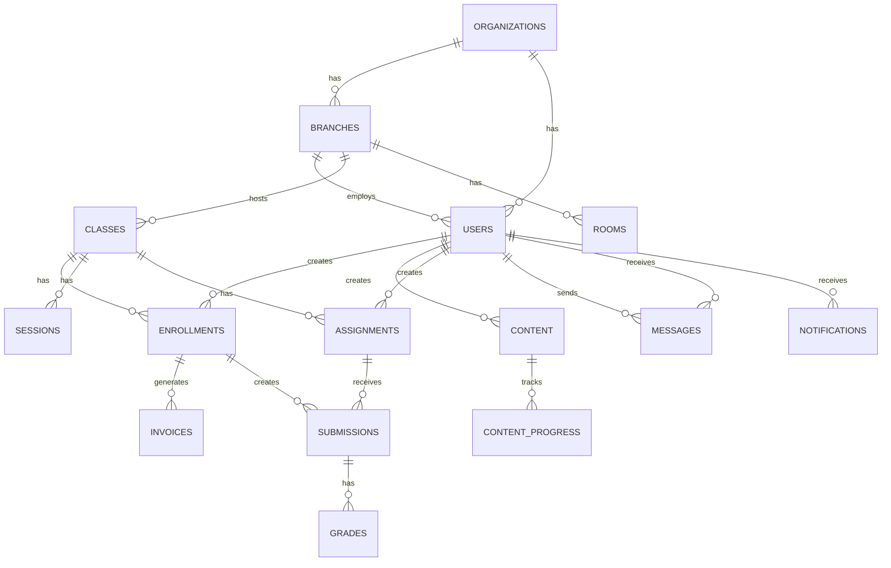

# 🗄️ Database Schema (ERD) - AI-Powered LMS

**Version**: 3.1  
**Date**: 2026-08-26  
**Database**: PostgreSQL 15+

> ⚠️ **(D9)** File này là ERD **tham chiếu**. Schema chuẩn cho implementation nằm ở [`04-database-schema.md`](../04-database-schema.md). Hệ thống quản lý license chưa triển khai ở giai đoạn này — các cột license (trial) dưới đây là mô tả ERD, chưa kích hoạt gate thật.

---

## 📋 Table of Contents

1. [Overview](#overview)
2. [Entity Relationship Diagram](#entity-relationship-diagram)
3. [Core Tables](#core-tables)
4. [Academic Tables](#academic-tables)
5. [Content & Library Tables](#content--library-tables)
6. [Assessment Tables](#assessment-tables)
7. [Communication Tables](#communication-tables)
8. [Financial Tables](#financial-tables)
9. [Analytics Tables](#analytics-tables)
10. [Indexes & Constraints](#indexes--constraints)

---

## Overview

### Database Design Principles
- **Normalized**: 3NF (Third Normal Form) for data integrity
- **Multi-tenancy**: Organization-scoped isolation
- **Soft deletes**: `deleted_at` for audit trail
- **Timestamps**: `created_at`, `updated_at` on all tables
- **UUIDs**: Primary keys for security & distributed systems
- **Audit**: Change tracking for sensitive data

### Statistics
```
Total Tables: 45
Core Tables: 12
Academic: 8
Content: 6
Assessment: 7
Communication: 5
Financial: 4
Analytics: 3
```

---

## Entity Relationship Diagram

### High-Level Overview



---

## Core Tables

### 1. organizations
```sql
CREATE TABLE organizations (
    id UUID PRIMARY KEY DEFAULT uuid_generate_v4(),
    name VARCHAR(255) NOT NULL,
    slug VARCHAR(100) UNIQUE NOT NULL,
    
    -- Contact
    email VARCHAR(255),
    phone VARCHAR(20),
    website VARCHAR(255),
    
    -- Address
    address TEXT,
    city VARCHAR(100),
    province VARCHAR(100),
    postal_code VARCHAR(20),
    country VARCHAR(2) DEFAULT 'VN',
    
    -- Settings
    settings JSONB DEFAULT '{}',
    features JSONB DEFAULT '{}',
    
    -- License
    license_type VARCHAR(50) DEFAULT 'trial',
    license_expires_at TIMESTAMP,
    max_users INT DEFAULT 50,
    max_students INT DEFAULT 500,
    
    -- Status
    status VARCHAR(20) DEFAULT 'active',
    
    -- Timestamps
    created_at TIMESTAMP DEFAULT CURRENT_TIMESTAMP,
    updated_at TIMESTAMP DEFAULT CURRENT_TIMESTAMP,
    deleted_at TIMESTAMP
);

CREATE INDEX idx_organizations_slug ON organizations(slug);
CREATE INDEX idx_organizations_status ON organizations(status) WHERE deleted_at IS NULL;
```

### 2. branches
```sql
CREATE TABLE branches (
    id UUID PRIMARY KEY DEFAULT uuid_generate_v4(),
    organization_id UUID NOT NULL REFERENCES organizations(id) ON DELETE CASCADE,
    
    name VARCHAR(255) NOT NULL,
    code VARCHAR(50) UNIQUE NOT NULL,
    
    -- Contact
    email VARCHAR(255),
    phone VARCHAR(20),
    
    -- Address
    address TEXT,
    city VARCHAR(100),
    province VARCHAR(100),
    postal_code VARCHAR(20),
    
    -- Manager
    manager_id UUID REFERENCES users(id),
    
    -- Settings
    settings JSONB DEFAULT '{}',
    
    -- Status
    is_active BOOLEAN DEFAULT true,
    
    -- Timestamps
    created_at TIMESTAMP DEFAULT CURRENT_TIMESTAMP,
    updated_at TIMESTAMP DEFAULT CURRENT_TIMESTAMP,
    deleted_at TIMESTAMP
);

CREATE INDEX idx_branches_org ON branches(organization_id);
CREATE INDEX idx_branches_code ON branches(code);
CREATE INDEX idx_branches_manager ON branches(manager_id);
```

### 3. users
```sql
CREATE TABLE users (
    id UUID PRIMARY KEY DEFAULT uuid_generate_v4(),
    organization_id UUID NOT NULL REFERENCES organizations(id) ON DELETE CASCADE,
    branch_id UUID REFERENCES branches(id),
    
    -- Authentication
    email VARCHAR(255) UNIQUE NOT NULL,
    password_hash VARCHAR(255) NOT NULL,
    email_verified_at TIMESTAMP,
    
    -- Profile
    first_name VARCHAR(100) NOT NULL,
    last_name VARCHAR(100) NOT NULL,
    full_name VARCHAR(255) GENERATED ALWAYS AS (first_name || ' ' || last_name) STORED,
    avatar_url VARCHAR(500),
    
    -- Contact
    phone VARCHAR(20),
    date_of_birth DATE,
    gender VARCHAR(10),
    
    -- Address
    address TEXT,
    city VARCHAR(100),
    province VARCHAR(100),
    postal_code VARCHAR(20),
    country VARCHAR(2) DEFAULT 'VN',
    
    -- Role & Permissions
    role VARCHAR(50) NOT NULL,
    permissions JSONB DEFAULT '[]',
    
    -- Settings
    preferences JSONB DEFAULT '{}',
    locale VARCHAR(10) DEFAULT 'vi',
    timezone VARCHAR(50) DEFAULT 'Asia/Ho_Chi_Minh',
    
    -- Security
    last_login_at TIMESTAMP,
    last_login_ip INET,
    failed_login_attempts INT DEFAULT 0,
    locked_until TIMESTAMP,
    
    -- Status
    status VARCHAR(20) DEFAULT 'active',
    
    -- Timestamps
    created_at TIMESTAMP DEFAULT CURRENT_TIMESTAMP,
    updated_at TIMESTAMP DEFAULT CURRENT_TIMESTAMP,
    deleted_at TIMESTAMP
);

CREATE UNIQUE INDEX idx_users_email ON users(email) WHERE deleted_at IS NULL;
CREATE INDEX idx_users_org ON users(organization_id);
CREATE INDEX idx_users_branch ON users(branch_id);
CREATE INDEX idx_users_role ON users(role);
CREATE INDEX idx_users_status ON users(status) WHERE deleted_at IS NULL;
```

### 4. roles
```sql
CREATE TABLE roles (
    id UUID PRIMARY KEY DEFAULT uuid_generate_v4(),
    organization_id UUID REFERENCES organizations(id) ON DELETE CASCADE,
    
    name VARCHAR(100) NOT NULL,
    slug VARCHAR(100) NOT NULL,
    description TEXT,
    
    -- Permissions
    permissions JSONB DEFAULT '[]',
    
    -- Type
    is_system BOOLEAN DEFAULT false,
    is_custom BOOLEAN DEFAULT false,
    
    -- Timestamps
    created_at TIMESTAMP DEFAULT CURRENT_TIMESTAMP,
    updated_at TIMESTAMP DEFAULT CURRENT_TIMESTAMP,
    deleted_at TIMESTAMP,
    
    UNIQUE(organization_id, slug)
);

CREATE INDEX idx_roles_org ON roles(organization_id);
CREATE INDEX idx_roles_slug ON roles(slug);
```

### 5. permissions
```sql
CREATE TABLE permissions (
    id UUID PRIMARY KEY DEFAULT uuid_generate_v4(),
    
    name VARCHAR(100) NOT NULL UNIQUE,
    slug VARCHAR(100) NOT NULL UNIQUE,
    description TEXT,
    
    -- Grouping
    module VARCHAR(50) NOT NULL,
    category VARCHAR(50),
    
    -- Timestamps
    created_at TIMESTAMP DEFAULT CURRENT_TIMESTAMP,
    updated_at TIMESTAMP DEFAULT CURRENT_TIMESTAMP
);

CREATE INDEX idx_permissions_module ON permissions(module);
```

---

## Academic Tables

### 6. programs
```sql
CREATE TABLE programs (
    id UUID PRIMARY KEY DEFAULT uuid_generate_v4(),
    organization_id UUID NOT NULL REFERENCES organizations(id) ON DELETE CASCADE,
    branch_id UUID REFERENCES branches(id),
    
    name VARCHAR(255) NOT NULL,
    code VARCHAR(50) NOT NULL,
    description TEXT,
    
    -- Details
    industry VARCHAR(50),
    level VARCHAR(50),
    duration_weeks INT,
    total_sessions INT,
    
    -- Pricing
    price DECIMAL(12, 2),
    currency VARCHAR(3) DEFAULT 'VND',
    
    -- Curriculum
    curriculum JSONB DEFAULT '[]',
    learning_outcomes JSONB DEFAULT '[]',
    
    -- Status
    is_active BOOLEAN DEFAULT true,
    
    -- Timestamps
    created_at TIMESTAMP DEFAULT CURRENT_TIMESTAMP,
    updated_at TIMESTAMP DEFAULT CURRENT_TIMESTAMP,
    deleted_at TIMESTAMP,
    
    UNIQUE(organization_id, code)
);

CREATE INDEX idx_programs_org ON programs(organization_id);
CREATE INDEX idx_programs_branch ON programs(branch_id);
CREATE INDEX idx_programs_code ON programs(code);
CREATE INDEX idx_programs_industry ON programs(industry);
```

### 7. classes
```sql
CREATE TABLE classes (
    id UUID PRIMARY KEY DEFAULT uuid_generate_v4(),
    organization_id UUID NOT NULL REFERENCES organizations(id) ON DELETE CASCADE,
    branch_id UUID NOT NULL REFERENCES branches(id) ON DELETE CASCADE,
    program_id UUID NOT NULL REFERENCES programs(id),
    
    name VARCHAR(255) NOT NULL,
    code VARCHAR(50) NOT NULL,
    description TEXT,
    
    -- Schedule
    start_date DATE NOT NULL,
    end_date DATE,
    schedule JSONB DEFAULT '[]',  -- [{day: 'monday', time: '18:00', duration: 90}]
    
    -- Delivery Mode
    delivery_mode VARCHAR(20) DEFAULT 'offline',  -- offline, online, hybrid, flexible
    meeting_url VARCHAR(500),
    meeting_id VARCHAR(100),
    meeting_password VARCHAR(100),
    
    -- Room (for offline/hybrid)
    room_id UUID REFERENCES rooms(id),
    
    -- Capacity
    max_students INT DEFAULT 20,
    min_students INT DEFAULT 5,
    
    -- Teachers
    primary_teacher_id UUID REFERENCES users(id),
    assistant_teacher_id UUID REFERENCES users(id),
    
    -- Status
    status VARCHAR(20) DEFAULT 'draft',  -- draft, open, ongoing, completed, cancelled
    
    -- Timestamps
    created_at TIMESTAMP DEFAULT CURRENT_TIMESTAMP,
    updated_at TIMESTAMP DEFAULT CURRENT_TIMESTAMP,
    deleted_at TIMESTAMP,
    
    UNIQUE(organization_id, code)
);

CREATE INDEX idx_classes_org ON classes(organization_id);
CREATE INDEX idx_classes_branch ON classes(branch_id);
CREATE INDEX idx_classes_program ON classes(program_id);
CREATE INDEX idx_classes_teacher ON classes(primary_teacher_id);
CREATE INDEX idx_classes_status ON classes(status);
CREATE INDEX idx_classes_dates ON classes(start_date, end_date);
```

### 8. rooms
```sql
CREATE TABLE rooms (
    id UUID PRIMARY KEY DEFAULT uuid_generate_v4(),
    organization_id UUID NOT NULL REFERENCES organizations(id) ON DELETE CASCADE,
    branch_id UUID NOT NULL REFERENCES branches(id) ON DELETE CASCADE,
    
    name VARCHAR(100) NOT NULL,
    code VARCHAR(50) NOT NULL,
    
    -- Type
    room_type VARCHAR(20) DEFAULT 'physical',  -- physical, virtual
    
    -- Physical Room
    floor INT,
    building VARCHAR(100),
    capacity INT,
    
    -- Virtual Room (for online)
    platform VARCHAR(50),  -- zoom, google-meet, ms-teams
    meeting_url VARCHAR(500),
    meeting_id VARCHAR(100),
    
    -- Facilities
    facilities JSONB DEFAULT '[]',
    
    -- Status
    is_active BOOLEAN DEFAULT true,
    
    -- Timestamps
    created_at TIMESTAMP DEFAULT CURRENT_TIMESTAMP,
    updated_at TIMESTAMP DEFAULT CURRENT_TIMESTAMP,
    deleted_at TIMESTAMP,
    
    UNIQUE(organization_id, branch_id, code)
);

CREATE INDEX idx_rooms_branch ON rooms(branch_id);
CREATE INDEX idx_rooms_type ON rooms(room_type);
```

### 9. sessions
```sql
CREATE TABLE sessions (
    id UUID PRIMARY KEY DEFAULT uuid_generate_v4(),
    organization_id UUID NOT NULL REFERENCES organizations(id) ON DELETE CASCADE,
    class_id UUID NOT NULL REFERENCES classes(id) ON DELETE CASCADE,
    
    title VARCHAR(255) NOT NULL,
    session_number INT NOT NULL,
    description TEXT,
    
    -- Schedule
    scheduled_at TIMESTAMP NOT NULL,
    duration_minutes INT DEFAULT 90,
    
    -- Delivery
    delivery_mode VARCHAR(20) DEFAULT 'offline',
    room_id UUID REFERENCES rooms(id),
    meeting_url VARCHAR(500),
    
    -- Recording (for online sessions)
    recording_url VARCHAR(500),
    recording_duration_seconds INT,
    recording_size_mb DECIMAL(10, 2),
    
    -- Content
    lesson_plan TEXT,
    homework TEXT,
    materials JSONB DEFAULT '[]',
    
    -- Attendance
    attendance_taken_at TIMESTAMP,
    attendance_taken_by UUID REFERENCES users(id),
    
    -- Status
    status VARCHAR(20) DEFAULT 'scheduled',  -- scheduled, ongoing, completed, cancelled
    
    -- Notes
    teacher_notes TEXT,
    
    -- Timestamps
    created_at TIMESTAMP DEFAULT CURRENT_TIMESTAMP,
    updated_at TIMESTAMP DEFAULT CURRENT_TIMESTAMP,
    deleted_at TIMESTAMP
);

CREATE INDEX idx_sessions_class ON sessions(class_id);
CREATE INDEX idx_sessions_scheduled ON sessions(scheduled_at);
CREATE INDEX idx_sessions_status ON sessions(status);
```

### 10. enrollments
```sql
CREATE TABLE enrollments (
    id UUID PRIMARY KEY DEFAULT uuid_generate_v4(),
    organization_id UUID NOT NULL REFERENCES organizations(id) ON DELETE CASCADE,
    
    student_id UUID NOT NULL REFERENCES users(id) ON DELETE CASCADE,
    class_id UUID NOT NULL REFERENCES classes(id) ON DELETE CASCADE,
    
    -- Dates
    enrolled_at TIMESTAMP DEFAULT CURRENT_TIMESTAMP,
    start_date DATE,
    end_date DATE,
    completed_at TIMESTAMP,
    
    -- Pricing
    original_price DECIMAL(12, 2),
    discount_amount DECIMAL(12, 2) DEFAULT 0,
    final_price DECIMAL(12, 2),
    currency VARCHAR(3) DEFAULT 'VND',
    
    -- Payment Status
    payment_status VARCHAR(20) DEFAULT 'pending',  -- pending, paid, partial, overdue
    paid_amount DECIMAL(12, 2) DEFAULT 0,
    
    -- Status
    status VARCHAR(20) DEFAULT 'active',  -- active, completed, dropped, suspended
    
    -- Performance
    attendance_rate DECIMAL(5, 2),
    average_grade DECIMAL(5, 2),
    
    -- Timestamps
    created_at TIMESTAMP DEFAULT CURRENT_TIMESTAMP,
    updated_at TIMESTAMP DEFAULT CURRENT_TIMESTAMP,
    deleted_at TIMESTAMP,
    
    UNIQUE(student_id, class_id)
);

CREATE INDEX idx_enrollments_student ON enrollments(student_id);
CREATE INDEX idx_enrollments_class ON enrollments(class_id);
CREATE INDEX idx_enrollments_status ON enrollments(status);
CREATE INDEX idx_enrollments_payment ON enrollments(payment_status);
```

### 11. attendance
```sql
CREATE TABLE attendance (
    id UUID PRIMARY KEY DEFAULT uuid_generate_v4(),
    organization_id UUID NOT NULL REFERENCES organizations(id) ON DELETE CASCADE,
    
    session_id UUID NOT NULL REFERENCES sessions(id) ON DELETE CASCADE,
    student_id UUID NOT NULL REFERENCES users(id) ON DELETE CASCADE,
    
    -- Status
    status VARCHAR(20) NOT NULL,  -- present, absent, late, excused
    
    -- Timing
    checked_in_at TIMESTAMP,
    checked_out_at TIMESTAMP,
    duration_minutes INT,
    
    -- Late
    minutes_late INT DEFAULT 0,
    
    -- Note
    note TEXT,
    
    -- Recording (who took attendance)
    recorded_by UUID REFERENCES users(id),
    recorded_at TIMESTAMP DEFAULT CURRENT_TIMESTAMP,
    
    -- Timestamps
    created_at TIMESTAMP DEFAULT CURRENT_TIMESTAMP,
    updated_at TIMESTAMP DEFAULT CURRENT_TIMESTAMP,
    
    UNIQUE(session_id, student_id)
);

CREATE INDEX idx_attendance_session ON attendance(session_id);
CREATE INDEX idx_attendance_student ON attendance(student_id);
CREATE INDEX idx_attendance_status ON attendance(status);
```

---

## Content & Library Tables

### 12. content
```sql
CREATE TABLE content (
    id UUID PRIMARY KEY DEFAULT uuid_generate_v4(),
    organization_id UUID NOT NULL REFERENCES organizations(id) ON DELETE CASCADE,
    
    title VARCHAR(500) NOT NULL,
    description TEXT,
    
    -- Type
    content_type VARCHAR(50) NOT NULL,  -- video, document, audio, interactive, ebook
    
    -- Files
    original_url VARCHAR(1000),
    processed_urls JSONB DEFAULT '{}',  -- {720p: 'url', 480p: 'url'}
    thumbnail_url VARCHAR(500),
    
    -- Metadata
    file_size_bytes BIGINT,
    duration_seconds INT,
    mime_type VARCHAR(100),
    
    -- Text Content (for search)
    transcript TEXT,
    extracted_text TEXT,
    
    -- Categorization
    category VARCHAR(100),
    tags JSONB DEFAULT '[]',
    industry VARCHAR(50),
    level VARCHAR(50),  -- beginner, intermediate, advanced
    language VARCHAR(10) DEFAULT 'vi',
    
    -- AI Features
    embedding VECTOR(1536),  -- OpenAI embedding for similarity search
    ai_tags JSONB DEFAULT '[]',
    ai_summary TEXT,
    difficulty_score DECIMAL(3, 2),
    
    -- Access Control
    access_level VARCHAR(20) DEFAULT 'enrolled',  -- public, enrolled, class, paid
    
    -- Statistics
    view_count INT DEFAULT 0,
    like_count INT DEFAULT 0,
    average_rating DECIMAL(3, 2),
    completion_rate DECIMAL(5, 2),
    
    -- Creator
    created_by UUID REFERENCES users(id),
    
    -- Processing Status
    processing_status VARCHAR(20) DEFAULT 'pending',  -- pending, processing, completed, failed
    processing_error TEXT,
    
    -- Status
    status VARCHAR(20) DEFAULT 'draft',  -- draft, published, archived
    published_at TIMESTAMP,
    
    -- Timestamps
    created_at TIMESTAMP DEFAULT CURRENT_TIMESTAMP,
    updated_at TIMESTAMP DEFAULT CURRENT_TIMESTAMP,
    deleted_at TIMESTAMP
);

CREATE INDEX idx_content_org ON content(organization_id);
CREATE INDEX idx_content_type ON content(content_type);
CREATE INDEX idx_content_category ON content(category);
CREATE INDEX idx_content_status ON content(status);
CREATE INDEX idx_content_creator ON content(created_by);
CREATE INDEX idx_content_published ON content(published_at) WHERE status = 'published';
CREATE INDEX idx_content_embedding ON content USING ivfflat (embedding vector_cosine_ops);
CREATE INDEX idx_content_search ON content USING gin(to_tsvector('simple', title || ' ' || description || ' ' || COALESCE(transcript, '')));
```

### 13. content_progress
```sql
CREATE TABLE content_progress (
    id UUID PRIMARY KEY DEFAULT uuid_generate_v4(),
    organization_id UUID NOT NULL REFERENCES organizations(id) ON DELETE CASCADE,
    
    content_id UUID NOT NULL REFERENCES content(id) ON DELETE CASCADE,
    user_id UUID NOT NULL REFERENCES users(id) ON DELETE CASCADE,
    
    -- Progress
    progress_percent DECIMAL(5, 2) DEFAULT 0,
    current_position_seconds INT DEFAULT 0,
    completed BOOLEAN DEFAULT false,
    completed_at TIMESTAMP,
    
    -- Engagement
    total_time_spent_seconds INT DEFAULT 0,
    view_count INT DEFAULT 0,
    
    -- Bookmarks
    bookmarks JSONB DEFAULT '[]',  -- [{time: 120, note: 'important'}]
    
    -- Rating
    rating INT CHECK (rating >= 1 AND rating <= 5),
    
    -- Timestamps
    created_at TIMESTAMP DEFAULT CURRENT_TIMESTAMP,
    updated_at TIMESTAMP DEFAULT CURRENT_TIMESTAMP,
    last_viewed_at TIMESTAMP,
    
    UNIQUE(content_id, user_id)
);

CREATE INDEX idx_content_progress_user ON content_progress(user_id);
CREATE INDEX idx_content_progress_content ON content_progress(content_id);
CREATE INDEX idx_content_progress_completed ON content_progress(completed);
```

### 14. playlists
```sql
CREATE TABLE playlists (
    id UUID PRIMARY KEY DEFAULT uuid_generate_v4(),
    organization_id UUID NOT NULL REFERENCES organizations(id) ON DELETE CASCADE,
    
    name VARCHAR(255) NOT NULL,
    description TEXT,
    
    -- Creator
    created_by UUID REFERENCES users(id),
    
    -- Type
    playlist_type VARCHAR(20) DEFAULT 'manual',  -- manual, ai-generated, smart
    
    -- Smart Playlist Criteria
    criteria JSONB DEFAULT '{}',
    
    -- Visibility
    is_public BOOLEAN DEFAULT false,
    
    -- Status
    is_active BOOLEAN DEFAULT true,
    
    -- Timestamps
    created_at TIMESTAMP DEFAULT CURRENT_TIMESTAMP,
    updated_at TIMESTAMP DEFAULT CURRENT_TIMESTAMP,
    deleted_at TIMESTAMP
);

CREATE INDEX idx_playlists_creator ON playlists(created_by);
CREATE INDEX idx_playlists_type ON playlists(playlist_type);
```

### 15. playlist_items
```sql
CREATE TABLE playlist_items (
    id UUID PRIMARY KEY DEFAULT uuid_generate_v4(),
    
    playlist_id UUID NOT NULL REFERENCES playlists(id) ON DELETE CASCADE,
    content_id UUID NOT NULL REFERENCES content(id) ON DELETE CASCADE,
    
    position INT NOT NULL,
    
    -- Timestamps
    created_at TIMESTAMP DEFAULT CURRENT_TIMESTAMP,
    
    UNIQUE(playlist_id, content_id),
    UNIQUE(playlist_id, position)
);

CREATE INDEX idx_playlist_items_playlist ON playlist_items(playlist_id);
CREATE INDEX idx_playlist_items_content ON playlist_items(content_id);
```

---

## Assessment Tables

### 16. assignments
```sql
CREATE TABLE assignments (
    id UUID PRIMARY KEY DEFAULT uuid_generate_v4(),
    organization_id UUID NOT NULL REFERENCES organizations(id) ON DELETE CASCADE,
    
    class_id UUID NOT NULL REFERENCES classes(id) ON DELETE CASCADE,
    created_by UUID NOT NULL REFERENCES users(id),
    
    title VARCHAR(500) NOT NULL,
    description TEXT,
    instructions TEXT,
    
    -- Type
    assignment_type VARCHAR(50) NOT NULL,  -- multiple-choice, essay, speaking, code, interactive
    
    -- Questions/Content
    content JSONB NOT NULL,  -- Assignment-specific structure
    rubric JSONB DEFAULT '{}',
    
    -- Scoring
    total_points DECIMAL(6, 2),
    passing_score DECIMAL(6, 2),
    
    -- AI Settings
    ai_grading_enabled BOOLEAN DEFAULT false,
    ai_grading_model VARCHAR(50),
    require_teacher_review BOOLEAN DEFAULT true,
    
    -- Deadlines
    available_from TIMESTAMP,
    due_date TIMESTAMP,
    late_submission_allowed BOOLEAN DEFAULT true,
    late_penalty_percent DECIMAL(5, 2) DEFAULT 0,
    
    -- Attempts
    max_attempts INT DEFAULT 1,
    
    -- Visibility
    published BOOLEAN DEFAULT false,
    published_at TIMESTAMP,
    
    -- Timestamps
    created_at TIMESTAMP DEFAULT CURRENT_TIMESTAMP,
    updated_at TIMESTAMP DEFAULT CURRENT_TIMESTAMP,
    deleted_at TIMESTAMP
);

CREATE INDEX idx_assignments_class ON assignments(class_id);
CREATE INDEX idx_assignments_creator ON assignments(created_by);
CREATE INDEX idx_assignments_type ON assignments(assignment_type);
CREATE INDEX idx_assignments_due ON assignments(due_date);
```

### 17. submissions
```sql
CREATE TABLE submissions (
    id UUID PRIMARY KEY DEFAULT uuid_generate_v4(),
    organization_id UUID NOT NULL REFERENCES organizations(id) ON DELETE CASCADE,
    
    assignment_id UUID NOT NULL REFERENCES assignments(id) ON DELETE CASCADE,
    student_id UUID NOT NULL REFERENCES users(id) ON DELETE CASCADE,
    
    attempt_number INT DEFAULT 1,
    
    -- Content
    answers JSONB NOT NULL,  -- Student's answers
    attachments JSONB DEFAULT '[]',
    
    -- Timing
    started_at TIMESTAMP,
    submitted_at TIMESTAMP,
    time_spent_seconds INT,
    
    -- Status
    status VARCHAR(20) DEFAULT 'draft',  -- draft, submitted, grading, graded, returned
    
    -- Late Submission
    is_late BOOLEAN DEFAULT false,
    late_penalty_applied DECIMAL(6, 2) DEFAULT 0,
    
    -- Timestamps
    created_at TIMESTAMP DEFAULT CURRENT_TIMESTAMP,
    updated_at TIMESTAMP DEFAULT CURRENT_TIMESTAMP,
    deleted_at TIMESTAMP
);

CREATE INDEX idx_submissions_assignment ON submissions(assignment_id);
CREATE INDEX idx_submissions_student ON submissions(student_id);
CREATE INDEX idx_submissions_status ON submissions(status);
CREATE INDEX idx_submissions_submitted ON submissions(submitted_at);
```

### 18. grades
```sql
CREATE TABLE grades (
    id UUID PRIMARY KEY DEFAULT uuid_generate_v4(),
    organization_id UUID NOT NULL REFERENCES organizations(id) ON DELETE CASCADE,
    
    submission_id UUID NOT NULL REFERENCES submissions(id) ON DELETE CASCADE,
    graded_by UUID REFERENCES users(id),
    
    -- Scores
    score DECIMAL(6, 2) NOT NULL,
    max_score DECIMAL(6, 2) NOT NULL,
    percentage DECIMAL(5, 2) GENERATED ALWAYS AS ((score / max_score) * 100) STORED,
    
    -- Letter Grade
    letter_grade VARCHAR(5),  -- A+, A, B+, etc.
    
    -- Rubric Breakdown
    rubric_scores JSONB DEFAULT '{}',  -- {grammar: 8, content: 9, structure: 7}
    
    -- Feedback
    feedback TEXT,
    ai_feedback TEXT,
    teacher_feedback TEXT,
    
    -- AI Grading
    is_ai_graded BOOLEAN DEFAULT false,
    ai_confidence DECIMAL(3, 2),
    ai_model VARCHAR(50),
    
    -- Teacher Review
    teacher_reviewed BOOLEAN DEFAULT false,
    teacher_adjusted BOOLEAN DEFAULT false,
    original_ai_score DECIMAL(6, 2),
    
    -- Status
    status VARCHAR(20) DEFAULT 'draft',  -- draft, published
    published_at TIMESTAMP,
    
    -- Timestamps
    created_at TIMESTAMP DEFAULT CURRENT_TIMESTAMP,
    updated_at TIMESTAMP DEFAULT CURRENT_TIMESTAMP,
    deleted_at TIMESTAMP,
    
    UNIQUE(submission_id)
);

CREATE INDEX idx_grades_submission ON grades(submission_id);
CREATE INDEX idx_grades_grader ON grades(graded_by);
CREATE INDEX idx_grades_status ON grades(status);
CREATE INDEX idx_grades_ai ON grades(is_ai_graded);
```

### 19. competencies
```sql
CREATE TABLE competencies (
    id UUID PRIMARY KEY DEFAULT uuid_generate_v4(),
    organization_id UUID NOT NULL REFERENCES organizations(id) ON DELETE CASCADE,
    
    name VARCHAR(255) NOT NULL,
    description TEXT,
    
    -- Hierarchy
    parent_id UUID REFERENCES competencies(id),
    
    -- Industry
    industry VARCHAR(50),
    
    -- Level
    level INT DEFAULT 1,  -- 1: beginner, 2: intermediate, 3: advanced, 4: expert
    
    -- Timestamps
    created_at TIMESTAMP DEFAULT CURRENT_TIMESTAMP,
    updated_at TIMESTAMP DEFAULT CURRENT_TIMESTAMP,
    deleted_at TIMESTAMP
);

CREATE INDEX idx_competencies_org ON competencies(organization_id);
CREATE INDEX idx_competencies_parent ON competencies(parent_id);
CREATE INDEX idx_competencies_industry ON competencies(industry);
```

### 20. student_competencies
```sql
CREATE TABLE student_competencies (
    id UUID PRIMARY KEY DEFAULT uuid_generate_v4(),
    organization_id UUID NOT NULL REFERENCES organizations(id) ON DELETE CASCADE,
    
    student_id UUID NOT NULL REFERENCES users(id) ON DELETE CASCADE,
    competency_id UUID NOT NULL REFERENCES competencies(id) ON DELETE CASCADE,
    
    -- Level
    current_level INT DEFAULT 1,  -- 1: beginner, 2: developing, 3: proficient, 4: excellent
    
    -- Evidence
    evidence JSONB DEFAULT '[]',  -- [{type: 'assignment', id: 'uuid', score: 85}]
    
    -- Last Assessment
    last_assessed_at TIMESTAMP,
    assessed_by UUID REFERENCES users(id),
    
    -- Timestamps
    created_at TIMESTAMP DEFAULT CURRENT_TIMESTAMP,
    updated_at TIMESTAMP DEFAULT CURRENT_TIMESTAMP,
    
    UNIQUE(student_id, competency_id)
);

CREATE INDEX idx_student_competencies_student ON student_competencies(student_id);
CREATE INDEX idx_student_competencies_competency ON student_competencies(competency_id);
```

---

## Communication Tables

### 21. messages
```sql
CREATE TABLE messages (
    id UUID PRIMARY KEY DEFAULT uuid_generate_v4(),
    organization_id UUID NOT NULL REFERENCES organizations(id) ON DELETE CASCADE,
    
    -- Sender & Recipient
    sender_id UUID NOT NULL REFERENCES users(id) ON DELETE CASCADE,
    recipient_id UUID REFERENCES users(id) ON DELETE CASCADE,
    
    -- Channel (if group/channel message)
    channel_id UUID REFERENCES channels(id) ON DELETE CASCADE,
    
    -- Thread
    parent_message_id UUID REFERENCES messages(id),
    thread_reply_count INT DEFAULT 0,
    
    -- Content
    content TEXT NOT NULL,
    content_html TEXT,
    
    -- Type
    message_type VARCHAR(20) DEFAULT 'text',  -- text, file, image, system
    
    -- Attachments
    attachments JSONB DEFAULT '[]',
    
    -- AI Classification (for parent-school messages)
    ai_topic VARCHAR(100),
    ai_sentiment VARCHAR(20),  -- positive, neutral, negative
    ai_urgency VARCHAR(20),  -- low, medium, high
    ai_route_to VARCHAR(50),  -- academic, finance, support, etc.
    
    -- Status
    is_read BOOLEAN DEFAULT false,
    read_at TIMESTAMP,
    
    -- Soft Delete
    deleted_by_sender BOOLEAN DEFAULT false,
    deleted_by_recipient BOOLEAN DEFAULT false,
    
    -- Timestamps
    created_at TIMESTAMP DEFAULT CURRENT_TIMESTAMP,
    updated_at TIMESTAMP DEFAULT CURRENT_TIMESTAMP,
    deleted_at TIMESTAMP
);

CREATE INDEX idx_messages_sender ON messages(sender_id);
CREATE INDEX idx_messages_recipient ON messages(recipient_id);
CREATE INDEX idx_messages_channel ON messages(channel_id);
CREATE INDEX idx_messages_parent ON messages(parent_message_id);
CREATE INDEX idx_messages_created ON messages(created_at);
CREATE INDEX idx_messages_unread ON messages(recipient_id, is_read) WHERE is_read = false;
```

### 22. channels
```sql
CREATE TABLE channels (
    id UUID PRIMARY KEY DEFAULT uuid_generate_v4(),
    organization_id UUID NOT NULL REFERENCES organizations(id) ON DELETE CASCADE,
    
    name VARCHAR(255) NOT NULL,
    description TEXT,
    
    -- Type
    channel_type VARCHAR(20) NOT NULL,  -- public, private, direct, announcement
    
    -- Class Channel
    class_id UUID REFERENCES classes(id),
    
    -- Creator
    created_by UUID REFERENCES users(id),
    
    -- Status
    is_active BOOLEAN DEFAULT true,
    
    -- Timestamps
    created_at TIMESTAMP DEFAULT CURRENT_TIMESTAMP,
    updated_at TIMESTAMP DEFAULT CURRENT_TIMESTAMP,
    deleted_at TIMESTAMP
);

CREATE INDEX idx_channels_org ON channels(organization_id);
CREATE INDEX idx_channels_type ON channels(channel_type);
CREATE INDEX idx_channels_class ON channels(class_id);
```

### 23. channel_members
```sql
CREATE TABLE channel_members (
    id UUID PRIMARY KEY DEFAULT uuid_generate_v4(),
    
    channel_id UUID NOT NULL REFERENCES channels(id) ON DELETE CASCADE,
    user_id UUID NOT NULL REFERENCES users(id) ON DELETE CASCADE,
    
    -- Role in channel
    role VARCHAR(20) DEFAULT 'member',  -- owner, admin, member
    
    -- Notifications
    muted BOOLEAN DEFAULT false,
    
    -- Last Read
    last_read_at TIMESTAMP,
    
    -- Timestamps
    created_at TIMESTAMP DEFAULT CURRENT_TIMESTAMP,
    
    UNIQUE(channel_id, user_id)
);

CREATE INDEX idx_channel_members_channel ON channel_members(channel_id);
CREATE INDEX idx_channel_members_user ON channel_members(user_id);
```

### 24. notifications
```sql
CREATE TABLE notifications (
    id UUID PRIMARY KEY DEFAULT uuid_generate_v4(),
    organization_id UUID NOT NULL REFERENCES organizations(id) ON DELETE CASCADE,
    
    user_id UUID NOT NULL REFERENCES users(id) ON DELETE CASCADE,
    
    -- Type
    notification_type VARCHAR(50) NOT NULL,  -- assignment_due, grade_published, message_received, etc.
    
    -- Content
    title VARCHAR(500) NOT NULL,
    body TEXT,
    
    -- Link
    action_url VARCHAR(500),
    
    -- Related Entity
    related_entity_type VARCHAR(50),
    related_entity_id UUID,
    
    -- Priority
    priority VARCHAR(20) DEFAULT 'normal',  -- low, normal, high, urgent
    
    -- Delivery Channels
    delivered_push BOOLEAN DEFAULT false,
    delivered_email BOOLEAN DEFAULT false,
    delivered_sms BOOLEAN DEFAULT false,
    
    -- Status
    is_read BOOLEAN DEFAULT false,
    read_at TIMESTAMP,
    
    -- Timestamps
    created_at TIMESTAMP DEFAULT CURRENT_TIMESTAMP,
    deleted_at TIMESTAMP
);

CREATE INDEX idx_notifications_user ON notifications(user_id);
CREATE INDEX idx_notifications_type ON notifications(notification_type);
CREATE INDEX idx_notifications_unread ON notifications(user_id, is_read) WHERE is_read = false;
CREATE INDEX idx_notifications_created ON notifications(created_at);
```

### 25. email_campaigns
```sql
CREATE TABLE email_campaigns (
    id UUID PRIMARY KEY DEFAULT uuid_generate_v4(),
    organization_id UUID NOT NULL REFERENCES organizations(id) ON DELETE CASCADE,
    
    name VARCHAR(255) NOT NULL,
    subject VARCHAR(500) NOT NULL,
    
    -- Content
    body_html TEXT NOT NULL,
    body_text TEXT,
    
    -- Audience
    target_audience JSONB NOT NULL,  -- {roles: ['student'], filters: {...}}
    recipient_count INT,
    
    -- Schedule
    scheduled_at TIMESTAMP,
    
    -- Status
    status VARCHAR(20) DEFAULT 'draft',  -- draft, scheduled, sending, sent, failed
    
    -- Statistics
    sent_count INT DEFAULT 0,
    delivered_count INT DEFAULT 0,
    opened_count INT DEFAULT 0,
    clicked_count INT DEFAULT 0,
    bounced_count INT DEFAULT 0,
    
    -- Creator
    created_by UUID REFERENCES users(id),
    
    -- Timestamps
    created_at TIMESTAMP DEFAULT CURRENT_TIMESTAMP,
    updated_at TIMESTAMP DEFAULT CURRENT_TIMESTAMP,
    sent_at TIMESTAMP,
    deleted_at TIMESTAMP
);

CREATE INDEX idx_email_campaigns_org ON email_campaigns(organization_id);
CREATE INDEX idx_email_campaigns_status ON email_campaigns(status);
CREATE INDEX idx_email_campaigns_scheduled ON email_campaigns(scheduled_at);
```

---

## Financial Tables

### 26. invoices
```sql
CREATE TABLE invoices (
    id UUID PRIMARY KEY DEFAULT uuid_generate_v4(),
    organization_id UUID NOT NULL REFERENCES organizations(id) ON DELETE CASCADE,
    
    invoice_number VARCHAR(50) UNIQUE NOT NULL,
    
    -- Customer
    student_id UUID NOT NULL REFERENCES users(id),
    enrollment_id UUID REFERENCES enrollments(id),
    
    -- Billing
    billing_name VARCHAR(255) NOT NULL,
    billing_email VARCHAR(255),
    billing_phone VARCHAR(20),
    billing_address TEXT,
    
    -- Amounts
    subtotal DECIMAL(12, 2) NOT NULL,
    discount_amount DECIMAL(12, 2) DEFAULT 0,
    tax_amount DECIMAL(12, 2) DEFAULT 0,
    total_amount DECIMAL(12, 2) NOT NULL,
    currency VARCHAR(3) DEFAULT 'VND',
    
    -- Line Items
    items JSONB NOT NULL,  -- [{description, quantity, unit_price, amount}]
    
    -- Dates
    issue_date DATE NOT NULL,
    due_date DATE NOT NULL,
    
    -- Payment
    payment_status VARCHAR(20) DEFAULT 'unpaid',  -- unpaid, partial, paid, overdue, cancelled
    paid_amount DECIMAL(12, 2) DEFAULT 0,
    paid_at TIMESTAMP,
    
    -- Notes
    notes TEXT,
    
    -- Timestamps
    created_at TIMESTAMP DEFAULT CURRENT_TIMESTAMP,
    updated_at TIMESTAMP DEFAULT CURRENT_TIMESTAMP,
    deleted_at TIMESTAMP
);

CREATE INDEX idx_invoices_org ON invoices(organization_id);
CREATE INDEX idx_invoices_student ON invoices(student_id);
CREATE INDEX idx_invoices_enrollment ON invoices(enrollment_id);
CREATE INDEX idx_invoices_status ON invoices(payment_status);
CREATE INDEX idx_invoices_due ON invoices(due_date);
CREATE INDEX idx_invoices_number ON invoices(invoice_number);
```

### 27. payments
```sql
CREATE TABLE payments (
    id UUID PRIMARY KEY DEFAULT uuid_generate_v4(),
    organization_id UUID NOT NULL REFERENCES organizations(id) ON DELETE CASCADE,
    
    invoice_id UUID NOT NULL REFERENCES invoices(id),
    
    -- Amount
    amount DECIMAL(12, 2) NOT NULL,
    currency VARCHAR(3) DEFAULT 'VND',
    
    -- Method
    payment_method VARCHAR(50) NOT NULL,  -- cash, bank-transfer, momo, vnpay, credit-card
    
    -- Gateway Transaction
    gateway_transaction_id VARCHAR(255),
    gateway_response JSONB DEFAULT '{}',
    
    -- Bank Transfer Details
    bank_name VARCHAR(100),
    bank_account VARCHAR(100),
    transfer_reference VARCHAR(255),
    
    -- Status
    status VARCHAR(20) DEFAULT 'pending',  -- pending, completed, failed, refunded
    
    -- Dates
    payment_date DATE NOT NULL,
    
    -- Receipt
    receipt_number VARCHAR(50),
    receipt_url VARCHAR(500),
    
    -- Recorded By
    recorded_by UUID REFERENCES users(id),
    
    -- Notes
    notes TEXT,
    
    -- Timestamps
    created_at TIMESTAMP DEFAULT CURRENT_TIMESTAMP,
    updated_at TIMESTAMP DEFAULT CURRENT_TIMESTAMP,
    deleted_at TIMESTAMP
);

CREATE INDEX idx_payments_invoice ON payments(invoice_id);
CREATE INDEX idx_payments_status ON payments(status);
CREATE INDEX idx_payments_date ON payments(payment_date);
CREATE INDEX idx_payments_method ON payments(payment_method);
```

### 28. expenses
```sql
CREATE TABLE expenses (
    id UUID PRIMARY KEY DEFAULT uuid_generate_v4(),
    organization_id UUID NOT NULL REFERENCES organizations(id) ON DELETE CASCADE,
    branch_id UUID REFERENCES branches(id),
    
    -- Details
    description VARCHAR(500) NOT NULL,
    category VARCHAR(100) NOT NULL,  -- salary, rent, utilities, marketing, supplies, etc.
    
    -- Amount
    amount DECIMAL(12, 2) NOT NULL,
    currency VARCHAR(3) DEFAULT 'VND',
    
    -- Date
    expense_date DATE NOT NULL,
    
    -- Payment
    payment_method VARCHAR(50),
    paid_to VARCHAR(255),
    
    -- Receipt
    receipt_number VARCHAR(100),
    receipt_url VARCHAR(500),
    
    -- Approval
    requires_approval BOOLEAN DEFAULT false,
    approved_by UUID REFERENCES users(id),
    approved_at TIMESTAMP,
    
    -- Recorded By
    recorded_by UUID REFERENCES users(id),
    
    -- Status
    status VARCHAR(20) DEFAULT 'pending',  -- pending, approved, rejected, paid
    
    -- Notes
    notes TEXT,
    
    -- Timestamps
    created_at TIMESTAMP DEFAULT CURRENT_TIMESTAMP,
    updated_at TIMESTAMP DEFAULT CURRENT_TIMESTAMP,
    deleted_at TIMESTAMP
);

CREATE INDEX idx_expenses_org ON expenses(organization_id);
CREATE INDEX idx_expenses_branch ON expenses(branch_id);
CREATE INDEX idx_expenses_category ON expenses(category);
CREATE INDEX idx_expenses_date ON expenses(expense_date);
CREATE INDEX idx_expenses_status ON expenses(status);
```

---

## Analytics Tables

### 29. analytics_events
```sql
CREATE TABLE analytics_events (
    id UUID PRIMARY KEY DEFAULT uuid_generate_v4(),
    organization_id UUID NOT NULL REFERENCES organizations(id) ON DELETE CASCADE,
    
    -- User
    user_id UUID REFERENCES users(id),
    session_id VARCHAR(100),
    
    -- Event
    event_type VARCHAR(100) NOT NULL,
    event_category VARCHAR(50),
    
    -- Properties
    properties JSONB DEFAULT '{}',
    
    -- Context
    page_url VARCHAR(1000),
    referrer_url VARCHAR(1000),
    user_agent TEXT,
    ip_address INET,
    
    -- Device
    device_type VARCHAR(20),  -- desktop, mobile, tablet
    os VARCHAR(50),
    browser VARCHAR(50),
    
    -- Location
    country VARCHAR(2),
    city VARCHAR(100),
    
    -- Timestamp
    created_at TIMESTAMP DEFAULT CURRENT_TIMESTAMP
) PARTITION BY RANGE (created_at);

-- Partitions (monthly)
CREATE TABLE analytics_events_2027_01 PARTITION OF analytics_events
    FOR VALUES FROM ('2027-01-01') TO ('2027-02-01');

CREATE INDEX idx_analytics_events_user ON analytics_events(user_id);
CREATE INDEX idx_analytics_events_type ON analytics_events(event_type);
CREATE INDEX idx_analytics_events_created ON analytics_events(created_at);
```

### 30. analytics_summaries
```sql
CREATE TABLE analytics_summaries (
    id UUID PRIMARY KEY DEFAULT uuid_generate_v4(),
    organization_id UUID NOT NULL REFERENCES organizations(id) ON DELETE CASCADE,
    
    -- Period
    period_type VARCHAR(20) NOT NULL,  -- daily, weekly, monthly
    period_start DATE NOT NULL,
    period_end DATE NOT NULL,
    
    -- Metrics
    metric_type VARCHAR(100) NOT NULL,
    metric_category VARCHAR(50),
    
    -- Values
    metric_value DECIMAL(12, 2),
    metric_count INT,
    metric_data JSONB DEFAULT '{}',
    
    -- Dimensions
    dimensions JSONB DEFAULT '{}',  -- {branch_id: 'xxx', class_id: 'yyy'}
    
    -- Timestamps
    created_at TIMESTAMP DEFAULT CURRENT_TIMESTAMP,
    updated_at TIMESTAMP DEFAULT CURRENT_TIMESTAMP,
    
    UNIQUE(organization_id, period_type, period_start, metric_type, dimensions)
);

CREATE INDEX idx_analytics_summaries_org ON analytics_summaries(organization_id);
CREATE INDEX idx_analytics_summaries_period ON analytics_summaries(period_start, period_end);
CREATE INDEX idx_analytics_summaries_metric ON analytics_summaries(metric_type);
```

---

## Indexes & Constraints

### Additional Indexes for Performance
```sql
-- Full-text search indexes
CREATE INDEX idx_users_fulltext ON users USING gin(to_tsvector('simple', full_name || ' ' || email));
CREATE INDEX idx_content_fulltext ON content USING gin(to_tsvector('simple', title || ' ' || description || ' ' || COALESCE(transcript, '')));

-- Composite indexes for common queries
CREATE INDEX idx_enrollments_student_status ON enrollments(student_id, status) WHERE deleted_at IS NULL;
CREATE INDEX idx_submissions_student_assignment ON submissions(student_id, assignment_id);
CREATE INDEX idx_messages_conversation ON messages(sender_id, recipient_id, created_at DESC);

-- Partial indexes for active records
CREATE INDEX idx_classes_active ON classes(organization_id, status) WHERE status IN ('open', 'ongoing') AND deleted_at IS NULL;
CREATE INDEX idx_users_active ON users(organization_id, role) WHERE status = 'active' AND deleted_at IS NULL;
```

### Foreign Key Constraints
All foreign keys have been defined with `ON DELETE CASCADE` or `ON DELETE SET NULL` to maintain referential integrity.

### Check Constraints
```sql
-- Rating constraints
ALTER TABLE content_progress ADD CONSTRAINT check_rating CHECK (rating BETWEEN 1 AND 5);
ALTER TABLE grades ADD CONSTRAINT check_percentage CHECK (percentage BETWEEN 0 AND 100);

-- Status constraints
ALTER TABLE users ADD CONSTRAINT check_user_status CHECK (status IN ('active', 'inactive', 'suspended', 'deleted'));
ALTER TABLE classes ADD CONSTRAINT check_class_status CHECK (status IN ('draft', 'open', 'ongoing', 'completed', 'cancelled'));
```

---

## Database Functions & Triggers

### Auto-update timestamps
```sql
CREATE OR REPLACE FUNCTION update_updated_at_column()
RETURNS TRIGGER AS $$
BEGIN
    NEW.updated_at = CURRENT_TIMESTAMP;
    RETURN NEW;
END;
$$ language 'plpgsql';

-- Apply to all tables
CREATE TRIGGER update_users_updated_at BEFORE UPDATE ON users
    FOR EACH ROW EXECUTE FUNCTION update_updated_at_column();
-- Repeat for all tables...
```

### Calculate enrollment metrics
```sql
CREATE OR REPLACE FUNCTION calculate_enrollment_metrics()
RETURNS TRIGGER AS $$
BEGIN
    -- Update attendance rate
    UPDATE enrollments
    SET attendance_rate = (
        SELECT CAST(COUNT(*) FILTER (WHERE status = 'present') AS DECIMAL) / NULLIF(COUNT(*), 0) * 100
        FROM attendance
        WHERE student_id = NEW.student_id
        AND session_id IN (SELECT id FROM sessions WHERE class_id = NEW.class_id)
    )
    WHERE id = NEW.enrollment_id;
    
    RETURN NEW;
END;
$$ LANGUAGE plpgsql;

CREATE TRIGGER update_enrollment_metrics_trigger
AFTER INSERT OR UPDATE ON attendance
FOR EACH ROW EXECUTE FUNCTION calculate_enrollment_metrics();
```

---

## Seed Data (Initial Setup)

```sql
-- System Permissions
INSERT INTO permissions (name, slug, module, category) VALUES
    ('View Dashboard', 'dashboard:view', 'dashboard', 'general'),
    ('Manage Users', 'users:manage', 'users', 'admin'),
    ('Create Classes', 'classes:create', 'classes', 'academic'),
    ('Manage Content', 'content:manage', 'content', 'academic'),
    ('Grade Assignments', 'assignments:grade', 'assignments', 'academic'),
    ('View Reports', 'reports:view', 'reports', 'general'),
    ('Manage Finance', 'finance:manage', 'finance', 'finance');

-- System Roles
INSERT INTO roles (name, slug, description, is_system, permissions) VALUES
    ('Organization Admin', 'organization_admin', 'Full system access', true, '["*"]'),
    ('Branch Manager', 'branch_manager', 'Branch-wide management', true, '["dashboard:view", "classes:*", "users:view", "reports:view"]'),
    ('Teacher', 'teacher', 'Teaching and assessment', true, '["dashboard:view", "classes:view", "content:create", "assignments:*"]'),
    ('Student', 'student', 'Learning access', true, '["dashboard:view", "classes:view", "content:view", "assignments:submit"]');

-- Competencies (Example for English)
INSERT INTO competencies (name, description, industry, level) VALUES
    ('Listening', 'Ability to understand spoken English', 'language', 1),
    ('Speaking', 'Ability to communicate verbally', 'language', 1),
    ('Reading', 'Ability to comprehend written texts', 'language', 1),
    ('Writing', 'Ability to write clearly', 'language', 1),
    ('Grammar', 'Understanding of grammatical structures', 'language', 1),
    ('Vocabulary', 'Range of known words and phrases', 'language', 1);
```

---

## Database Maintenance

### Vacuum & Analyze
```sql
-- Regular maintenance (weekly)
VACUUM ANALYZE;

-- Per table
VACUUM ANALYZE users;
VACUUM ANALYZE content;
VACUUM ANALYZE analytics_events;
```

### Partition Management
```sql
-- Create next month's partition
CREATE TABLE analytics_events_2027_02 PARTITION OF analytics_events
    FOR VALUES FROM ('2027-02-01') TO ('2027-03-01');

-- Drop old partitions (after backup)
DROP TABLE analytics_events_2026_01;
```

---

## Migration Strategy

### Phase 1: Core Tables
1. Organizations, Branches, Users, Roles, Permissions
2. Programs, Classes, Rooms, Enrollments

### Phase 2: Academic
3. Sessions, Attendance
4. Content, Content Progress

### Phase 3: Assessment
5. Assignments, Submissions, Grades
6. Competencies, Student Competencies

### Phase 4: Communication
7. Messages, Channels, Notifications
8. Email Campaigns

### Phase 5: Financial
9. Invoices, Payments, Expenses

### Phase 6: Analytics
10. Analytics Events, Summaries

---

**Last Updated**: 2026-08-25  
**Database Version**: 1.0  
**PostgreSQL Version**: 15+
