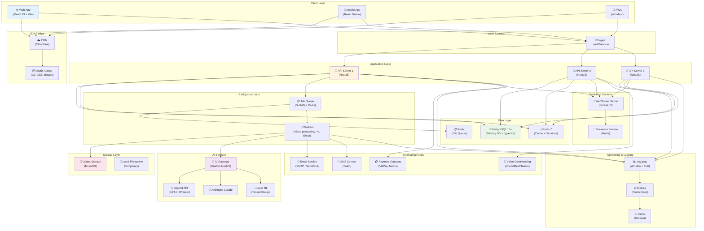
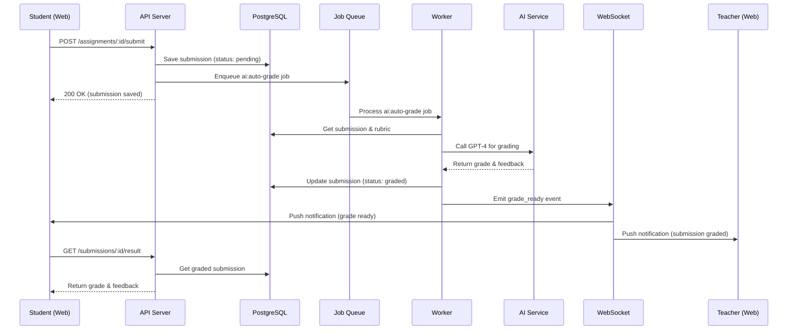

# 🏗️ Technical Architecture - AI-Powered LMS

**Version**: 3.0  
**Date**: 2026-08-25  
**Status**: Production Ready

---

## 📋 Table of Contents

1. [Overview](#overview)
2. [High-Level Architecture](#high-level-architecture)
3. [System Components](#system-components)
4. [Technology Stack](#technology-stack)
5. [Data Flow](#data-flow)
6. [Deployment Architecture](#deployment-architecture)
7. [Security Architecture](#security-architecture)
8. [Scalability & Performance](#scalability--performance)

---

## Overview

AI-Powered LMS là một **monolithic-first, microservices-ready** architecture với focus vào:
- **Self-hosted**: Full control, data sovereignty
- **AI-first**: AI integrated at every layer
- **Scalable**: From 100 to 100,000 users
- **Modern**: Latest tech stack
- **Secure**: Enterprise-grade security

---

## High-Level Architecture



---

## System Components

### 1. Frontend Layer

#### Web Application (React 19)
```typescript
// Tech Stack
{
  "framework": "React 19",
  "buildTool": "Vite 5.x",
  "ui": "Ant Design Pro 6.x",
  "stateManagement": "TanStack Query + Zustand",
  "routing": "React Router 6",
  "forms": "React Hook Form + Zod",
  "charts": "Recharts / Chart.js",
  "i18n": "react-i18next"
}

// Structure
src/
├── pages/           # Page components
├── components/      # Reusable components
├── layouts/         # Layout components
├── hooks/           # Custom hooks
├── services/        # API services
├── stores/          # Zustand stores
├── utils/           # Utilities
├── types/           # TypeScript types
└── assets/          # Static assets
```

**Features:**
- Server-Side Rendering (SSR) ready
- Code splitting & lazy loading
- Progressive Web App (PWA)
- Responsive design (mobile-first)
- Dark mode support
- Accessibility (WCAG 2.1 AA)

#### Mobile App (React Native) - Phase 4
```typescript
// Native apps for iOS & Android
{
  "framework": "React Native 0.73+",
  "navigation": "React Navigation",
  "state": "TanStack Query + Zustand",
  "ui": "React Native Paper",
  "offline": "WatermelonDB",
  "push": "Firebase Cloud Messaging"
}
```

---

### 2. Backend Layer

#### API Server (NestJS)
```typescript
// Tech Stack
{
  "framework": "NestJS 10.x",
  "runtime": "Node.js 20 LTS",
  "language": "TypeScript 5.x",
  "orm": "TypeORM / Prisma",
  "validation": "class-validator + class-transformer",
  "authentication": "JWT + Passport",
  "documentation": "Swagger / OpenAPI",
  "testing": "Jest + Supertest"
}

// Structure
src/
├── modules/
│   ├── auth/              # Authentication & Authorization
│   ├── users/             # User management
│   ├── organizations/     # Multi-tenancy
│   ├── classes/           # Class management
│   ├── content/           # Content management
│   ├── assignments/       # Assignments & grading
│   ├── communication/     # Messaging system
│   ├── library/           # Digital library
│   ├── analytics/         # Analytics & reports
│   ├── ai/                # AI integration
│   └── payments/          # Payment processing
├── common/
│   ├── decorators/        # Custom decorators
│   ├── guards/            # Auth guards
│   ├── interceptors/      # Response interceptors
│   ├── pipes/             # Validation pipes
│   └── filters/           # Exception filters
├── database/
│   ├── entities/          # TypeORM entities
│   ├── migrations/        # Database migrations
│   └── seeds/             # Seed data
└── config/                # Configuration
```

**Architecture Patterns:**
- **Modular Architecture**: Each feature is a module
- **Dependency Injection**: NestJS DI container
- **CQRS**: Command Query Responsibility Segregation (for complex flows)
- **Event-Driven**: Internal events for decoupling
- **Repository Pattern**: Data access abstraction

**API Design:**
- RESTful API (primary)
- GraphQL (optional, Phase 4)
- WebSocket (real-time)
- Server-Sent Events (notifications)

---

### 3. Database Layer

#### PostgreSQL 15+ (Primary Database)
```sql
-- Extensions
CREATE EXTENSION IF NOT EXISTS "uuid-ossp";      -- UUID generation
CREATE EXTENSION IF NOT EXISTS "pgcrypto";       -- Encryption
CREATE EXTENSION IF NOT EXISTS "vector";         -- pgvector for AI embeddings

-- Key Tables (simplified)
organizations
branches
users
roles
permissions
classes
enrollments
content
assignments
submissions
grades
messages
notifications
analytics_events

-- Partitioning Strategy
-- Large tables partitioned by time
CREATE TABLE analytics_events (
    id UUID PRIMARY KEY,
    event_type VARCHAR(50),
    user_id UUID,
    data JSONB,
    created_at TIMESTAMP
) PARTITION BY RANGE (created_at);

-- Indexes for performance
CREATE INDEX idx_users_email ON users(email);
CREATE INDEX idx_users_org_id ON users(organization_id);
CREATE INDEX idx_classes_branch ON classes(branch_id);
CREATE INDEX idx_enrollments_student ON enrollments(student_id);
CREATE INDEX idx_assignments_class ON assignments(class_id);
CREATE INDEX idx_content_vector ON content USING ivfflat (embedding vector_cosine_ops);
```

**Database Features:**
- **Schemas**: Multi-tenancy via schemas or shared schema
- **Row-Level Security (RLS)**: Data isolation
- **Full-Text Search**: For content search
- **Vector Search**: pgvector for AI embeddings
- **Partitioning**: For large tables (analytics, logs)
- **Replication**: Streaming replication for HA

#### Redis 7 (Cache + Sessions + Queue)
```typescript
// Usage patterns
{
  "cache": {
    "type": "read-through",
    "ttl": "5-60 minutes",
    "keys": "user:{id}, class:{id}, content:{id}"
  },
  "sessions": {
    "storage": "redis",
    "ttl": "7 days"
  },
  "queue": {
    "engine": "BullMQ",
    "queues": ["video-processing", "ai-grading", "email", "notifications"]
  },
  "pubsub": {
    "use": "real-time events",
    "channels": ["chat", "notifications", "presence"]
  }
}
```

---

### 4. Background Jobs

#### Job Queue (BullMQ + Redis)
```typescript
// Job Types
interface JobTypes {
  // Content Processing
  'video:transcode': { contentId: string; videoUrl: string };
  'video:generate-thumbnail': { contentId: string };
  'video:generate-transcript': { contentId: string };
  'document:process': { contentId: string };
  'audio:transcode': { contentId: string };
  
  // AI Tasks
  'ai:auto-grade-essay': { submissionId: string };
  'ai:auto-grade-speaking': { submissionId: string };
  'ai:generate-content': { assignmentId: string };
  'ai:generate-feedback': { submissionId: string };
  'ai:tag-content': { contentId: string };
  
  // Communication
  'email:send': { to: string; subject: string; body: string };
  'email:campaign': { campaignId: string };
  'sms:send': { phone: string; message: string };
  'notification:push': { userId: string; title: string; body: string };
  
  // Reports
  'report:generate': { type: string; params: any };
  'report:progress-weekly': { studentId: string };
  'report:progress-monthly': { studentId: string };
  
  // Analytics
  'analytics:aggregate': { date: Date };
  'analytics:insights': { period: string };
}

// Worker Configuration
const queues = {
  'video-processing': {
    concurrency: 2,        // Parallel jobs
    limiter: {
      max: 10,             // Max 10 jobs per 10 seconds
      duration: 10000
    }
  },
  'ai-grading': {
    concurrency: 5,
    limiter: {
      max: 50,             // Rate limit for AI API
      duration: 60000
    }
  },
  'email': {
    concurrency: 10,
    limiter: {
      max: 100,            // Email service limits
      duration: 60000
    }
  }
};

// Job Priority
enum JobPriority {
  CRITICAL = 1,    // Urgent (payment, security)
  HIGH = 2,        // Important (grading, notifications)
  NORMAL = 3,      // Regular (content processing)
  LOW = 4          // Batch (reports, analytics)
}
```

---

### 5. AI Services

#### AI Gateway (Custom)
```typescript
// AI Gateway acts as facade to multiple AI providers
class AIGateway {
  // Providers
  private openai: OpenAI;
  private anthropic: Anthropic;
  private local: LocalML;
  
  // Route requests based on task type & cost
  async processRequest(task: AITask): Promise<AIResponse> {
    const provider = this.selectProvider(task);
    const cache = await this.checkCache(task);
    
    if (cache) return cache;
    
    const response = await provider.process(task);
    await this.cacheResponse(task, response);
    
    return response;
  }
  
  // Cost optimization
  private selectProvider(task: AITask): AIProvider {
    switch (task.type) {
      case 'essay-grading':
        return task.length > 500 ? this.openai : this.anthropic;
      case 'content-generation':
        return this.openai;  // GPT-4 best for generation
      case 'sentiment-analysis':
        return this.local;   // Fast, cheap, local
      case 'speech-to-text':
        return this.openai;  // Whisper best
      default:
        return this.openai;
    }
  }
}

// AI Tasks
interface AITasks {
  // Content Generation
  generateAssignment(params: GenerateAssignmentParams): Promise<Assignment>;
  generateLessonPlan(params: GenerateLessonParams): Promise<LessonPlan>;
  improveContent(content: string): Promise<string>;
  
  // Grading
  gradeEssay(essay: string, rubric: Rubric): Promise<Grade>;
  gradeSpeaking(audioUrl: string, rubric: Rubric): Promise<Grade>;
  gradeCode(code: string, tests: Test[]): Promise<Grade>;
  
  // Analysis
  analyzeSentiment(text: string): Promise<Sentiment>;
  classifyTopic(text: string): Promise<Topic>;
  detectUrgency(text: string): Promise<Urgency>;
  
  // Recommendations
  recommendContent(userId: string, context: Context): Promise<Content[]>;
  recommendLearningPath(userId: string): Promise<LearningPath>;
  
  // Speech
  speechToText(audioUrl: string): Promise<Transcript>;
  analyzeP ronunciation(audioUrl: string): Promise<PronunciationScore>;
}
```

**AI Provider Selection:**
| Task | Provider | Reason | Cost/Request |
|------|----------|--------|--------------|
| Essay Grading | GPT-4 / Claude | High quality | $0.03 |
| Content Generation | GPT-4 | Best creativity | $0.05 |
| Speech-to-Text | Whisper | Best accuracy | $0.006/min |
| Sentiment Analysis | Local (TF.js) | Fast, free | $0 |
| Content Tags | GPT-3.5 | Good enough | $0.002 |
| Recommendations | Local (Vector) | Fast, free | $0 |

---

### 6. Storage Layer

#### Object Storage (Minio / S3)
```typescript
// Storage structure
{
  "buckets": {
    "content": {
      "path": "content/{type}/{year}/{month}/{id}/",
      "files": [
        "original.mp4",
        "720p.mp4",
        "480p.mp4",
        "360p.mp4",
        "thumbnail.jpg",
        "transcript.vtt"
      ],
      "retention": "Forever",
      "public": false
    },
    "uploads": {
      "path": "uploads/{userId}/{timestamp}/",
      "retention": "7 days",
      "public": false
    },
    "static": {
      "path": "static/{type}/",
      "retention": "Forever",
      "public": true,
      "cdn": true
    },
    "backups": {
      "path": "backups/{date}/",
      "retention": "30 days",
      "encryption": true
    }
  }
}

// CDN Integration
{
  "provider": "Cloudflare / CloudFront",
  "caching": {
    "static": "1 year",
    "content": "1 hour",
    "api": "No cache"
  },
  "features": [
    "Global distribution",
    "DDoS protection",
    "SSL/TLS",
    "Image optimization",
    "Video streaming"
  ]
}
```

---

### 7. Real-time Services

#### WebSocket Server (Socket.IO)
```typescript
// Real-time features
{
  "chat": {
    "rooms": "class:{id}, dm:{user1}:{user2}",
    "events": ["message", "typing", "read"],
    "persistence": "Redis + PostgreSQL"
  },
  "notifications": {
    "events": ["notification", "badge_count"],
    "delivery": "Push to online users"
  },
  "presence": {
    "events": ["user_online", "user_offline", "user_typing"],
    "storage": "Redis (TTL 5 min)"
  },
  "collaboration": {
    "features": ["Live cursors", "Shared editing"],
    "phase": "4"
  }
}

// Connection management
class WebSocketGateway {
  private io: Server;
  private redis: Redis;
  
  // Authenticate connection
  @UseGuards(WsAuthGuard)
  async handleConnection(socket: Socket) {
    const user = socket.data.user;
    
    // Join user's rooms
    await socket.join(`user:${user.id}`);
    await socket.join(`org:${user.organizationId}`);
    
    // Mark online
    await this.redis.setex(
      `presence:${user.id}`,
      300,  // 5 minutes
      JSON.stringify({ online: true, lastSeen: Date.now() })
    );
    
    // Broadcast online status
    socket.broadcast.emit('user_online', { userId: user.id });
  }
  
  // Handle message
  @SubscribeMessage('send_message')
  async handleMessage(
    @ConnectedSocket() socket: Socket,
    @MessageBody() data: SendMessageDto
  ) {
    // Save to database
    const message = await this.messagesService.create(data);
    
    // Emit to recipient
    this.io.to(`user:${data.recipientId}`).emit('new_message', message);
    
    // Push notification if offline
    const isOnline = await this.isUserOnline(data.recipientId);
    if (!isOnline) {
      await this.notificationsService.sendPush(data.recipientId, {
        title: 'New message',
        body: message.content
      });
    }
  }
}
```

---

## Data Flow

### Example: Student Submits Assignment



---

## Deployment Architecture

### Production Environment (Self-Hosted)

```yaml
# Server Specifications (Recommended)
servers:
  # Small Setup (100-500 users)
  small:
    app_server:
      cpu: 4 cores
      ram: 8 GB
      disk: 100 GB SSD
      os: Ubuntu 22.04 LTS
    database:
      cpu: 2 cores
      ram: 4 GB
      disk: 200 GB SSD (PostgreSQL + backups)
    storage:
      disk: 500 GB HDD (content storage)
  
  # Medium Setup (500-2000 users)
  medium:
    app_server_1:
      cpu: 8 cores
      ram: 16 GB
      disk: 200 GB SSD
    app_server_2:
      cpu: 8 cores
      ram: 16 GB
      disk: 200 GB SSD
    database_primary:
      cpu: 4 cores
      ram: 16 GB
      disk: 500 GB SSD
    database_replica:
      cpu: 4 cores
      ram: 16 GB
      disk: 500 GB SSD
    storage:
      disk: 2 TB HDD
  
  # Large Setup (2000+ users)
  large:
    load_balancer:
      cpu: 2 cores
      ram: 4 GB
    app_servers: # 3+ instances
      cpu: 16 cores each
      ram: 32 GB each
      disk: 500 GB SSD each
    database_cluster:
      primary: 8 cores, 32 GB RAM, 1 TB SSD
      replica_1: 8 cores, 32 GB RAM, 1 TB SSD
      replica_2: 8 cores, 32 GB RAM, 1 TB SSD
    redis_cluster:
      nodes: 3
      cpu: 4 cores each
      ram: 16 GB each
    storage:
      disk: 10 TB HDD (or S3-compatible)
```

### Docker Compose (Development)
```yaml
version: '3.8'

services:
  # API Server
  api:
    build: ./backend
    ports:
      - "3000:3000"
    environment:
      NODE_ENV: development
      DATABASE_URL: postgresql://postgres:password@db:5432/lms
      REDIS_URL: redis://redis:6379
    depends_on:
      - db
      - redis
    volumes:
      - ./backend:/app
      - /app/node_modules

  # PostgreSQL
  db:
    image: pgvector/pgvector:pg15
    ports:
      - "5432:5432"
    environment:
      POSTGRES_DB: lms
      POSTGRES_USER: postgres
      POSTGRES_PASSWORD: password
    volumes:
      - postgres_data:/var/lib/postgresql/data

  # Redis
  redis:
    image: redis:7-alpine
    ports:
      - "6379:6379"
    volumes:
      - redis_data:/data

  # Minio (S3-compatible)
  minio:
    image: minio/minio
    ports:
      - "9000:9000"
      - "9001:9001"
    environment:
      MINIO_ROOT_USER: minioadmin
      MINIO_ROOT_PASSWORD: minioadmin
    command: server /data --console-address ":9001"
    volumes:
      - minio_data:/data

  # Worker (Background Jobs)
  worker:
    build: ./backend
    command: npm run worker
    environment:
      NODE_ENV: development
      DATABASE_URL: postgresql://postgres:password@db:5432/lms
      REDIS_URL: redis://redis:6379
    depends_on:
      - db
      - redis
    volumes:
      - ./backend:/app

  # Frontend
  web:
    build: ./frontend
    ports:
      - "5517:5517"
    environment:
      VITE_API_URL: http://localhost:3000
    volumes:
      - ./frontend:/app
      - /app/node_modules

volumes:
  postgres_data:
  redis_data:
  minio_data:
```

---

## Security Architecture

### Authentication & Authorization

```typescript
// JWT-based Authentication
interface JWTPayload {
  sub: string;              // User ID
  email: string;
  organizationId: string;
  branchId?: string;
  roles: string[];
  permissions: string[];
  iat: number;
  exp: number;
}

// Token Strategy
{
  "accessToken": {
    "lifetime": "15 minutes",
    "storage": "Memory (not localStorage)",
    "transmission": "Bearer token in Authorization header"
  },
  "refreshToken": {
    "lifetime": "7 days",
    "storage": "HttpOnly cookie",
    "rotation": "On refresh"
  }
}

// Role-Based Access Control (RBAC)
@UseGuards(AuthGuard, RolesGuard)
@Roles('teacher', 'academic_manager')
@Controller('assignments')
class AssignmentsController {
  @Post()
  @RequirePermissions('assignments:create')
  async create(@Body() data: CreateAssignmentDto) {
    // Only users with permission can create
  }
}

// Row-Level Security
class QueryBuilder {
  // Automatically filter by organization & access
  scopeQuery(query: SelectQueryBuilder, user: User) {
    query
      .andWhere('entity.organizationId = :orgId', { orgId: user.organizationId })
      .andWhere(/* Additional access checks */);
  }
}
```

### Data Security

```typescript
// Encryption
{
  "at_rest": {
    "database": "PostgreSQL TDE (Transparent Data Encryption)",
    "files": "AES-256 encryption for sensitive files",
    "backups": "Encrypted backups (AES-256)"
  },
  "in_transit": {
    "https": "TLS 1.3",
    "database": "SSL/TLS connections",
    "internal": "Private network or VPN"
  },
  "application": {
    "passwords": "bcrypt (cost factor 12)",
    "tokens": "Cryptographically secure random",
    "pii": "Field-level encryption for sensitive data"
  }
}

// Sensitive Data Handling
class User {
  @Column()
  email: string;
  
  @Column({ select: false })  // Never auto-select
  password: string;
  
  @Column({ 
    type: 'varchar',
    transformer: new EncryptionTransformer()  // Auto encrypt/decrypt
  })
  ssn: string;
}
```

### API Security

```typescript
// Rate Limiting
{
  "global": "100 requests per minute per IP",
  "authenticated": "1000 requests per minute per user",
  "ai_endpoints": "10 requests per minute per user",
  "auth_endpoints": "5 requests per minute per IP"
}

// Input Validation
@Post('users')
async createUser(@Body() dto: CreateUserDto) {
  // All inputs validated with class-validator
}

class CreateUserDto {
  @IsEmail()
  @MaxLength(255)
  email: string;
  
  @IsString()
  @MinLength(8)
  @Matches(/^(?=.*[a-z])(?=.*[A-Z])(?=.*\d)/)
  password: string;
  
  @IsString()
  @MaxLength(100)
  @Matches(/^[a-zA-Z\s]+$/)
  name: string;
}

// SQL Injection Prevention
// Using ORM (TypeORM/Prisma) with parameterized queries
const users = await this.userRepository.find({
  where: { email: userEmail }  // Automatically parameterized
});

// XSS Prevention
// React automatically escapes output
// For HTML content, use DOMPurify
import DOMPurify from 'dompurify';
const clean = DOMPurify.sanitize(dirty);

// CSRF Protection
// CORS configuration
{
  "origin": ["https://yourdomain.com"],
  "credentials": true,
  "methods": ["GET", "POST", "PUT", "DELETE", "PATCH"],
  "allowedHeaders": ["Content-Type", "Authorization"]
}
```

---

## Scalability & Performance

### Horizontal Scaling

```typescript
// Stateless API Servers
{
  "design": "Shared-nothing architecture",
  "session": "Stored in Redis (not in-memory)",
  "files": "Object storage (not local filesystem)",
  "scaling": "Add more API servers behind load balancer"
}

// Load Balancer Configuration (Nginx)
upstream api_servers {
  least_conn;  // Route to least busy server
  
  server api1.internal:3000 weight=1 max_fails=3 fail_timeout=30s;
  server api2.internal:3000 weight=1 max_fails=3 fail_timeout=30s;
  server api3.internal:3000 weight=1 max_fails=3 fail_timeout=30s;
}

// Health Check
server {
  location /health {
    access_log off;
    return 200 "healthy\n";
  }
}
```

### Database Optimization

```typescript
// Read Replicas
{
  "primary": "Write operations",
  "replica_1": "Read operations (50%)",
  "replica_2": "Read operations (50%)",
  "routing": "Automatic (TypeORM replication)"
}

// Connection Pooling
{
  "pool_size": 20,
  "max_connections": 100,
  "idle_timeout": "10 minutes",
  "connection_reuse": true
}

// Query Optimization
// Use indexes
CREATE INDEX CONCURRENTLY idx_assignments_class_status 
ON assignments(class_id, status) 
WHERE deleted_at IS NULL;

// Use materialized views for expensive queries
CREATE MATERIALIZED VIEW student_performance_summary AS
SELECT 
  student_id,
  AVG(grade) as avg_grade,
  COUNT(*) as assignment_count,
  -- ... complex calculations
FROM submissions
GROUP BY student_id;

// Refresh periodically
REFRESH MATERIALIZED VIEW CONCURRENTLY student_performance_summary;
```

### Caching Strategy

```typescript
// Cache Layers
{
  "L1": {
    "type": "In-memory (Node.js)",
    "ttl": "1 minute",
    "size": "100 MB",
    "use": "Frequently accessed data"
  },
  "L2": {
    "type": "Redis",
    "ttl": "5-60 minutes",
    "size": "10 GB",
    "use": "Shared cache across servers"
  },
  "L3": {
    "type": "CDN",
    "ttl": "1 hour - 1 year",
    "size": "Unlimited",
    "use": "Static assets, public content"
  }
}

// Cache Patterns
class CacheService {
  // Read-through
  async getUser(userId: string): Promise<User> {
    const cached = await this.redis.get(`user:${userId}`);
    if (cached) return JSON.parse(cached);
    
    const user = await this.db.findUser(userId);
    await this.redis.setex(`user:${userId}`, 300, JSON.stringify(user));
    
    return user;
  }
  
  // Write-through
  async updateUser(userId: string, data: Partial<User>): Promise<User> {
    const user = await this.db.updateUser(userId, data);
    await this.redis.setex(`user:${userId}`, 300, JSON.stringify(user));
    return user;
  }
  
  // Cache invalidation
  async invalidateUser(userId: string): Promise<void> {
    await this.redis.del(`user:${userId}`);
  }
}
```

### Performance Targets

```typescript
{
  "response_time": {
    "p50": "< 100ms",
    "p95": "< 500ms",
    "p99": "< 1000ms"
  },
  "throughput": {
    "requests_per_second": "1000+",
    "concurrent_users": "5000+"
  },
  "availability": {
    "uptime": "99.9% (8.76 hours downtime/year)",
    "recovery_time": "< 15 minutes"
  },
  "scalability": {
    "users": "100 → 100,000",
    "database": "1 GB → 1 TB",
    "storage": "100 GB → 10 TB"
  }
}
```

---

## Monitoring & Observability

```typescript
// Logging (Winston + ELK)
{
  "levels": ["error", "warn", "info", "debug"],
  "format": "JSON",
  "storage": "Elasticsearch",
  "retention": "30 days",
  "dashboard": "Kibana"
}

// Metrics (Prometheus + Grafana)
{
  "metrics": [
    "http_requests_total",
    "http_request_duration_seconds",
    "database_query_duration_seconds",
    "cache_hit_ratio",
    "ai_api_calls_total",
    "ai_api_cost_usd",
    "background_job_duration_seconds",
    "websocket_connections_active"
  ],
  "alerts": [
    "API response time > 1s (p95)",
    "Error rate > 1%",
    "Database CPU > 80%",
    "Disk usage > 85%",
    "AI API cost > $100/day"
  ]
}

// Health Checks
{
  "endpoint": "/health",
  "checks": [
    "database_connection",
    "redis_connection",
    "storage_accessible",
    "ai_service_reachable"
  ],
  "frequency": "Every 30 seconds"
}
```

---

## Backup & Disaster Recovery

```typescript
{
  "database": {
    "full_backup": "Daily at 2 AM",
    "incremental": "Every 6 hours",
    "retention": "30 days",
    "storage": "Encrypted, offsite"
  },
  "files": {
    "backup": "Daily",
    "versioning": "Enabled (S3 versioning)",
    "retention": "30 days"
  },
  "recovery": {
    "rpo": "Recovery Point Objective: 6 hours",
    "rto": "Recovery Time Objective: 2 hours",
    "testing": "Quarterly disaster recovery drills"
  }
}
```

---

## Cost Estimation (Monthly)

### Small Setup (100-500 users)
```
Server (VPS):           $50/month
Database Storage:       $20/month
Object Storage (100GB): $10/month
CDN:                    $20/month
AI API (GPT-4):         $100/month
Email/SMS:              $20/month
Domain/SSL:             $5/month
-----------------------------------
Total:                  ~$225/month
```

### Medium Setup (500-2000 users)
```
Servers (2x VPS):       $150/month
Database:               $80/month
Object Storage (500GB): $40/month
CDN:                    $50/month
AI API:                 $500/month
Email/SMS:              $100/month
Monitoring:             $20/month
-----------------------------------
Total:                  ~$940/month
```

### Large Setup (2000+ users)
```
Servers (4x VPS):       $400/month
Database Cluster:       $300/month
Object Storage (2TB):   $150/month
CDN:                    $200/month
AI API:                 $2000/month
Email/SMS:              $300/month
Monitoring/Logs:        $100/month
Support:                $200/month
-----------------------------------
Total:                  ~$3,650/month
```

---

## Next Steps

1. ✅ Setup development environment (Docker Compose)
2. ✅ Initialize NestJS backend project
3. ✅ Initialize React frontend project
4. ✅ Setup PostgreSQL with pgvector
5. ✅ Configure Redis for caching & queues
6. ✅ Implement authentication (JWT)
7. ✅ Implement authorization (RBAC)
8. → Start building core modules...

---

**Last Updated**: 2026-08-25  
**Reviewed By**: Tech Lead  
**Next Review**: After MVP completion
