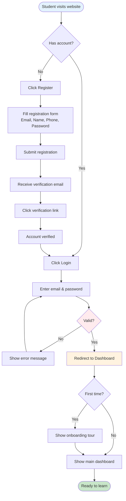
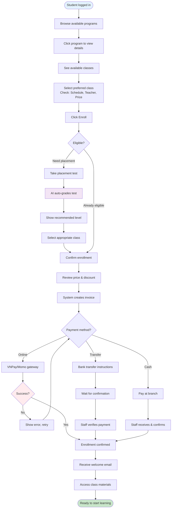
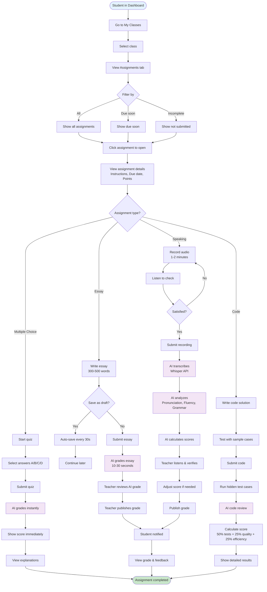
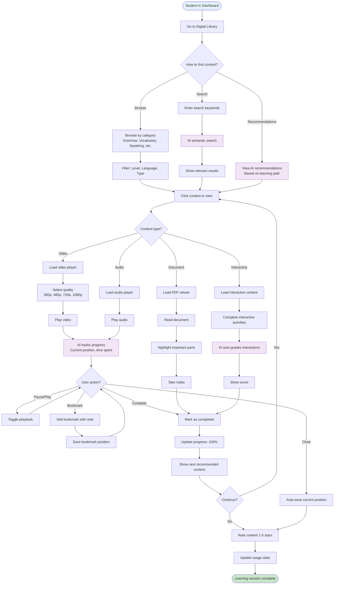
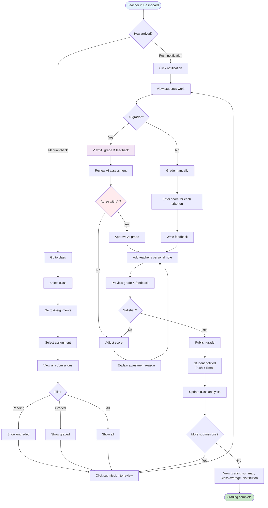
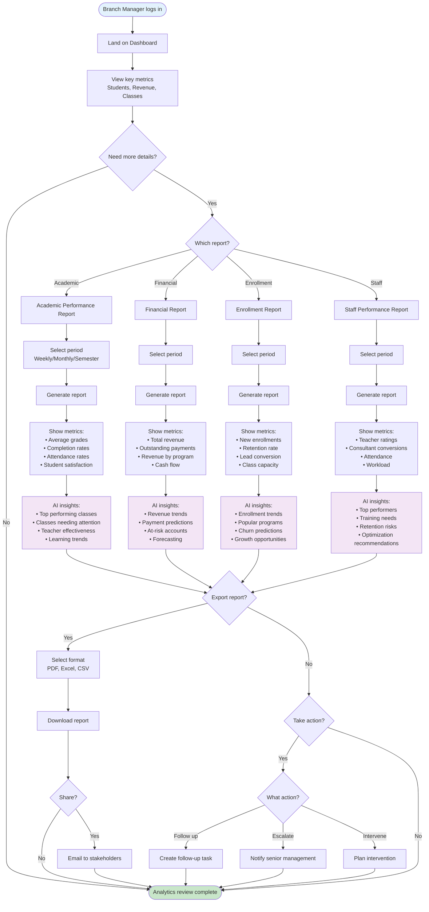
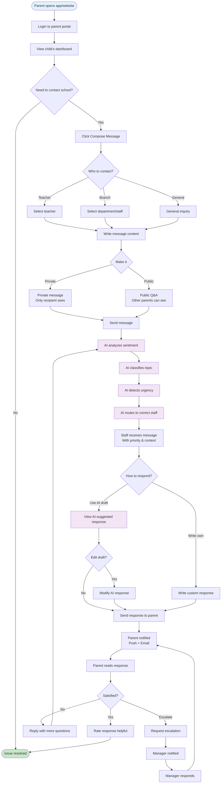

# 🔄 User Flow Diagrams - AI-Powered LMS

**Version**: 3.0  
**Date**: 2026-08-25  
**Purpose**: Visual representation of key user journeys

---

## 📋 Table of Contents

1. [Student Flows](#student-flows)
2. [Teacher Flows](#teacher-flows)
3. [Admin Flows](#admin-flows)
4. [Parent Flows](#parent-flows)

---

## Student Flows

### 1. Student Registration & First Login



---

### 2. Student Enrolls in Class



---

### 3. Student Completes Assignment



---

### 4. Student Views Content in Digital Library



---

## Teacher Flows

### 5. Teacher Creates Assignment with AI

```mermaid
flowchart TD
    Start([Teacher in Dashboard]) --> SelectClass[Select class]
    SelectClass --> Assignments[Go to Assignments tab]
    Assignments --> CreateNew[Click Create Assignment]
    CreateNew --> ChooseMethod{How to create?}
    
    ChooseMethod -->|Manual| SelectType[Select assignment type<br/>MC, Essay, Speaking, Code]
    SelectType --> EnterDetails[Enter details<br/>Title, Instructions, Points]
    EnterDetails --> CreateQuestions[Create questions manually]
    CreateQuestions --> SetRubric[Define rubric/criteria]
    SetRubric --> SetDeadline
    
    ChooseMethod -->|AI Generate| AIForm[Fill AI generation form]
    AIForm --> SpecifyTopic[Specify topic & level]
    SpecifyTopic --> SpecifyCount[Number of questions]
    SpecifyCount --> SpecifyFocus[Focus areas (optional)]
    SpecifyFocus --> SubmitAI[Submit to AI]
    SubmitAI --> AIGenerating[AI generates assignment<br/>GPT-4, 10-30 seconds]
    AIGenerating --> ShowPreview[Show generated assignment]
    ShowPreview --> ReviewAI{Review quality?}
    
    ReviewAI -->|Good| ApproveAI[Approve as-is]
    ApproveAI --> SetDeadline
    
    ReviewAI -->|Need changes| EditGenerated[Edit generated content]
    EditGenerated --> SetRubric
    
    SetDeadline[Set deadlines & attempts] --> ConfigureAI[Configure AI grading]
    ConfigureAI --> EnableAI{Enable AI grading?}
    
    EnableAI -->|Yes| SetAIOptions[Set AI options<br/>Model, Require review]
    SetAIOptions --> Preview
    
    EnableAI -->|No| ManualGrading[Manual grading only]
    ManualGrading --> Preview
    
    Preview[Preview assignment] --> SatisfiedPreview{Satisfied?}
    SatisfiedPreview -->|No| EditGenerated
    SatisfiedPreview -->|Yes| PublishDecision{Publish now?}
    
    PublishDecision -->|Yes| Publish[Publish to class]
    Publish --> NotifyStudents[Students notified]
    NotifyStudents --> End
    
    PublishDecision -->|No| SaveDraft[Save as draft]
    SaveDraft --> End
    
    End([Assignment ready])
    
    style Start fill:#e3f2fd
    style End fill:#c8e6c9
    style AIGenerating fill:#f3e5f5
    style ConfigureAI fill:#f3e5f5
```

---

### 6. Teacher Reviews & Grades Submission



---

### 7. Teacher Uploads Content to Digital Library

```mermaid
flowchart TD
    Start([Teacher in Dashboard]) --> Library[Go to Digital Library]
    Library --> Upload[Click Upload Content]
    Upload --> SelectType{Content type?}
    
    SelectType -->|Video| UploadVideo[Select video file<br/>MP4, AVI, MOV]
    UploadVideo --> CheckSize{File size?}
    CheckSize -->|> 500MB| TooLarge[Error: File too large<br/>Max 500MB]
    TooLarge --> UploadVideo
    CheckSize -->|OK| StartUpload
    
    SelectType -->|Document| UploadDoc[Select document<br/>PDF, DOCX, PPTX]
    UploadDoc --> StartUpload
    
    SelectType -->|Audio| UploadAudio[Select audio file<br/>MP3, WAV]
    UploadAudio --> StartUpload
    
    SelectType -->|Interactive| CreateInteractive[Create interactive content]
    CreateInteractive --> StartUpload
    
    StartUpload[Upload to server] --> ShowProgress[Show upload progress]
    ShowProgress --> UploadComplete[Upload complete]
    UploadComplete --> FillMetadata[Fill metadata form]
    
    FillMetadata --> EnterTitle[Enter title]
    EnterTitle --> EnterDescription[Enter description]
    EnterDescription --> SelectCategory[Select category]
    SelectCategory --> EnterTags[Enter tags]
    EnterTags --> SelectLevel[Select level]
    SelectLevel --> SelectLanguage[Select language]
    SelectLanguage --> SetAccess[Set access level<br/>Public/Enrolled/Class/Paid]
    
    SetAccess --> SubmitMetadata[Submit metadata]
    SubmitMetadata --> AIProcessing[AI processes content]
    
    AIProcessing --> AITasks{Processing tasks}
    AITasks -->|Video| VideoTasks[• Transcode to multiple qualities<br/>• Generate thumbnail<br/>• Extract audio for transcript<br/>• Generate transcript with Whisper]
    AITasks -->|Document| DocTasks[• Convert to web format<br/>• Extract text for search<br/>• Generate preview images]
    AITasks -->|Audio| AudioTasks[• Transcode format<br/>• Generate transcript<br/>• Extract keywords]
    
    VideoTasks --> AITagging
    DocTasks --> AITagging
    AudioTasks --> AITagging
    
    AITagging[AI auto-tags content<br/>Topics, difficulty, keywords] --> AISummary[AI generates summary]
    AISummary --> AIEmbedding[Generate vector embedding<br/>for semantic search]
    AIEmbedding --> ProcessComplete[Processing complete]
    
    ProcessComplete --> NotifyTeacher[Teacher notified<br/>Content ready]
    NotifyTeacher --> ReviewAI[Review AI-generated tags]
    ReviewAI --> ApproveAI{Approve AI tags?}
    
    ApproveAI -->|Yes| PublishContent[Publish content]
    ApproveAI -->|No| EditTags[Edit tags manually]
    EditTags --> PublishContent
    
    PublishContent --> MakeVisible[Make visible to students]
    MakeVisible --> ShareOptions{Share to?}
    
    ShareOptions -->|Library only| JustLibrary[Add to public library]
    JustLibrary --> End
    
    ShareOptions -->|Specific class| ShareToClass[Share to class]
    ShareToClass --> NotifyStudents[Students notified]
    NotifyStudents --> End
    
    ShareOptions -->|Multiple classes| SelectClasses[Select classes]
    SelectClasses --> ShareToClass
    
    End([Content published & available])
    
    style Start fill:#e3f2fd
    style End fill:#c8e6c9
    style AIProcessing fill:#f3e5f5
    style AITagging fill:#f3e5f5
    style AISummary fill:#f3e5f5
    style AIEmbedding fill:#f3e5f5
```



---

## Admin Flows

### 8. Branch Manager Reviews Analytics



---

## Parent Flows

### 9. Parent Sends Message to School



---

### 10. Parent Views Child's Progress Report

```mermaid
flowchart TD
    Start([Parent logs in]) --> Dashboard[View parent dashboard]
    Dashboard --> SelectChild{Multiple children?}
    
    SelectChild -->|Yes| ChooseChild[Select child]
    SelectChild -->|No| ViewProgress
    ChooseChild --> ViewProgress
    
    ViewProgress[View child's progress] --> ReportOptions{What to view?}
    
    ReportOptions -->|Overview| QuickView[Quick overview<br/>• Current classes<br/>• Recent grades<br/>• Attendance rate<br/>• Upcoming assignments]
    QuickView --> End
    
    ReportOptions -->|Detailed Report| SelectPeriod[Select period<br/>Weekly/Monthly/Semester]
    SelectPeriod --> GenerateReport[Generate progress report]
    GenerateReport --> ShowSections[Show report sections]
    
    ShowSections --> AttendanceSection[📊 Attendance<br/>• Sessions attended: 38/40<br/>• Rate: 95%<br/>• Late count: 2]
    AttendanceSection --> GradesSection
    
    GradesSection[📝 Grades<br/>• Average: 85.5%<br/>• Assignments: 12/12 completed<br/>• Trend: Improving]
    GradesSection --> CompetenciesSection
    
    CompetenciesSection[🎯 Competencies<br/>• Grammar: Proficient<br/>• Speaking: Developing<br/>• Listening: Proficient<br/>• Writing: Proficient]
    CompetenciesSection --> EngagementSection
    
    EngagementSection[💡 Engagement<br/>• Content viewed: 45 items<br/>• Learning time: 18 hours<br/>• Completion rate: 89%]
    EngagementSection --> AIInsightsSection
    
    AIInsightsSection[🤖 AI Insights<br/>• Strengths: Strong in grammar<br/>• Areas to improve: Speaking fluency<br/>• Recommendations:<br/>  - Practice speaking daily<br/>  - Watch pronunciation videos<br/>  - Join conversation club]
    AIInsightsSection --> TeacherComments
    
    TeacherComments[👨‍🏫 Teacher Comments<br/>"John is making great progress...<br/>Needs more practice in speaking..."]
    TeacherComments --> ActionOptions
    
    ActionOptions{Actions available}
    
    ActionOptions -->|Download| DownloadPDF[Download as PDF]
    DownloadPDF --> End
    
    ActionOptions -->|Email| EmailReport[Email report to self]
    EmailReport --> End
    
    ActionOptions -->|Contact| ContactTeacher[Contact teacher]
    ContactTeacher --> ComposeMessage[Compose message to teacher]
    ComposeMessage --> SendMsg[Send message]
    SendMsg --> End
    
    ActionOptions -->|Schedule| ScheduleMeeting[Schedule parent-teacher meeting]
    ScheduleMeeting --> PickTime[Pick available time]
    PickTime --> ConfirmMeeting[Confirm meeting]
    ConfirmMeeting --> End
    
    ActionOptions -->|Close| End
    
    End([Report reviewed])
    
    style Start fill:#e3f2fd
    style End fill:#c8e6c9
    style AIInsightsSection fill:#f3e5f5
```

---

## Summary

### User Flows Created:
1. ✅ **Student Registration & First Login**
2. ✅ **Student Enrolls in Class** (with placement test & payment)
3. ✅ **Student Completes Assignment** (4 types: MC, Essay, Speaking, Code)
4. ✅ **Student Views Content in Digital Library**
5. ✅ **Teacher Creates Assignment with AI**
6. ✅ **Teacher Reviews & Grades Submission**
7. ✅ **Teacher Uploads Content to Digital Library**
8. ✅ **Branch Manager Reviews Analytics**
9. ✅ **Parent Sends Message to School** (AI-routed)
10. ✅ **Parent Views Child's Progress Report**

### Key Features Illustrated:
- 🤖 **AI Integration**: Auto-grading, recommendations, insights
- 🔄 **Multi-path flows**: Different user decisions
- ⚡ **Real-time**: Instant notifications, live updates
- 📊 **Analytics**: Progress tracking, performance metrics
- 💬 **Communication**: Multi-channel messaging
- 🎓 **Learning**: Content delivery, assessment, feedback

---

**Last Updated**: 2026-08-25  
**Format**: Mermaid flowcharts  
**Total Flows**: 10 major user journeys
